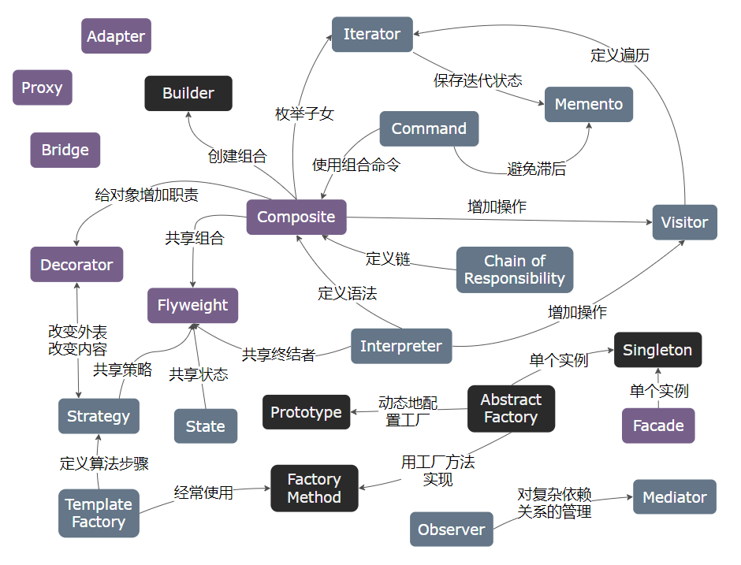

# 设计模式简述

---
- [设计模式简述](#设计模式简述)
  - [1. 设计模式基本要素](#1-设计模式基本要素)
  - [2. GOF 设计模式的编目](#2-gof-设计模式的编目)
  - [3. 设计模式之间的关系](#3-设计模式之间的关系)
  - [4. 设计模式怎样解决设计问题](#4-设计模式怎样解决设计问题)
  - [5. 设计模式在常见运用中体现的灵活性](#5-设计模式在常见运用中体现的灵活性)
  - [6. 设计模式所支持的设计的可变方面](#6-设计模式所支持的设计的可变方面)

---
## 1. 设计模式基本要素

- 一般地, 每一个设计模式描述了一个在我们周围不断重复发生的问题, 以及该问题的解决方案的核心。其最根本的意图是适应需求变更

> 一个模式有四个基本要素:

1. **模式名称 (pattern name)**: 描述模式的问题, 解决方案和效果
2. **问题 (problem)**: 描述了应该在何时使用模式
3. **解决方案 (solution)**: 描述了设计的组成成分, 它们之间的相互关系及各自的职责和协作方式
4. **效果 (consequences)**: 描述了模式应用的效果及使用模式应权衡的问题

> 模式思维

- 应对变更的直接手段就是封装变更，从而是变更的影响降到最小
- 封装复杂性，对外提供简单接口，通过多态包容的特性扩展新功能来应对变更
- 多态包容：宿主对象中包含抽象基类（或接口）的引用，而实际行为委托给这个引用所指向的实际对象，从而使这些行为可以根据该引用所指向的实际对象不同而不同

> 实现思路

- 增加间接层
  - 任何问题都可以通过增加一个间接层次来解决（抽象层）
  - 通过增加一个间接层（多为抽象层），将具体类之间的关系转变为具体类和抽象层之间的关系，使依赖止于抽象，从而设计出高质量的方案
- 针对接口编程，不针对实现编程
  - 具体类之间通过接口相互通信
  - 是对增加间接层设计思路的进一步表述
- 优先使用聚合，而不是继承
  - 利用聚合能在运行时动态修改的特点应对变化
  - 聚合抽象类（接口），并继承（或实现）具体类来扩展相应的功能，从而动态改变聚合行为

---
## 2. GOF 设计模式的编目

> 创建型模式

1. **Abstract Factory**（抽象工厂）：提供一个创建一系列相关或相互依赖对象的接口，而无需指定它们具体的类
2. **Builder**（建造者）：将一个复杂对象的构建与它的表示分离，使得同样的构建过程可以创建不同的表示
3.  **Factory Method**（工厂方法）：定义一个用于创建对象的接口，让子类决定将哪一个类实例化。Factory Method 使一个类的实例化延迟到其子类。
4.  **Prototype**（原型）：用原型实例指定创建对象的种类，并且通过拷贝这个原型来创建新的对象。
5.  **Singleton**（单例）：保证一个类仅有一个实例，并提供一个访问它的全局访问点。

> 结构型模式

6. **Adapter**（适配器）：将一个类的接口转换成客户希望的另外一个接口，Adapter 模式使得原本由于接口不兼容而不能一起工作的那些类可以一起工作
7. **Bridge**（桥接）：将抽象部分与它的实现部分分离，使它们都可以独立地变化
8.  **Composite**（组合）：将对象组合成树形结构以表示 “部分整体” 的层次结构。Composite 使得客户对单个对象和复合对象的使用具有一致性。
9.  **Decorator**（装饰）：动态地给一个对象添加一些额外的职责。就扩展功能而言，Decorator 模式比生成子类方式更为灵活。
10. **Facade**（外观）：为子系统中的一组接口提供一个一致的界面，Facade 模式定义了一个高层接口，这个接口使得这一子系统更加容易使用。
11. **Flyweight**（享元）：运用共享技术有效地支持大量细粒度的对象。
12. **Proxy**（代理）：为其他对象提供一个代理以控制对这个对象的访问。

> 行为型模式

13. **Chain of Responsibility**（责任链）：为解除请求的发送者和接收者之间的耦合，而使多个对象都有机会处理这个请求。将这些对象连成一条链，并沿着这条链传递该请求，直到有一个对象处理它
14. **Command**（命令）：将一个请求封装为一个对象，从而使你可用不同的请求对客户进行参数化；对请求排队或记录请求日志，以及支持可取消的操作。
15. **Interpreter**（解释器）：给定一个语言，定义它的文法的一种表示，并定义一个解释器，该解释器使用该表示来解释语言中的句子。
16. **Iterator**（迭代器）：提供一种方法顺序访问一个聚合对象中各个元素，而又不需暴露该对象的内部表示。
17. **Mediator**（中介者）：用一个中介对象来封装一系列的对象交互。中介者使各对象不需要显式地相互引用，从而使其耦合松散，而且可以独立地改变它们之间的交互。
18. **Memento**（备忘录）：在不破坏封装性的前提下，捕获一个对象的内部状态，并在该对象之外保存这个状态。这样以后就可将该对象恢复到保存的状态。
19. **Observer**（观察者）：定义对象间的一种一对多的依赖关系，以便当一个对象的状态发生改变时，所有依赖于它的对象都得到通知并自动刷新。
20. **State**（状态）：允许一个对象在其内部状态改变时改变它的行为。对象看起来似乎修改了它所属的类。
21. **Strategy**（策略）：定义一系列的算法把它们一个个封装起来，并且使它们可相互替换。本模式使得算法的变化可独立于使用它的客户。
22. **Template Method**（模板方法）：定义一个操作中的算法的骨架，而将一些步骤延迟到子类中。Template Method 使得子类可以不改变一个算法的结构即可重定义该算法的某些特定步骤。
23. **Visitor**（访问者）：表示一个作用于某对象结构中的各元素的操作。它使你可以在不改变各元素的类的前提下定义作用于这些元素的新操作。

---
## 3. 设计模式之间的关系

---
## 4. 设计模式怎样解决设计问题

> **寻找合适的对象**

- 面向对象程序由对象组成，对象包括数据和对数据进行操作的过程，过程通常称为方法或操作。对象在收到客户的请求或消息后，执行相应的操作；客户请求是使对象执行操作的唯一方法，操作又是对象改变内部数据的唯一方法。

> **决定对象的粒度**

- 对象在大小和数目上变化极大，它们能表示下自硬件或上自整个应用的任何事物。

> **指定对象接口**

- 对象操作所定义的所有操作型构（对象声明的每一个操作指定操作名、作为参数的对象和返回值）的集合称为该对象的接口，在面向对象系统中，接口是基本的组成部分，对象只有通过接口才能与外部交流。
- 发送给对象的请求和它的相应操作在运行时刻的连接称之为 **动态绑定**（dynamic binding），动态绑定是指发送的请求直到运行时刻才受具体实现的约束

> **描述对象的实现**

- 对象通过实例化类来创建，此对象被称为该类的实例；当实例化类时，要给对象的内部数据（由实例变量组成）分配内存空间、并将操作与这些数据联系起来
- 抽象类（abstract class）的只要目的是为它的子类定义公共接口，一个抽象类将它的部分或全部操作的实现延时到子类。
- 混入类（mixin class）是给其他类提供可选择的接口或功能的类，混入类要求多继承
- 类继承与接口继承之间的区别：类继承根据一个对象的实现定义了另一个对象的实现，它是代码和表示的共享机制；接口继承描述了一个对象什么时候能够被用来替代另一个对象

> **运用复用机制**

- 面向对象系统中功能复用最常用的技术是类继承和对象组合
- 通过生成子类的复用被称为白箱复用（white-box reuse），即在继承方式中，父类的内部细节对子类可见
- 新的更复杂的功能可以通过组装或组合对象来获得，对象组合要求被组合的对象具有良好定义的接口，这种复用方式被称为黑箱复用（black-box reuse），对象的内部细节是不可见的
- 类继承在编译时就定义了，因此无法在运行时改变从父类继承的实现，继承常被认为是 “破坏了封装性”，子类与父类之间的耦合性很高；对象组合是通过获得对其他对象的引用而在运行时刻动态定义的，对象只通过接口访问，因此保护了对象的封装性
- 理论上优先使用对象组合而不是类继承，但常常将继承与对象组合一起使用

- 委托（delegation）是一种组合方法；在委托方式下，有两个对象参与处理一个请求，接受请求的对象将操作委托给它的代理者（delegate）

> **关联运行时刻和编译时刻的结构**

- 聚合（aggregation）意味着一个对象拥有另一个对象或对另一个对象负责，聚合意味着聚合对象和其拥有者具有相同的生命周期
- 相识（acquaintance）（或关联、引用关系）意味着一个对象仅仅知道另一个对象，相识的对象可能请求彼此的操作，但相互之间不为对方负责，它只标识了对象间较松散的耦合关系

> **设计应支持变化**

- 获得最大限度复用的关键在于对新需求和已有需求发生变化时的预见性，要求设计的系统能够相应地改进
- 常见一些导致重新设计的一般原因：
  1. 通过显式地指定一个类来创建对象
  2. 对特殊操作的依赖
  3. 对硬件和软件平台的依赖
  4. 对对象表示或实现的依赖
  5. 算法依赖
  6. 紧耦合
  7. 通过生成子类来扩充功能
  8. 不能方便地对类进行修改

---
## 5. 设计模式在常见运用中体现的灵活性

> **应用程序**

- 设计模式的内部复用性确保系统中不会出现过多的设计与实现，通过减少依赖性来提高内部复用性
- 松散耦合增强了一类对象与其他多个对象协作的可能性，通过孤立和封装每一个操作，以消除对特定操作的依赖，可使在不同上下文复用一个操作变得更简单
- 通过显示怎样扩展类层次结构和怎样使用对象复用，可以增强系统的易扩充性，耦合程度的降低也会增强可扩充性

> **工具箱**

- 一个应用经常会使用来自一个或多个被称为工具箱（Toolkit）的预定义类库中的类，例如列表、表单等集合，IO 流库等
- 工具箱并不强调应用采用某个特定的设计，仅仅提供功能上的帮助

> **框架**

- 框架（Framework）是构成一类特定软件可复用设计的一组相互协作的类
- 框架规定了应用的体系结构，定义了整体结构，类和对象的分割，各部分的主要责任，类和对象怎样协作，以及控制流程
- 框架预定义了这些设计参数，以便于应用设计者或实现者能集中精力于应用本身的特定细节，框架记录了其应用领域的共同的设计决策

> **框架与设计模式的区别**

1. 设计模式比框架更抽象：框架能用代码表示，但设计模式只有其实例才能表示为代码
2. 设计模式是比框架更小的体系结构元素：一个典型的框架包括了多个设计模式
3. 框架比设计模式更加特例化：框架总是针对一个特定的应用领域

---
## 6. 设计模式所支持的设计的可变方面

> 创建型

-  Abstract Factory：产品对象家族
-  Builder：如何创建一个组合对象
-  Factory Method：被实例化的子类
-  Prototype：被实例化的类
-  Singleton：一个类的唯一实例

> 结构型

- Adapter：对象的接口
- Bridge：对象的实现
- Composite：一个对象的结构和组成
- Decorator：对象的职责，不生成子类
- Facade：一个子系统的接口
- Flyweight：对象的存储开销
- Proxy：如何访问一个对象；该对象的位置

> 行为型

- Chain of Responsibility：满足一个请求的对象
- Command：何时、怎样满足一个需求
- Interpreter：一个语言的文法及解释
- Iterator：如何遍历、访问一个聚合的各元素
- Mediator：对象间怎样交互、和谁交互
- Memento：一个对象中哪些私有信息存放在该对象之外，以及在什么时候进行存储
- Observer：多个对象依赖于另外一个对象，而这些对象又如何保持一致
- State：对象的状态
- Strategy：算法
- Template Method：算法中的某些步骤
- Visitor：某些可作用于一个 / 组对象上的操作，但不修改这些对象的类

---