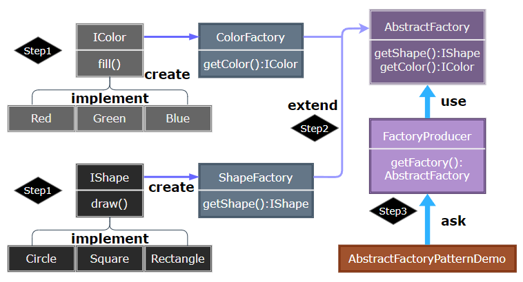

## Abstract Factory Pattern

- [Abstract Factory Pattern](#abstract-factory-pattern)
  - [抽象工厂模式 (Abstract Factory)](#抽象工厂模式-abstract-factory)
  - [模式设计](#模式设计)
    - [模式实现](#模式实现)
    - [抽象工厂优缺点](#抽象工厂优缺点)
  - [案例实现](#案例实现)

---
### 抽象工厂模式 (Abstract Factory)

抽象工厂模式 (Abstract Factory Pattern) 是围绕一个超级工厂创建其他工厂。该超级工厂又称为其他工厂的工厂。这种类型的设计模式属于创建型模式，它提供了一种创建对象的最佳方式。

在抽象工厂模式中，接口是负责创建一个相关对象的工厂，不需要显式指定它们的类。每个生成的工厂都能按照工厂模式提供对象。

> 工厂模式存在的问题

- 不能应对 “不同系列对象” 的变化。比如有不同风格的游戏场景 —— 对应不同风格的道路、房屋、地道。
- 如何解决 —— 使用面向对象的技术来 “封装” 变化点。
- 解决思路：封装变化点 —— 哪里变化，封装哪里。潜台词：如果没有变化，当然不需要额外的封装。

> **意图**

提供一个创建一系列相关或相互依赖对象的接口，而无需指定它们具体的类。**主要解决接口选择的问题**。

> **动机**

在软件系统中，经常面临着 “一系列相互依赖的对象” 的创建工作；同时，由于需求的变化，往往存在更多系列对象的创建工作。

如何应对这种变化？如何绕过常规的对象创建方法 (new)，提供一种 “封装机制” 来避免客户程序和这种 “多系列具体对象创建工作” 的紧耦合?

> **适用性**

- 一个系统要独立于它的产品的创建、组合和表示时。
- 一个系统要由多个产品系列中的一个来配置时。
- 当要强调一系列相关的产品对象的设计以便进行联合使用时。
- 当提供一个产品类库时，只想显示它们的接口而不是实现时。

>---
### 模式设计

> **Abstract Factory 抽象工厂设计示意**

  

> **参与者**

- AbstractFactory：声明一个创建抽象产品对象的操作接口。
- ConcreteFactory：实现创建具体产品对象的操作。
- AbstractProduct：为一类产品对象对应声明一个接口。
- ConcreteProduct：定义一个将被相应的具体工厂创建的产品对象，实现 AbstractProduct 接口。
- Client：仅使用由 AbstractFactory 和 AbstractProduct 类声明的接口。

#### 模式实现

1. 将工厂作为单件：一个产品系列只需要一个 ConcreteFactory 的实例，可使用 Singleton 单例模式。
2. 创建产品：AbstractFactory 只负责创建产品的接口，创建产品是由 ConcreteFactory 子类实现，可使用 Factory Method 工厂模式或 Prototype。
3. 定义可扩展的工厂：增加一个新的产品需求可能要求改变 AbstractFactory 的接口形式与其相关的类，一种灵活的方式可以给创建对象的操作增加一个参数，该参数指定将被创建对象的种类。

> **设计要点**

1. 如果没有应对 “多系列对象构建” 的需求变化，则没有必要使用 AbstractFactory 模式，这时候使用简单工厂模式完全可以。
2. “系列对象” 指的是这些对象之间有相互依赖、或作用的关系，例如游戏开发场景中的 “道路” 与 "房屋” 的依赖，“道路” 与 “地道” 的依赖。
3. AbstractFactory 模式主要在于应对 “新系列” 的需求变动。其缺点在于难以应对 “新对象” 的需求变动。
4. AbstractFactory 模式经常和 Factory Method 模式共同组合来应对 “对象创建” 的需求变化。

#### 抽象工厂优缺点

- 抽象工厂分离了具体的类：一个工厂封装创建产品对象的责任和过程，将客户与类的实现分离；客户通过抽象工厂提供的接口操纵实例。
- 使得易于交换产品系列：抽象工厂创建了一个完整的产品系列，只需改变具体的工厂即可使用不同的产品配置。
- 有利于产品的一致性：当一个系列中的产品对象被设计成一起工作时，一个应用一次只能使用同一个系列中的对象。
- 难以支持新种类的产品：难以扩展抽象工厂以生成新种类的产品。AbstractFactory 接口确定了可以被创建的产品的集合，支持新产品需要扩展该工厂接口，这将改变 AbstractFactory 类及其子类的结构。

>---
### 案例实现

绘制一个图形，这个图形有特定形状和特定的颜色组合。首先创建 IColor 和 IShape 接口和实现这些接口的实体类，以及用于生产这些产品的简单工厂。然后创建抽象工厂类 AbstractFactory，用来生产组合产品和定义抽象操作。最后构造一个生成器类 FactoryProducer，为抽象工厂提供具体工厂类。

AbFactoryPatternDemo 中，演示用 FactoryProducer 来获取 AbstractFactory 对象。

> **案例示意**

  

- **Step1**：构建 Color 与 Shape 相关抽象对象与实体类，以及对应产品的简单工厂。
- **Step2**：构建 Abstract 工厂和专门的产品工厂用于生成产品类实体。
- **Step3**：可以构建一个组合枚举，将多个组合工厂合并到 FactoryProducer 中，根据需求提供不同的 AbstractFactory 实体对象。

> **代码实现**

1. [C# 实现](../../_DP_04_程序参考/DesignPatterns%20For%20CSharp/Creational%20Patterns/Abstract%20Factory/AbstractFactory.cs)

2. ...

---