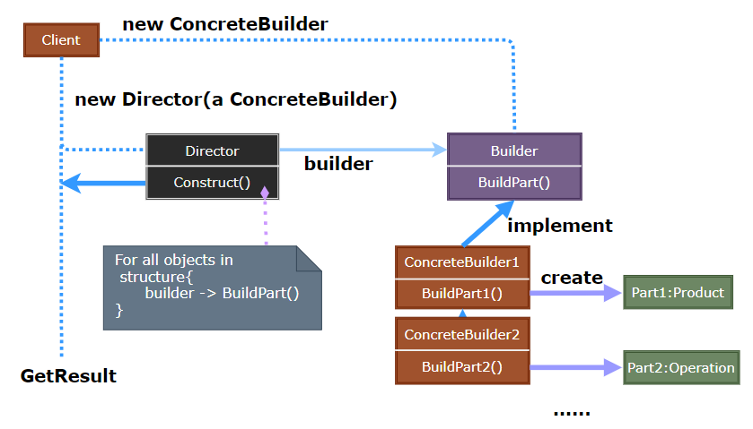
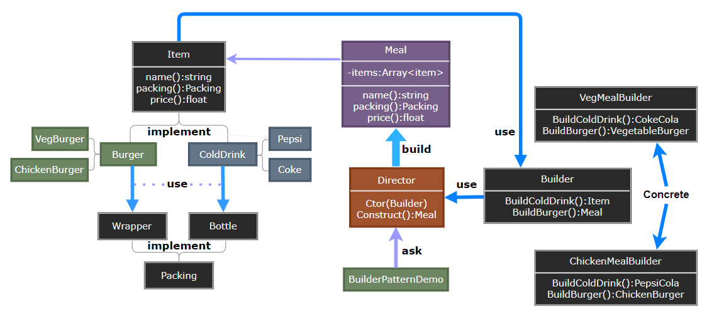

## Builder Pattern

- [Builder Pattern](#builder-pattern)
  - [建造者模式 (Builder)](#建造者模式-builder)
  - [模式设计](#模式设计)
    - [模式实现](#模式实现)
    - [建造者模式优缺点](#建造者模式优缺点)
  - [案例实现](#案例实现)

---
### 建造者模式 (Builder)

建造者模式 (Builder Pattern) 使用多个简单的对象一步一步构建成一个复杂的对象。这种类型的设计模式属于创建型模式，它提供了一种创建对象的最佳方式。

一个 Builder 类会一步一步构造最终的对象。该 Builder 类是独立于其他对象的。

> **意图**

**将一个复杂的构建与其表示相分离，使得同样的构建过程可以创建不同的表示**。

> **动机**

在软件系统中，有时候而临着 “一个复杂对象” 的创建工作，其通常由各个部分的子对象用一定的算法构成；由于需求的变化，这个复杂对象的各个部分经常面临着剧烈的变化，但是将它们组合在一起的算法却相对稳定。

如何应对这种变化? 如何提供一种 “封装机制” 来隔离出 “复杂对象的各个部分” 的变化，从而保持系统中的 “稳定构建算法” 不随着需求改变而改变?

> **适用性**

- 当创建复杂对象的算法应该独立于该对象的组成部分以及它们的装配方式时。
- 当构造过程必须允许被构造的对象有不同的表示时。

>---
### 模式设计

> **Builder 建造者设计示意**

  

> **参与者**

- Builder：为创建一个 Product 对象的各个部件指定抽象接口。
- ConcreteBuilder：实现 Builder 的接口以构造和装配该产品的各个部件，定义并明确它所创建的表示，提供一个使用 Builder 接口的对象。
- Director：构造一个使用 Builder 接口的对象。
- Product：表示被构造的复杂对象，ConcreteBuilder 创建该产品的内部表示并定义它的装配过程，product 包含定义组成部件的类，包括将这些部件装配成最终产品的接口。

#### 模式实现

通常有一个抽象的 Builder 类为 Director 可能要求创建的每一个构建定义一个操作，这些操作默认情况下什么都不做；而一个 ConcreteBuilder 类对它感兴趣创建的构件重定义这些操作。

常见的一些问题：
1. 装配和构造接口：Builder 逐步的构造它们的产品。
2. 产品没有抽象类：有具体 Builder 生成的产品，产品的表示可能相差很大，以至于给不同的产品以公共父类没有太大意义。
3. 在 Builder 中缺省的方法为空：客户只需要对自身感兴趣的操作进行重定义。

> **实现效果**

1. 建造者模式可以改变一个产品的内部表示：Builder 对象提供给 Director 一个构造产品的抽象接口，当要改变产品内部表示时只需定义一个新的 Builder。
2. 将构造代表与表示代码分开：Builder 通过封装一个复杂对象的创建和表示方式提高了对象的模块性。
3. 使得设计可对构造过程进行更精密的控制：Builder 是在 Director 的控制下一步一步构造产品的。

> **设计要点**

1. Builder 模式主要用于 “分步骤构建一个复杂的对象” 在这其中 “分步骤” 是一个稳定的算法，而复杂对象的各个部分则经常变化。
2. 变化点在哪里，封装哪里 一 Builder 模式主要在于应对 “复杂对象各个部分” 的频繁需求变动。其缺点在于难以应对 “分步骤构建算法” 的需求变动。
3. AbstractFactory 与 Builder 相似，都可以创建复杂对象。主要的区别是 Builder 着重于一步步构造一个复杂对象，AbstractFactory 着重于多个系列的产品对象；Builder 在最后一步返回产品，AbstractFactory 的产品是立即返回的。
4. Composite 通常是用 Builder 生成的。

#### 建造者模式优缺点

> 优点：
  - 建造者独立，易扩展。 
  - 便于控制细节风险。

> 缺点： 
  - 产品必须有共同点，范围有限制。 
  - 内部变化复杂，会有很多的建造类。

>---
### 案例实现

我们假设一个快餐店的商业案例，其中，一个典型的套餐可以是一个汉堡 (Burger) 和一杯冷饮 (Cold drink)。汉堡 (Burger) 可以是素食汉堡 (Veg Burger) 或鸡肉汉堡 (Chicken Burger)，它们是包在纸盒中。冷饮 (Cold drink) 可以是可口可乐 (coke) 或百事可乐 (pepsi)，它们是装在瓶子中。

> **案例示意**

  

- **Step1**: 我们将创建一个表示食物条目 (比如汉堡和冷饮) 的 Item 接口和实现 Item 接口的实体类，以及一个表示食物包装的 Packing 接口和实现 Packing 接口的实体类，汉堡是包在纸盒中，冷饮是装在瓶子中。
- **Step2**: 然后我们创建一个 Meal 类，带有 Item 的 ArrayList 和一个通过结合 Item 来创建不同类型的 Meal 对象的 MealBuilder。BuilderPatternDemo，我们的演示类使用 MealBuilder 来创建一个 Meal。

> **代码实现**

1. [C# 实现](../../_DP_04_程序参考/DesignPatterns%20For%20CSharp/Creational%20Patterns/Builder/Builder.cs)
2. ...

---