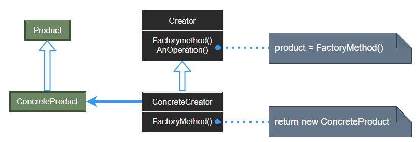

## Factory Pattern

- [Factory Pattern](#factory-pattern)
  - [工厂模式 (Factory Method)](#工厂模式-factory-method)
  - [模式设计](#模式设计)
    - [模式实现](#模式实现)
    - [工厂模式优缺点](#工厂模式优缺点)
  - [案例实现](#案例实现)

---
### 工厂模式 (Factory Method)

工厂模式 (Factory Method Pattern) 是面向对象编程中最常用的设计模式之一。这种类型的设计模式属于创建型模式，它提供了一种创建对象的最佳方式。

在工厂模式中，我们在创建对象时不会对客户端暴露创建逻辑，并且是通过使用一个共同的接口来指向新创建的对象。

> **从耦合关系谈起**

- 耦合关系直接决定着软件面对变化时的行为
- 模块与模块之间的紧耦合使得软件面对变化时，相关的模块都要随之更改

  

- 模块与模块之间的松耦合使得软件面对变化时，一些模块更容易被替换或者更改，但其他模块保持不变

  

> **意图**

定义一个用于创建对象的接口，让其子类决定实例化哪一个类，Factory Method 使一个类的实例化延迟到子类进行。**主要解决接口选择的问题**。

> **动机**

在软件系统中，经常面临着 “某个对象” 的创建工作；由于需求的变化，这个对象的具体实现经常面临着剧烈的变化，但是它却拥有比较稳定的接口。(例如床需要床单，但是床单可以经常换，但是床不换)。
  
如何应对这种变化？如何提供一种 “封装机制” 来隔离出 “这个易变对象” 的变化，从而保持系统中 “其他依赖该对象的对象” 不随着需求改变而改变? (只改变床单而不需要修改床的变化)。

> **适用性**

可以使用 Factory Method 情况：

- 当一个类不知道它所必须创建的对象的类的时候。
- 当一个类希望由它的子类来指定它所创建的对象的时候。
- 当类将创建对象的职责委托给多个帮助子类中的某一个，并且希望将某一个帮助子类是代理者这一信息局部化的时候。

>---
### 模式设计

> **Factory 工厂模式设计示意**

  

> **参与者**

- Product：定义工厂方法所创建的对象的接口。
- ConcreteProduct：实现 Product 接口。
- Creator：声明工厂方法，该方法返回一个 Product 类型的对象。Creator 也可定义一个工厂方法的缺省实现，它返回一个缺省的 ConcreteProduct 对象；通过调用工厂方法以创建一个 Product 对象。Creator 依赖于它的子类来定义工厂方法，所以它返回一个适当的 ConcreteProduct 实例。
- ConcreteCreator：重定义工厂方法以返回一个 ConcreteProduct 实例。

#### 模式实现

Factory Method 主要有两种不同的情况：
- Creator 类是一个抽象类并且不提供它所声明的工厂方法的实现，因此需要子类来定义实现。
- Creator 是一个具体的类而且为工厂方法提供一个缺省的实现，用一个独立的操作创建对象，因此子类可以灵活地重定义它们的创建方法，这保证了子类的设计能够在必要时改变父类所实例化的对象的类。

参数化工厂方法：工厂方法采用一个标识被创建对象种类的参数，所有对象将共享 Product 接口；一旦类标识符被读取后，这个框架将调用 Creator，并在构造器中根据参数进行查询并实例化它的映射对象。

注意事项：作为一种创建类模式，在任何需要生成复杂对象的地方，都可以使用工厂模式。而简单对象，特别是只需要通过 new 就可以完成创建的对象，无需使用工厂模式。如果使用工厂模式，就需要引入一个工厂类，会增加系统的复杂度。

> **实现效果**

1. 为子类提供挂钩：用工厂方法在一个类的内部创建对象通常比直接创建对象更灵活。
2. 连接平行的类层次：当一个类将它的一些职责委托给一个独立的类的时候，就产生了平行类层次，使得原有的层次结构变得更容易扩展和复用。

> **设计要点**

1. Factory Method 模式主要用于隔离类对象的使用者和具体类型之间的耦合关系。面对一个经常变化的具体类型，紧耦合关系会导致软件的脆弱。
2. Factory Method 模式通过面向对象的手法，将所要创建的具体对象工作延迟到子类，从而实现一种扩展 (而非更改) 的策略，较好地解决了这种紧耦合关系。
3. Factory Method 模式解决 “单个对象” 的需求变化，AbstractFactory 模式解决 “系列对象” 的需求变化，Builder 模式解决 “对象部分” 的需求变化。
4. Factory Method 模式表示将对象的变种通过一个入口 (生产的工厂) 进入，进入的钥匙则是具体的对象变种 (或者说是抽象对象的继承子类，即汽车下面的大众车，丰田车)，而整体程序的主框架不会发生大的改变 (对车的性能测试功能并没有进行太大的改动)。

从分支易变到拓展
- 通过配置表的方式实现对象的变化，而解析配置表的方法就是构建对象变体的过程，但是配置表的格式要提前约定，才能保证解析配置到数据分配生产具体对象的过程不需要太大的变动。

#### 工厂模式优缺点

- 优点： 
  - 一个调用者想创建一个对象，只要知道其名称就可以了。 
  - 扩展性高，如果想增加一个产品，只要扩展一个工厂类就可以。 
  - 屏蔽产品的具体实现，调用者只关心产品的接口。

+ 缺点：
  - 每次增加一个产品时，都需要增加一个具体类和对象实现工厂，使得系统中类的个数成倍增加，在一定程度上增加了系统的复杂度，同时也增加了系统具体类的依赖。这并不是什么好事。

>---
### 案例实现

我们将创建一个 IShape 接口和实现 Shape 接口的实体类。下一步是定义工厂类 ShapeFactory。FactoryPatternDemo 类使用 ShapeFactory 来获取 Shape 对象。它将向 ShapeFactory 传递信息 (CIRCLE / RECTANGLE / SQUARE) ，以便获取它所需对象的类型。

> **案例示意**

  

- **Step1**: 创建 IShape 接口与 circle, rectrangle, square 等 IShape 的实体类。
- **Step2**: 创建一个工厂, 生成基于给定信息的实体类的对象。
- **Step3**: 使用该工厂, 通过传递类型信息获取实体类的对象。

> **代码实现**

1. [C# 实现](../../_DP_04_程序参考/DesignPatterns%20For%20CSharp/Creational%20Patterns/Factory%20Method/Creator.cs)
2. ...

---