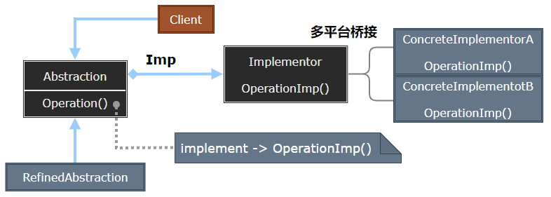
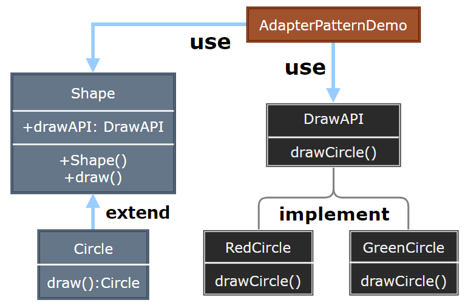

## Bridge Pattern

- [Bridge Pattern](#bridge-pattern)
	- [桥接模式 (Bridge)](#桥接模式-bridge)
	- [模式设计](#模式设计)
		- [模式实现](#模式实现)
		- [桥接模式优缺点](#桥接模式优缺点)
	- [案例实现](#案例实现)
	- [相关模式比较](#相关模式比较)

---
### 桥接模式 (Bridge) 

抽象不应该依赖于实现细节，实现细节应该依赖于抽象。

假如我们需要开发一个同时支持 PC 和手机的坦克游戏，游戏在 PC 和手机上功能都一样，都有同样的类型，面临同样的功能需求变化，比如坦克可能有多种不同的型号: T50、T75、T90 对于其中的坦克设计，我们可能很容易设计出来一个 Tank 的抽象基类，然后各种不同型号的 Tank 继承自该类。但是 PC 和手机上的图形绘制、声效、操作等实现完全不同 —— 因此对于各种型号的坦克，都要提供各种不同平台上的坦克实现。

这样的设计会带来很多问题：有很多重复代码，类的结构过于复杂，难以维护，最致命的是引入任何新平台，比如在 TV 上的 Tank 游戏，都会让整个类层级结构复杂化。

> **意图**

- 意图：将抽象部分与实现部分分离，使它们都可以独立地变化。
- 主要解决：在有多种可能会变化的情况下，用继承会造成类爆炸问题，扩展起来不灵活。
- 何时使用：实现系统可能有多个角度分类，每一种角度都可能变化。
- 如何解决：把这种多角度分类分离出来，让它们独立变化，减少它们之间耦合。

> **动机**

思考上述问题的症结：事实上由于 Tank 类型的固有逻辑，使得 Tank 类型具有了两个变化的维度：一个变化的维度为 “平台的变化”，一个变化的维度为 “型号的变化”。

如何应对这种 “多维度的变化”? 如何利用面向对象技术来使得 Tank 类型可以轻松地沿着 “平台” 和 “型号” 两个方向变化，而不引入额外的复杂度?

> **适用性**

使用 Bridge 模式的几种情况：
- 当不希望在抽象和它的实现部分之间有一个固定的绑定关系。
- 类的抽象以及它的实现都应该可以通过生成子类的方法加以扩充。
- 对一个抽象的实现部分的修改应对客户不产生影响，客户代码不必重新编译。
- 对客户完全隐藏抽象的实现部分。
- 将一个对象分成抽象与实现两个部分。
- 在多个对象之间共享实现。

>---

### 模式设计

> **桥接模式**

  

> **参与者**

- Abstraction：定义抽象类的接口，维护一个指向 Implementor 类型对象的指针。Abstraction 将 Client 请求转发给它的 Implementor 对象。
- RefinedAbstraction：扩充由 Abstraction 定义的接口。
- Implementor：定义实现类的接口，仅提供基本操作，可以不与 Abstraction 的接口完全一至，Abstraction 接口定义基于基本操作较高层次的操作。
- ConcreteImplementor：实现 Implementor 定义的接口。

#### 模式实现

Bridge 需要注意的问题：

1. 仅有一个 Implementor：当仅有一个实现的时候，无须创建一个抽象的 Implementor，这种情况下 Abstraction 与 Implementor 之间有一种一对一的关系。
2. 创建正确的 Implementor 对象：Abstraction 知道所有的 ConcreteImplementor 类时，它可以在其构造器中对其中一个类进行实例化，也可以通过传递参数决定实例化哪一个类。
3. 采用多重继承机制：使用多重继承机制将抽象接口和它的实现部分结合起来。
4. 一个类存在两个独立变化的维度，且这两个维度都需要进行扩展。

注意事项：对于两个独立变化的维度，使用桥接模式再适合不过了。

> **设计要点**

1. Bridge 模式使用 “对象间的组合关系” 解耦了抽象和实现之间固有的绑定关系，使得抽象 (Shape) 和实现 (DrawAPI) 可以沿着各自的维度来变化。
2. 所谓抽象和实现沿着各自纬度的变化，即 “子类化” 它们，比如不同的 Shape (Circle 等) 子类，和不同的 DrawAPI 子类。得到各个子类之后，便可以任意组合它们，从而获得不同颜色的图形。
3. Bridge 模式有时候类似于多继承方案，但是多继承方案往往违背单一职责原则(即一个类只有一个变化的原因)，复用性比较差。Bridge 模式是比多继承方案更好的解决方法。(作为桥接成为类的成员或参数)。
4. Bridge 模式的应用一般在 “两个非常强的变化维度”，有时候即使有两个变化的维度，但是某个方向的变化维度并不剧烈——换言之两个变化不会导致纵横交错的结果，并不一定要使用 Bridge 模式。

#### 桥接模式优缺点

> 优点

- 分离接口及其实现部分：抽象类的实现可以在运行时刻进行配置，一个对象可以在运行时刻改变它的实现。
- 提高可扩充性：可以独立地对 Abstraction 与 Implementor 层次结构进行扩充。
- 实现细节对客户透明：可以对客户隐藏实现细节。

> 缺点：
 
- 桥接模式的引入会增加系统的理解与设计难度，由于聚合关联关系建立在抽象层，要求开发者针对抽象进行设计与编程。

>---
### 案例实现

我们有一个作为桥接实现的 DrawAPI 接口和实现了 DrawAPI 接口的实体类 RedCircle、GreenCircle。

Shape 是一个抽象类，将使用 DrawAPI 的对象。BridgePatternDemo，我们的演示类使用 Shape 类来画出不同颜色的圆。

> **案例示意**
 
  

> **代码实现**

1. [C# 实现](../../_DP_04_程序参考/DesignPatterns%20For%20CSharp/Structural%20Patterns/Bridge/Implementor.cs)
2. ...
   
>---
### 相关模式比较

- AbstractFactory 可以创建和配置一个特定的 Bridge 对象。
- Adapter 用于帮助无关类的协同工作，通常在系统设计完成后才被使用；Bridge 则是在系统开始时就被使用，它使得抽象接口和实现部分独立进行改变。

---