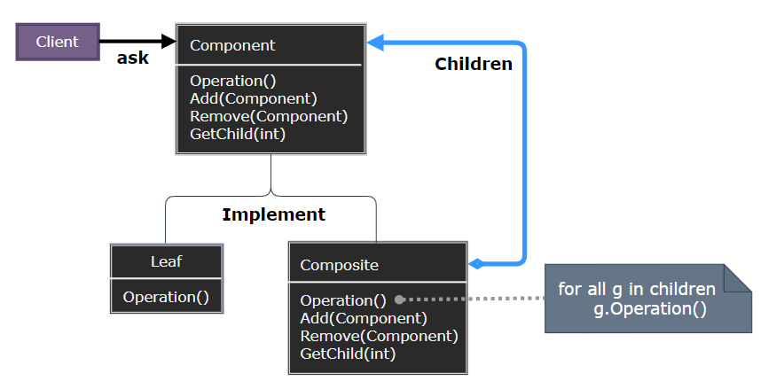
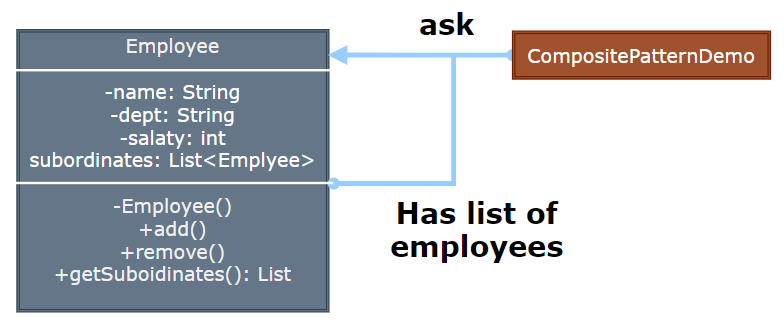

## Composite Pattern

- [Composite Pattern](#composite-pattern)
	- [组合模式 (Composite)](#组合模式-composite)
	- [模式设计](#模式设计)
		- [模式实现](#模式实现)
		- [组合模式优缺点](#组合模式优缺点)
	- [案例实现](#案例实现)
	- [相关模式](#相关模式)

---
### 组合模式 (Composite)

组合模式 (Composite Pattern)，又叫部分整体模式，是用于把一组相似的对象当作一个单一的对象。组合模式依据树形结构来组合对象，用来表示部分以及整体层次。这种类型的设计模式属于结构型模式，它创建了对象组的树形结构。

这种模式创建了一个包含自己对象组的类。该类提供了修改相同对象组的方式。

> 对象容器的问题 (俄罗斯套娃) 

在面向对象系统中，我们常会遇到一类具有 “容器” 特征的对象 —— 即它们在充当对象的同时，又是其他对象的容器。

> **意图**

意图：将对象组合成树形结构以表示 “部分 — 整体”，Composite 模式使得用户对单个对象和组合对象的使用具有一致性。

主要解决：它在我们树型结构的问题中，模糊了简单元素和复杂元素的概念，客户程序可以向处理简单元素一样来处理复杂元素，从而使得客户程序与复杂元素的内部结构解耦。

> **动机**

客户代码过多地依赖于对象容器复杂的内部实现结构，对象容器内部实现结构 (而非抽象接口) 的变化将引起客户代码的频繁变化，带来了代码的维护性、扩展性等弊端。

如何将 “客户代码与复杂的对象容器结构” 解耦？让对象容器自己来实现自身的复杂结构，从而使得客户代码就像处理简单对象一样来处理复杂的对象容器?

> **适用性**

- 当想要表示对象的部分—整体层次结构。
- 希望用户忽略组合对象与单个对象的不同，用户将统一地使用组合结构中的所有对象。

>---
### 模式设计

> **组合模式**

  

> **参与者**

- Component：为组合中的声明接口，在适当的时候，实现所有类的共有接口的缺省行为；声明一个接口用于访问和管理 Component 的子组件；在递归结构中定义一个接口，用于访问一个父组件，并在合适的情况下实现它。
- Leaf：在组合中表示叶节点对象，叶节点没有子节点；在组合中定义图元对象的行为。
- Composite：定义子部件的行为；存储子部件；在 Component 接口中实现与子部件有关的操作。
- Client：通过 Component 接口操纵组合部件的对象。

用户使用 Component 类接口与组合结构中的对象进行交互；叶节点将直接处理请求；Composite 将请求发送给它的子部件，在转发前/后可以执行一些辅助操作。

#### 模式实现

使用 Composite 需要考虑的问题：

1. 显式的父部件引用：保持从子部件到父部件的引用能简化组合结构的遍历和管理。
2. 共享组件的问题：子部件可以将一些状态存储在外部，而不需要将状态或请求发送给父部件，可以减少对贮存的需求，实现共享组件。
3. 最大化 Component 接口：Composite 应为 Leaf 与 Composite 类尽可能的定义一些公共操作；子部件可以对它们进行重定义。
4. 声明管理子部件的操作：在 Composite 类中定义管理子部件的方法具有良好的安全性，但损失了透明性，Leaf 与 Composite 具有不同的接口；而提供透明性的唯一方法是在 Component 中定义缺省 Add 与 Remove 操作，但在 Leaf 中操作 Add 可能会引入错误。
5. Component 是否应该实现一个 Component 列表：在 Component 类中将子集合定义为一个实例变量，对于 Leaf 来说会导致空间浪费。
6. 子部件排序：Composite 子部件的顺序必须反映程序结构，在考虑子部件顺序的时候必须为设计对子节点的访问与管理接口。
7. 使用高速缓冲存储改善性能：当对一个组合频繁的遍历与查找，Composite 可以缓冲存储对它的子节点的访问与查找遍历；当一个组件发生变化时，它的父节点原先缓冲存储的信息变得无效，需要定义一个接口来通知组合组件所缓冲存储的信息无效。
8. 应该由谁删除 Component：当一个 Composite 被销毁时，最好由 Composite 负责删除其子节点。
9. 存储组件最好用哪一种数据结构：可以使用连接列表、树、数组和 hash 表；数据结构的选择取决于效率。

注意事项：定义时为具体类。

> **设计要点**

- Composite 模式采用树形结构来实现普遍存在的对象容器，从而将 “一对多” 的关系转化为 “一对一” 的关系，使得客户代码可以一致地处理对象和对象容器，无需关心处理的是单个的对象，还是组合的对象容器。
- 将 “客户代码与复杂的对象容器结构” 解耦是 Composite 模式的核心思想，解耦之后，客户代码将与纯粹的抽象接口——而非对象容器的复内部实现结构——发生依赖关系，从而更能 “应对变化”。
- Composite 模式中，是将 “Add 和 Remove 等和对象容器相关的方法” 定义在 “表示抽象对象的 Component 类” 中，还是将其定义在 “表示对象容器的 Composite 类” 中，是一个关乎 “透明性” 和 “安全性” 的两难问题，需要仔细权衡。这里有可能违背面向对象的 “单一职责原则”，但是对于这种特殊结构，这又是必须付出的代价。ASP.NET 控件的实现在这方面为我们提供了一个很好的示范。
- Composite 模式在具体实现中，可以让父对象中的子对象反向追朔：如果父对象有频繁的遍历需求，可使用缓存技巧来改善效率。

#### 组合模式优缺点

> 优点

- 定义了包含基本对象和组合对象的类层次结构。
- 简化客户代码。
- 使得更容易增加新类型的组件。
- 高层模块调用简单，节点自由增加。

> 缺点
 
- 在使用组合模式时，其叶子和树枝的声明都是实现类，而不是接口，违反了依赖倒置原则。

>---
### 案例实现

我们有一个类 Employee，该类被当作组合模型类。CompositePatternDemo，我们的演示类使用 Employee 类来添加部门层次结构，并打印所有员工。

> **案例示意**

  

> **代码实现**

1. [C# 实现](../../_DP_04_程序参考/DesignPatterns%20For%20CSharp/Structural%20Patterns/Composite/Composite.cs)
2. ...

>---
### 相关模式

- 通常部件与父部件连接用于 Responsibility of Chain 模式。
- Decorator 经常与 Composite 一起使用，一般它们会有一个公共的父类，所以装饰必须支持具有 Add、Remove 和 GetChild 操作的 Component 接口。
- Flyweight 共享组件，但不能引用其父部件。
- Iterator 可用来遍历 Composite。
- Visitor 将本来应分布在 Composite 与 Leaf 类中的操作和行为局部化。

---