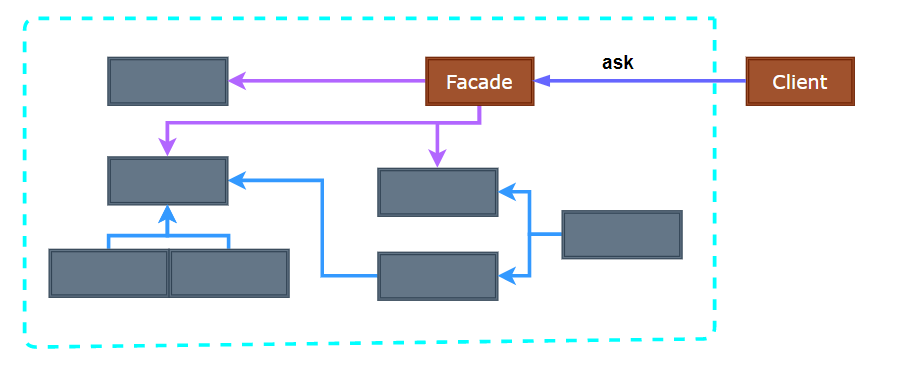
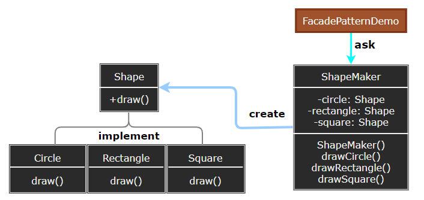

## Facade Pattern

- [Facade Pattern](#facade-pattern)
	- [外观模式 (Facade)](#外观模式-facade)
	- [模式设计](#模式设计)
		- [模式实现](#模式实现)
		- [外观模式优缺点](#外观模式优缺点)
	- [案例实现](#案例实现)
	- [相关模式](#相关模式)

---
### 外观模式 (Facade)

外观模式 (Facade Pattern) 隐藏系统的复杂性，并向客户端提供了一个客户端可以访问系统的接口。这种类型的设计模式属于结构型模式，它向现有的系统添加一个接口，来隐藏系统的复杂性。

这种模式涉及到一个单一的类，该类提供了客户端请求的简化方法和对现有系统类方法的委托调用。

> 系统的复杂度

- 假设我们需要开发一个坦克模拟系统用于模拟坦克车在各种作战环境中的行为，其中坦克系统由引擎、控制器、车轮、车身等各子系统构成。
- 系统内部与外部相耦合, 复杂度提高, 抵抗变化的能力较低, 稳定性较差。

> **意图**

- 意图：将一个系统划分为若干个子系统有利于降低系统的复杂性，使子系统间的通信和相互依赖关系达到最小。为子系统中的一组接口提供一个一致的界面，Facade 模式定义了一个高层接口，这个接口使得这一子系统更加容易使用。
- 主要解决：降低访问复杂系统的内部子系统时的复杂度，简化客户端与之的接口。
- 何时使用：客户端不需要知道系统内部的复杂联系，整个系统只需提供一个 "接待员" 即可；定义系统的入口。
- 如何解决：客户端不与系统耦合，外观类与系统耦合。(内部耦合, 内部提供接口与外部耦合)

> **动机**

系统内部与外部相耦合的方案, 问题在于组件的客户和组件中各种复杂的子系统有了过多的耦合，随着外部客户程序和各子系统的演化，这种过多的耦合面临很多变化的挑战。

如何简化外部客户程序和系统间的交互接口？如何将外部客户程序的演化和内部子系统的变化之间的依赖相互解耦?

> **适用性**

使用 Facade 的情况：
- 当要为一个复杂子系统提供一个简单接口时。
- 客户程序与抽象类的实现部分之间存在着很大的依赖性，引入 Facade 接口将子系统与客户以及其他的子系统分离，提高子系统的独立性与移植性。
- 当需要构建一个层次结构的子系统时，使用 Facade 定义子系统中每层的入口点。

>---
### 模式设计

> **外观模式**

  

> **参与者**

- Facade：知道哪些子系统类负责处理请求；将客户的请求代理给适当的子系统对象。
- Subsystem Classes：实现子系统的功能，处理由 Facade 对象指派的任务，且没有 Facade 的任何相关信息与指针。

使用 Facade 的客户程序不直接访问子系统。客户程序通过发送请求给 Facade 的方式与子系统通信。

#### 模式实现

Facade 需要注意的地方：
1. 降低客户—子系统之间的耦合度：用抽象类实现 Facade 而它的具体子类对应于不同的子系统实现。
2. 公共子系统类与私有子系统类：子系统的公共接口包含所有客户成宿可以访问的类；私有接口仅用于子系统进行扩充。

注意事项：在层次化结构中，可以使用外观模式定义系统中每一层的入口。

> **设计要点**

1. 从客户程序的角度来看，Facade 模式不仅简化了整个组件系统的接口，同时对于组件内部与外部客户程序来说，从某种程度上也达到了一种 “解耦” 的效果——内部子系统的任何变化不会影响到 Facade 接口的变化。
2. Facade 设计模式更注重从架构的层次去看整个系统，而不是单个类的层次。Facade 很多时候更是一种架构设计模式。
3. 注意区分 Facade 模式、Adapter 模式、Bridge 模式与 Decorator 模式。Facade 模式注重简化接口，Adapter 模式注重转换接口，Bridge 模式注重分离接口 (抽象)与其实现，Decorator 模式注重稳定接口的前提下为对象扩展功能。

#### 外观模式优缺点

> 优点

- Facade 对客户屏蔽子系统组件，减少了客户处理的对象的数目。
- 实现了子系统与客户之间的松耦合关系，提高了灵活性与安全性。

> 缺点

- 不符合开闭原则，如果要改东西很麻烦，继承重写都不合适。

>---
### 案例实现

> **案例示意**

  

- **Step1**: 我们将创建一个 Shape 接口和实现了 Shape 接口的实体类。下一步是定义一个外观类 ShapeMaker。
- **Step2**: ShapeMaker 类使用实体类来代表用户对这些类的调用。FacadePatternDemo，我们的演示类使用 ShapeMaker 类来显示结果。

> **代码示意**

1. [C# 实现](../../_DP_04_程序参考/DesignPatterns%20For%20CSharp/Structural%20Patterns/Facade/Facade.cs)
2. ...

>---
### 相关模式

- AbstractFactory 可以与 Facade 一起使用以提供一个接口，用来以一种子系统独立的方式创建子系统对象。
- Mediator 与 Facade 相似之处在于，它抽象一些已有类的功能；但 Mediator 是对同事之间的任意通讯进行抽象，Facade 仅对子系统对象的接口进行抽象。
- 通常仅需要一个 Facade 对象，也属于 Singleton。

---