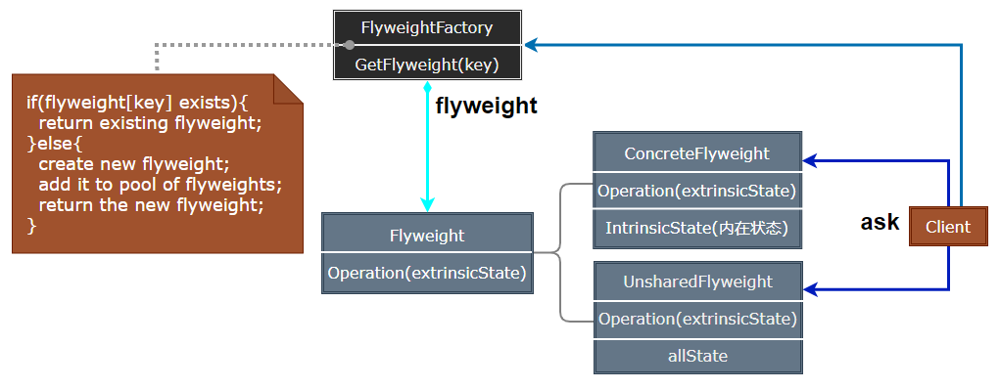
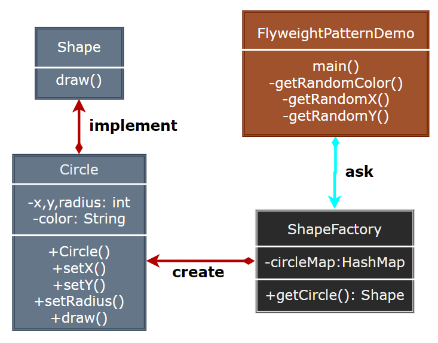

## Flyweight Pattern

- [Flyweight Pattern](#flyweight-pattern)
  - [享元模式 (Flyweight)](#享元模式-flyweight)
  - [模式设计](#模式设计)
    - [模式实现](#模式实现)
    - [享元模式优缺点](#享元模式优缺点)
  - [案例实现](#案例实现)
  - [相关模式](#相关模式)

---
### 享元模式 (Flyweight)

享元模式 (Flyweight Pattern) 主要用于减少创建对象的数量，以减少内存占用和提高性能。这种类型的设计模式属于结构型模式，它提供了减少对象数量从而改善应用所需的对象结的方式。

享元模式尝试重用现有的同类对象，如果未找到匹配的对象，则创建新对象。

> 面向对象的代价

- 面向对象很好地解决了系统抽象性的问题，同时在大多数情况下，也不会损及系统的性能。
- 但是，在某些特殊的应用中下，由于对象的数量太大，采用面向对象会给系统带来难以承受的内存开销。比如图形应用中的图元等对象、字处理应用中的字符对象等。

> **意图**

- 意图：运用共享技术有效地支持大量细粒度的对象。
- 主要解决：在有大量对象时，有可能会造成内存溢出，我们把其中共同的部分抽象出来，如果有相同的业务请求，直接返回在内存中已有的对象，避免重新创建。
- 何时使用： 
  1. 系统中有大量对象。
  2. 这些对象消耗大量内存。
  3. 这些对象的状态大部分可以外部化。
  4. 这些对象可以按照内蕴状态分为很多组，当把外蕴对象从对象中剔除出来时，每一组对象都可以用一个对象来代替。 
  5. 系统不依赖于这些对象身份，这些对象是不可分辨的。
- 如何解决：用唯一标识码判断，如果在内存中有，则返回这个唯一标识码所标识的对象。

> **动机**

- 采用纯粹对象方案的问题在于大量细粒度的对象会很快充斥在系统中，从而带来很高的运行时代价——主要指内存需求方面的代价。
- 如何在避免大量细粒度对象问题的同时，让外部客户程序仍然能够透明地使用面向对象的方式来进行操作?

> **适用性**

使用 Flyweight 的几种情景：
- 一个应用程序使用了大量的对象。
- 完全由于使用大量的对象，造成很大的存储开销。
- 对象的大多数状态都可以变为外部状态。
- 如果删除对象的外部状态，那可以用相对较少的共享对象取代很多组对象。
- 应用程序不依赖于对象标识。

>---
### 模式设计

> **享元模式**

  

> **参与者**

- Flyweight：描述一个接口，通过这个接口 flyweight 可以接收并作用于外部状态。
- ConcreteFlyweight：实现 Flywight 接口，并为内部状态 (若存在) 增加存储空间；ConcreteFlyweight 对象必须是共享的，且其存储的状态必须是内部的。
- UnsharedConcreteFlyweight：并非所有的 Flyweight 子类都需要被共享，UnsharedCreconteFlyweight 对象通常将 ConcreteFlyweight 对象作为子节点。
- FlyweightFactory：创建并管理 Flyweight 对象；确保合理地共享 Flyweight。
- Client：维持一个对 Flyweight 的引用；计算或存储一个或多个 Flyweight 的外部状态。

Flyweight 执行时所需的状态必是内部的或外部的，用户不应该直接对 ConcreteFlyweight 类进行实例化。

#### 模式实现

注意状态：
1. 删除外部状态：理想的状态是，外部状态可以由一个单独的对象结构计算得到，且该结构的存储要求非常小。
2. 管理共享对象：共享意味着某种形式的引用计数和垃圾回收，当一个 Flyweight 不再使用时，可以回收它的存储空间。

> **设计要点**

1. 面向对象很好地解决了抽象性的问题，但是作为一个运行在机器中的程序实体，我们需要考虑对象的代价问题。Flyweight 设计模式主要解决面向对象的代价问题，一般不触及面向对象的抽象性问题。
2. Flyweight 采用对象共享的做法来降低系统中对象的个数，从而降低细粒度对象给系统带来的内存压力。在具体实现方面，要注意对象状态的处理。
3. 对象的数量太大从而导致对象内存开销加大——什么样的数量才算大？这需要我们仔细的根据具体应用情况进行评估，而不能凭空臆断。

#### 享元模式优缺点

> 对存储节约上的体现

- 由于共享，实例总数减少的数目。
- 对象内部状态的平均数目。
- 外部状态是计算的还是存储的。

> 优点

- 共享的 Flyweight 越多，存储节约也就越多，节约量随共享状态的增多而增大。

> 缺点

- 提高了系统的复杂度，需要分离出外部状态和内部状态，而且外部状态具有固有化的性质，不应该随着内部状态的变化而变化，否则会造成系统的混乱。

>---
### 案例实现

- **Step1**: 我们将创建一个 Shape 接口和实现了 Shape 接口的实体类 Circle。下一步是定义工厂类 ShapeFactory。
- **Step2**: ShapeFactory 有一个 Circle 的 HashMap，其中键名为 Circle 对象的颜色。无论何时接收到请求，都会创建一个特定颜色的圆。ShapeFactory 检查它的 HashMap 中的 circle 对象，如果找到 Circle 对象，则返回该对象，否则将创建一个存储在 hashmap 中以备后续使用的新对象，并把该对象返回到客户端。
- **Step3**: FlyWeightPatternDemo，我们的演示类使用 ShapeFactory 来获取 Shape 对象。它将向 ShapeFactory 传递信息 (red / green / blue/ black / white) ，以便获取它所需对象的颜色。

> **案例示意**

  

> **代码实现**

1. [C# 实现](../../_DP_04_程序参考/DesignPatterns%20For%20CSharp/Structural%20Patterns/Flyweight/Flyweight.cs)
2. ...

>---
### 相关模式

- Flyweight 常与 Composite 结合起来，用共享叶节点的有向无环图实现一个逻辑上的层次结构。
- 一般用 Flyweight 实现 State 与 Strategy 对象。

---