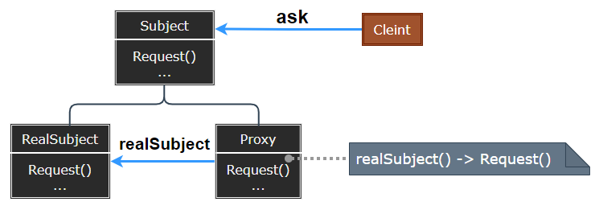
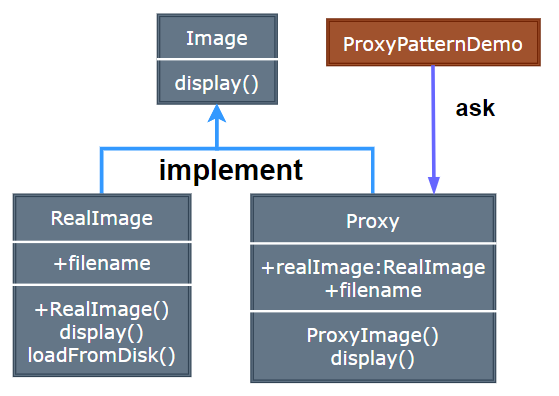

## Proxy Pattern

- [Proxy Pattern](#proxy-pattern)
	- [代理模式 (Proxy)](#代理模式-proxy)
	- [模式设计](#模式设计)
		- [模式实现](#模式实现)
		- [代理模式优缺点](#代理模式优缺点)
	- [案例实现](#案例实现)
	- [相关模式](#相关模式)

---
### 代理模式 (Proxy)

在代理模式 (Proxy Pattern) 中，一个类代表另一个类的功能。这种类型的设计模式属于结构型模式。

在代理模式中，我们创建具有现有对象的对象，以便向外界提供功能接口。

> 直接与间接

人们对于复杂的软件系统常常有一种处理手法, 即增加一层间接层, 从而对系统获得一种更为灵活、满足特定需求的解决方案。

> **意图**

- 意图：为其他对象提供一种代理以控制对这个对象的访问。
- 主要解决：在直接访问对象时带来的问题，
- 何时使用：想在访问一个类时做一些控制。
- 如何解决：增加中间层。
- 关键代码：实现与被代理类组合。

> **动机**

在面向对象系统中，有些对象由于某种原因 (比如对象创建的开销很大，或者某些操作需要安全控制，或者需要进程外的访问等) ，直接访问会给使用者、或者系统结构带来很多麻烦。

如何在不失去透明操作对象的同时来管理/控制这些对象特有的复杂性? 增加一层间接层是软件开发中常见的解决方式。

> **适用性**

可以使用 Proxy 常见情况：
1. 远程代理 (Remote Proxy) ：为一个对象在不同的地址空间提供局部代表。
2. 虚代理 (Virtual Proxy) ：根据需要创建开销很大的对象。
3. 保护代理 (Protection Proxy) ：控制对原始对象的保护。
4. 智能指引 (Smart Reference) ：取代简单的指针，它在访问对象时执行了些附加操作，常用于对指向实际对象的引用计数，对首次访问对象进行存储，访问时以锁定对象以确保其他对象不能修改它。

>---
### 模式设计

> **代理模式**
    
  

> **参与者**

- Proxy：保存一个引用使得代理可以访问实体；提供一个与 Subject 的接口相同的接口，代理就可以替代实体；控制对实体的存取，并可能负责创建和删除它。
- 远程代理：负责对请求及其参数进行编码，并对不同地址空间中的实体发送以编码的请求。
- 虚代理：可以缓存实体的附加信息，以便延时对它的访问。
- 保护代理：检查调用者是否具有实现一个请求所必需的访问权限。
- Subject：定义 RealSubject 与 Proxy 的公用接口。
- RealSubject：定义 Proxy 所代表的实体。

代理根据其种类，在适当的时候向 RealSubject 转发请求。

#### 模式实现

- Proxy 并不是需要知道实体的类型：可以用一个接口处理多个 RealSubject，但只有在需要创建 RealSubject 的实体时才需要知道具体的类 

> **设计要点**

1. “增加一层间接层” 是软件系统中对许多复杂问题的一种常见解决方法。在面向对象系统中，直接使用某些对象会带来很多问题，作为间接层的 Proxy 对象便是解决这一问题的常用手段。
2. 具体 Proxy 设计模式的实现方法、实现粒度都相差很大，有些可能对单个对象做细粒度的控制，如 copy-on-write 技术，有些可能对组件模块提供抽象代理层，在架构层次对对象做 Proxy。
3. Proxy 并不一定要求保持接口的一致性，只要能够实现间接控制，有时候损及一些透明性是可以接受的。

#### 代理模式优缺点

Proxy 在访问对象时引入了一定程度的间接性：
  1. Remote Proxy 可以隐藏一个对象存在于不同地址空间的事实。
  2. Virtual Proxy 可以进行最优化，根据需求创建对象。
  3. Protection 与 Smart Proxy 允许在访问对象时有一些附加的内务处理。

> 缺点

1. 由于在客户端和真实主题之间增加了代理对象，因此有些类型的代理模式可能会造成请求的处理速度变慢。 
2. 实现代理模式需要额外的工作，有些代理模式的实现非常复杂。

>---
### 案例实现

我们将创建一个 Image 接口和实现了 Image 接口的实体类。ProxyImage 是一个代理类，减少 RealImage 对象加载的内存占用。

ProxyPatternDemo，我们的演示类使用 ProxyImage 来获取要加载的 Image 对象，并按照需求进行显示。

> **案例示意**

  

> **代码实现**

1. [C# 实现](../../_DP_04_程序参考/DesignPatterns%20For%20CSharp/Structural%20Patterns/Proxy/Proxy.cs)
2. ...

>---
### 相关模式

- Adapter：适配器为它所适配的对象提供了一个不同的接口；代理则提供了一个相同的接口。
- Decorator：装饰与代理的实现部分相似，但目的不一样，代理提供访问，装饰增加功能。
- 保护代理的实现可能与装饰相似，其次，远程代理不包含对实体的直接引用，虚代理开始时使用一个间接引用 (如文件名) ，但最终获取并使用一个直接引用。

---