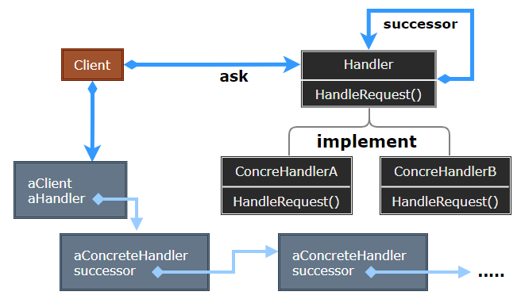
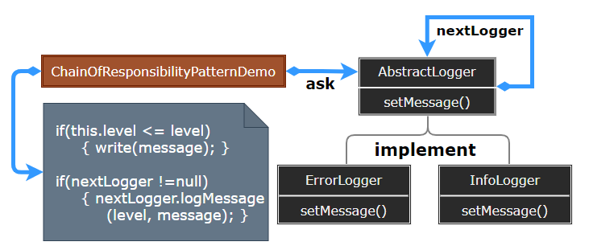

# Chain of Responsibility Pattern

---

- [Chain of Responsibility Pattern](#chain-of-responsibility-pattern)
	- [1. 责任链模式(Chain of Responsibility)](#1-责任链模式chain-of-responsibility)
	- [2. 意图](#2-意图)
	- [3. 动机](#3-动机)
	- [4. 适用性](#4-适用性)
	- [5. 结构与参与者](#5-结构与参与者)
	- [6. 责任链模式优缺点](#6-责任链模式优缺点)
	- [7. 实现](#7-实现)
	- [8. 设计要点](#8-设计要点)
	- [9. 案例](#9-案例)
	- [10. 相关模式](#10-相关模式)

---
## 1. 责任链模式(Chain of Responsibility)

- 责任链模式（Chain of Responsibility Pattern）为请求创建了一个接收者对象的链。这种模式给予请求的类型，对请求的发送者和接收者进行解耦。这种类型的设计模式属于行为型模式。
- 在这种模式中，通常每个接收者都包含对另一个接收者的引用。如果一个对象不能处理该请求，那么它会把相同的请求传给下一个接收者，依此类推。

---
## 2. 意图

- **使多个对象都有机会处理请求，从而避免请求的发送者和接收者之间的耦合关系。将这些对象连成一条链，并沿着这些链传递该请求，直到有一个对象处理它为止**。

- 主要解决：职责链上的处理者负责处理请求，客户只需要将请求发送到职责链上即可，无须关心请求的处理细节和请求的传递，所以职责链将请求的发送者和请求的处理者解耦了。

- 何时使用：在处理消息的时候以过滤很多道。
- 如何解决：拦截的类都实现统一接口。
- 关键代码：Handler 里面聚合它自己，在 HandleRequest 里判断是否合适，如果没达到条件则向下传递，向谁传递之前 set 进去。

---
## 3. 动机

- 在软件构建过程中，一个请求可能被多个对象处理，但是每个请求在运行时只能有一个接受者，如果显式指定，将必不可少地带来请求发送者与接受者的紧耦合。
- 如何使请求的发送者不需要指定具体的接受者? 让请求的接受者自己在运行时决定来处理请求，从而使两者解耦。
  
---
## 4. 适用性

- 有多个的对象可以处理一个请求，哪个处理该请求运行时刻自动确定
- 在不明确指定接收者的情况下，向多个对象中的一个提交一个请求
- 可处理一个请求的对象集合应被动态指定

---
## 5. 结构与参与者

> 责任链模式

  

> 参与者

- Handler：定义一个处理请求的接口，可实现为后继链的形式
- ConcreteHandler：处理它所负责的请求，可访问它的后继者；若可处理该请求则处理之，否则将转发给它的后继者
- Client：向链上的具体处理者 ConcreteHandler 对象提交请求

---
## 6. 责任链模式优缺点

> 优点

1. 降低耦合度：它将请求的发送者和接收者解耦。 
2. 简化了对象：使得对象不需要知道链的结构。
3. 增强给对象指派职责的灵活性：通过改变链内的成员或者调动它们的次序，允许动态地新增或者删除责任。
4. 增加新的请求处理类很方便。

> 缺点

1. 不能保证请求一定被接收。
2. 系统性能将受到一定影响，而且在进行代码调试时不太方便，可能会造成循环调用。 
3. 可能不容易观察运行时的特征，有碍于除错。

---
## 7. 实现

> 实现后继链

1. 定义新的链接：在 Handler 中定义
2. 使用已有的链接：使用已有的对象引用来形成后继链

> 连接后继者

- 通常 Handler 不仅定义处理该请求的接口，也维护其后继链接。Handler 提供了 HandleRequest 的缺省实现：HandleRequest 向后继者转发请求；当 ConcreteHandler 对此请求不感兴趣，Handler 的缺省行为将进行无条件转发

> 表示请求

1. 有多个对象可以处理同一个请求，具体哪个对象处理该请求由运行时刻自动确定。 
2. 在不明确指定接收者的情况下，向多个对象中的一个提交一个请求。 
3. 可动态指定一组对象处理请求

---
## 8. 设计要点

1. Chain of Responsibility 模式的应用场合在于 “一个请求可能有多个接受者，但是最后真正的接受者只有一个”，只有这时候请求发送者与接受者的耦合才有可能出现 “变化脆弱” 的症状，职责链的目的就是将二者解耦，从而更好地应对变化。
2. 应用了 Chain of Responsibility 模式后，对象的职责分派将更具灵活性。我们可以在运行时**动态添加/修改请求**的处理职责。
3. 如果请求传递到职责链的末尾仍得不到处理，应该有一个合理的缺省机制。这也是每一个接受对象的责任，而不是发出请求的对象的责任。

---
## 9. 案例

- 我们创建抽象类 AbstractLogger，带有详细的日志记录级别。然后我们创建三种类型的记录器，都扩展了 AbstractLogger。每个记录器消息的级别是否属于自己的级别，如果是则相应地打印出来，否则将不打印并把消息传给下一个记录器。

> 案例示意

  

> 代码实现

1. [C# 实现](/【设计模式】程序参考/DesignPatterns%20For%20CSharp/Behavioral%20Patterns/ChainOfResponsibility/Handler.cs)
2. ...

---
## 10. 相关模式

1. 责任链模式常与 Composite 一起使用，一个构件的父构件可作为它的后继

---