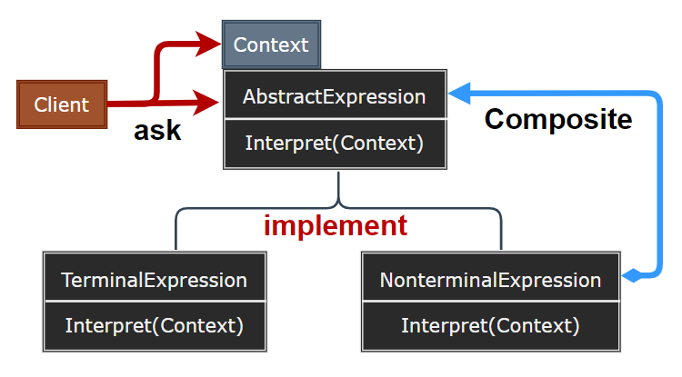
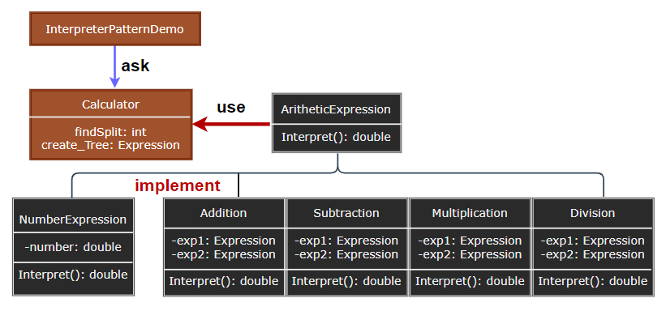

## Interpreter Pattern

- [Interpreter Pattern](#interpreter-pattern)
	- [解释器模式 (Interpreter)](#解释器模式-interpreter)
	- [模式设计](#模式设计)
		- [模式实现](#模式实现)
		- [解释器模式优缺点](#解释器模式优缺点)
	- [案例实现](#案例实现)
	- [相关模式](#相关模式)

---
### 解释器模式 (Interpreter)

解释器模式 (Interpreter Pattern) 提供了评估语言的语法或表达式的方式，它属于行为型模式。这种模式实现了一个表达式接口，该接口解释一个特定的上下文。这种模式被用在 SQL 解析、符号处理引擎等。

> **意图**

- 意图：给定一个语言，定义它的文法的一种表示，并定义一个解释器，这个解释器使用该表示来解释语言中的句子。
- 主要解决：对于一些固定文法构建一个解释句子的解释器。

> **动机**

在软件构建过程中，如果某一特定领域的问题比较复杂，类似的模式不断重复出现，如果使用普通的编程方式来实现将面临非常频繁的变化。

在这种情况下，将特定领域的问题表达为某种语法规则下的句子，然后构建一个解释器来解释这样的句子，从而达到解决问题的目的。

> **适用性**

- 解释器模式使用类来表示每一条文法规则。
- 当有一个语言需要解释执行，且可将该语言中的句子表示为一个抽象语法树时，可使用解释器模式：
  - 该文法简单对于复杂的文法，文法的类层次变得庞大而无法管理。
  - 效率不是一个关键问题：最高效的解释器通常不是通过直接解释语法分析树实现的，如正则表达式通常转换成状态机。

>---
### 模式设计

> **解释器模式**

  

> **参与者**

- AbstractExpression：抽象表达式，声明一个抽象的解释操作，这个接口为抽象语法树中所有节点所共享。
- TerminalExpression：终结符表达式，实现与文法中的终结符相关联的解释操作，一个句子中的每个终结符需要该类的一个实例。
- NonterminalExpression：非终结符表达式，对文法中的每一条规则 R 都需要一个 Nonterminal 类，每个 R 规则下的每一个符号都维护一个 AbstractExpression 类；为文法中的非终结符实现解释操作，解释一般要递归地调用表示每个 R 对象的解释操作。
- Context：上下文，包含解释器之外的一些全局信息。
- Client：构建 (或给定) 表示该文法定义的语句中一个特定的句子的抽象语法树，该抽象语法树由 Nonterminal 与 Terminal 的实例装配而成，并调用解释操作。

> **协作**

- Client 构建的一个句子，它是 Nonterminal 与 Terminal 实例的一个抽象语法树，然后初始化上下文并调用解释操作。
- 每一非终结表达式节点定义相应子表达式的解释操作，而各终结符表达式的解释操作构成了递归的基础。
- 每一节点的解释操作用上下文来存储和访问解释器的状态。

#### 模式实现

1. 创建抽象语法树：解释器模式并未解释如何创建一个抽象的语法树，它不涉及语法分析。
2. 定义解释操作：并非在每一个表达式类中定义解释操作，可以使用 Visitor 将解释放入一个独立的访问者对象中。
3. 与 Flyweight 共享终结符：一个句子中可能多次出现同一个终结符。

> **设计要点**

- Interpreter 模式的应用场合是 Interpreter 模式应用中的难点，只有满足 “业务规则频繁变化，且类似的模式不断重复出现，并且容易抽象为语法规则的问题” 才适合使用 Interpreter 模式。
- 使用 Interpreter 模式来表示文法规则，从而可以使用面向对象技巧来方便地 “扩展” 文法。
- Interpreter 模式比较适合简单的文法表示，对于复杂的文法表示，Interpreter 模式会产生比较大的类层次结构，需要求助于语法分析生成器这样的标准工具。

#### 解释器模式优缺点

1. 易于改变与扩展文法：通过继承改变或扩展。
2. 易于实现文法：各个节点类的结构大致相似。
3. 复杂的文法难以维护：包含许多规则的文法相对难以管理与维护。

>---
### 案例实现

创建一个简单四则运算的解释器结构。

> **案例示意**

  

> **代码实现**

1. [C# 实现](../../_DP_04_程序参考/DesignPatterns%20For%20CSharp/Behavioral%20Patterns/Interpreter/AbstractExpression.cs)
2. ...

>---
### 相关模式

- Composite：抽象语法树是一个复合模式的实例。
- Flyweight：说明了如何在抽象语法树中共享终结符。
- Iterator：解释器可用一个迭代器遍历该结构。
- Visitor：可用来在一个类中维护抽象语法树中的各节点的行为。

---