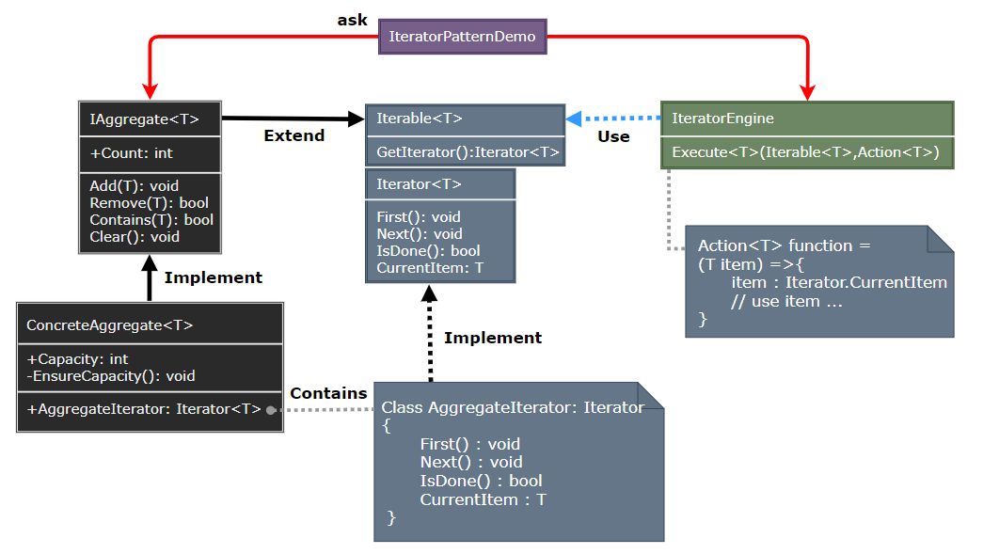

## Iterator Pattern

- [Iterator Pattern](#iterator-pattern)
	- [迭代器模式 (Iterator)](#迭代器模式-iterator)
	- [模式设计](#模式设计)
		- [模式实现](#模式实现)
		- [迭代器模式优缺点](#迭代器模式优缺点)
	- [案例实现](#案例实现)
	- [相关模式](#相关模式)

---
### 迭代器模式 (Iterator)

迭代器模式 (Iterator Pattern) 是面向对象中常用的设计模式。这种模式用于顺序访问集合对象的元素，不需要知道集合对象的底层表示。迭代器模式属于行为型模式。

> **意图**

- 意图：提供一个方法顺序访问一个聚合对象中各个元素，而又不需暴露该对象的内部表示。
- 主要解决：不同的方式来遍历整个整合对象。

> **动机**

在软件构建过程中，集合对象内部结构常常变化各异。但对于这些集合对象，我们希望在不暴露其内部结构的同时，可以让外部客户代码透明地访问其中包含的元素；同时这种 “透明遍历” 也为 “同一种算法在多种集合对象上进行操作” 提供了可能。

使用面向对象技术将这种遍历机制抽象为 “迭代器对象” 为应对变化中的 “集合对象” 提供了一种优雅的方式。

> **适用性**

- 访问一个聚合对象的内容而无需暴露它的内部表示。
- 支持对聚合对象的多种遍历。
- 为遍历不同的聚合结构提供统一的接口 (支持多态迭代)。

>---
### 模式设计

> **迭代器模式**

  

> **参与者**

- Iterator：迭代器定义访问和遍历元素的接口。
- ConcreteIterator：具体迭代器实现迭代器接口，对该聚合遍历时跟踪当前位置。
- Aggregate：聚合定义创建相应的迭代器对象接口。
- ConcreteAggregate：具体聚合实现创建相应迭代器的接口，该操作返回一个 ConcreteIterator 的一个适当的实例。

#### 模式实现

1. 应由谁控制迭代：当客户控制迭代时为外部迭代器；有迭代器控制时为内部迭代器；外部迭代器比内部迭代器更加灵活。
2. 应由谁定义遍历算法：遍历算法放入迭代器中会破坏聚合的封装性。
3. 迭代器的健壮程度如何：在遍历一个聚合时更改这个聚合可能是危险的，一个健壮的迭代器保证插入和删除操作不会干扰遍历，且不需要拷贝该聚合；需要向这个聚合注册该迭代器，在插入和删除元素时，该聚合要么调整迭代器的内部状态，要么在内部维护额外的信息以保证正确的遍历。
4. 附加的迭代器操作：迭代器的最小接口由 First、Next、IsDone 和 CurrentItem 操作组成；Previous 将迭代器定位到前一个元素，SkipTo 用于已排序索引的聚合，将迭代器定位到指定条件的元素对象上。
5. 多态迭代器。
6. 迭代器可有特权访问：迭代器与聚合紧密耦合，迭代器可包含一些 Protected 操作访问聚合类的重要的非可见对象，迭代器子类也可使用 protected 操作特权访问。
7. 用于复合对象的迭代器：控制游标跟踪复合对象的各个节点。
8. 空迭代器：有助于处理边界条件，它的 IsDone 总返回 true。

> **设计要点**

- 迭代抽象：访问一个聚合对象的内容而无需暴露它的内部表示。
- 迭代多态：为遍历不同的集合结构提供一个统一的接口，从而支持同样的算法在不同的集合结构上进行操作。
- 迭代器的健壮性考虑：遍历的同时更改迭代器所在的集合结构，会导致问题。

#### 迭代器模式优缺点

1. 迭代器支持以不同的方式遍历一个聚合。
2. 迭代器简化了聚合的接口：聚合本身不需要类似的遍历接口了。
3. 在同一个聚合上可以有多个遍历：每个迭代器保持它自己的遍历状态，可以同时进行多个遍历。

>---
### 案例实现

实现一个多态抽象迭代器。

> **案例示意**

  

> **代码实现**

1. [C# 实现](../../_DP_04_程序参考/DesignPatterns%20For%20CSharp/Behavioral%20Patterns/Iterator/Iterator.cs)
2. ...

>---
### 相关模式

- Composite：迭代器常被应用到像复合这样的递归结构上。
- Factory Method：多态迭代器靠 Factory Method 来例化适当的迭代器子类。
- Memento：迭代器可使用一个 memento 来捕捉一个迭代的状态，迭代器在其内部存储 memento。

---