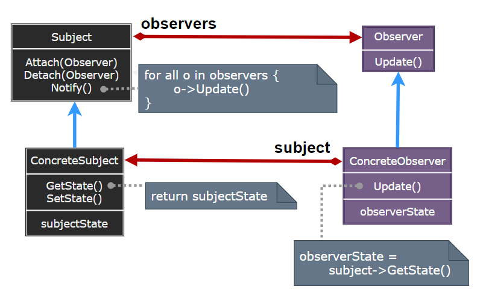
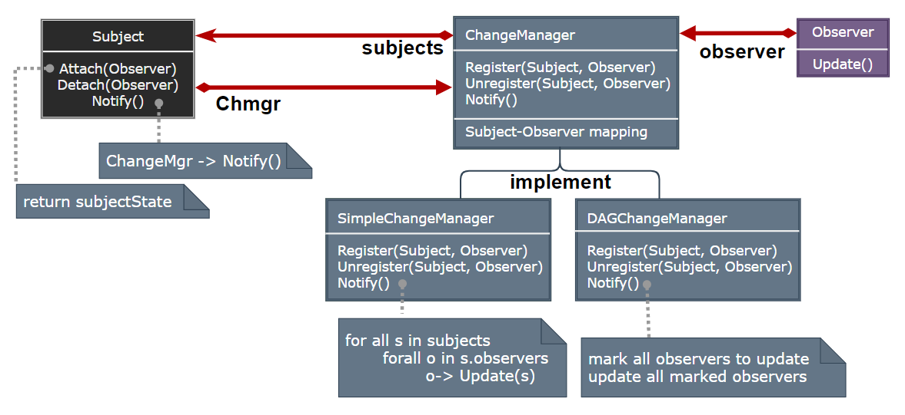

## Observer Pattern

- [Observer Pattern](#observer-pattern)
	- [观察者模式 (Observer)](#观察者模式-observer)
	- [模式设计](#模式设计)
		- [模式实现](#模式实现)
		- [观察者模式优缺点](#观察者模式优缺点)
	- [案例实现](#案例实现)
	- [相关模式](#相关模式)

---
### 观察者模式 (Observer)

当对象间存在一对多关系时，则使用观察者模式 (Observer Pattern) 。比如，当一个对象被修改时，则会自动通知它的依赖对象。观察者模式属于行为型模式。

> **意图**

- 意图：定义对象间的一种一对多的依赖关系，当一个对象的状态发生改变时，所有依赖于它的对象都得到通知并被自动更新。
- 主要解决：一个对象状态改变给其他对象通知的问题，而且要考虑到易用和低耦合，保证高度的协作。

> **动机**

在软件构建过程中，我们需要为某些对象建立一种 “通知依赖关系” — 一个对象 (目标对象) 的状态发生改变，所有的依赖对象 (观察者对象) 都将得到通知。如果这样的依赖关系过于紧密，将使软件不能很好地抵御变化。

使用面向对象技术，可以将这种依赖关系弱化，并形成一种稳定的依赖关系。从而实现软件体系结构的松耦合。

> **适用性**

- 当一个抽象模型有两个方面，其中一个方面依赖于另一方面。将这二者封装在独立的对象中以使它们可以各自独立地改变和复用。
- 当对一个对象的改变需要同时改变其它对象，而不知道具体有多少对象有待改变。
- 当一个对象必须通知其它对象，而它又不能假定其它对象是谁。换言之，你不希望这些对象是紧密耦合的。

>---
### 模式设计

> **观察者模式**

  

> **参与者**

- Subject：目标知道它的观察者。可以有任意多个观察者观察同一个目标；提供注册和删除观察者对象的接口。
- Observer：为那些在目标发生改变时需获得通知的对象定义一个更新接口。
- ConcreteSubject：将有关状态存入各 ConcreteObserver 对象。当它的状态发生改变时，向它的各个观察者发出通知。
- ConcreteObserver：维护一个指向 ConcreteSubject 对象的引用；存储有关状态，这些状态应与目标的状态保持一致；实现 Observer 的更新接口以使自身状态与目标的状态保持一致。

> **协作**

- 当 ConcreteSubject 发生任何可能导致其观察者与其本身状态不一致的改变时，它将通知它的各个观察者。
- 在得到一个具体目标的改变通知后，ConcreteObserver 对象可向目标对象查询信息。ConcreteObserver 使用这些信息以使它的状态与目标对象的状态一致。

#### 模式实现

1. 创建目标到其观察者之间的映射：一个目标对象跟踪它应通知的观察者的最简单的方式是显式地在目标中保存对它们的引用。
2. 观察多个目标：多数情况下，一个观察者依赖于多个目标可能是有意义的。
3. 谁触发更新：目标和它的观察者依赖于通知机制来保持一致，一种是由目标对象的状态设定操作在改变目标对象的状态后自动调用 Notify；一种是让客户负责在适当的时候调用 Notify。
4. 对以删除目标的悬挂引用：删除一个目标时应注意不要在其观察者中遗留对该目标的悬挂引用 (空引用)。
5. 在发出通知前确保目标的状态自身是一致的：观察者在更新其状态的过程中需要查询目标的当前状态。
6. 避免特定于观察者的更新协议 — 推/拉模型：推 (目标向观察者发送关于改变的信息而不关心其是否需要，推模型假定目标知道一些观察者需要的信息) ；拉 (目标除最小通知外什么也不送出，仅由观察者显式地向目标询问细节，拉模型强调目标不知道它的观察者)。
7. 显式地指定感兴趣的改变：可以扩展目标的注册接口。让各观察者注册为仅对特定事件感兴趣。
8. 封装复杂的更新语义：创建更改管理器 (ChangeManager)，它的目的是尽量减少观察者反映其目标的状态变化所需的工作量。如果一个操作涉及到对几个相互依赖的目标进行改动，就必须保证仅在所有的目标都已更改完毕后，才一次性地通知它们的观察者，而不是每个目标都通知观察者。

> ChangeManager 有三个责任:

- 它将一个目标映射到它的观察者并提供一个接口来维护这个映射。这就不需要由目标来维护对其观察者的引用，反之亦然。
- 它定义一个特定的更新策略。
- 根据一个目标的请求,它更新所有依赖于这个目标的观察者。

> **设计要点**

- 使用面向对象的抽象，Observer 模式使得我们可以独立地，改变目标与观察者，从而使二者之间的依赖关系达致松耦合目标发送通知时，无需指定观察者，通知 (可以携带通知信息作为参数) 会自动传播。观察者自己决定是否需要订阅通知，目标对象对此无所知。
- 在 C# 的 event 中，委托充当了抽象的 Observer 接口，而提供事件的对象充当了目标对象。委托是比抽象 Observer 接口更为松耦合的设计。

#### 观察者模式优缺点

1. Observer 模式允许独立的改变目标和观察者。
2. 目标和观察者间的抽象耦合：一个目标所知道的仅仅是它有一系列观察者，每个都符合抽象的 Observer 类的简单接口。
3. 支持广播通信：不像通常的请求，目标发送的通知不需指定它的接收者。
4. 意外的更新：因为一个观察者并不知道其它观察者的存在，它可能对改变目标的最终代价一无所知。

>---
### 案例实现

> **更改管理器 (ChangeManager) 是一个 Mediator 的实例**

  

> **代码实现**

1. [C# 实现](../../_DP_04_程序参考/DesignPatterns%20For%20CSharp/Behavioral%20Patterns/Observer/Observer.cs)
2. ...

>---
### 相关模式

- Mediator：通过封装复杂的更新语义, ChangeManager 充当目标和观察者之间的中介者。
- Singleton: ChangeManager 可使用 Singleton 模式来保证它是唯一的并且是可全局访问的。

---