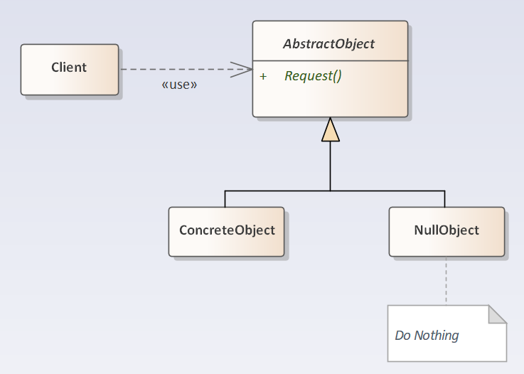

## Null Object Pattern

- [Null Object Pattern](#null-object-pattern)
  - [空对象模式 (Null-Object)](#空对象模式-null-object)
  - [模式设计](#模式设计)
    - [相关模式](#相关模式)
  - [案例实现](#案例实现)

---
### 空对象模式 (Null-Object)

在 **空对象模式** (Null Object Pattern) 中，一个空对象取代 NULL 对象实例的检查。Null 对象不是检查空值，而是反应一个不做任何动作的关系。这样的 Null 对象也可以在数据不可用的时候提供默认的行为。

在空对象模式中，我们创建一个指定各种要执行的操作的抽象类和扩展该类的实体类，还创建一个未对该类做任何实现的空对象类，该空对象类将无缝地使用在需要检查空值的地方。

> **意图**

- 通过对缺失对象的封装，以提供默认无任何行为的对象替代品。

> **适用性**

- 一个对象需要一个协作对象，但并无具体的协作对象。
- 协作对象不需要做任何事情。

>---
### 模式设计

> 空对象模式

  

> 效果

- 减少了对对象是否为 Null 的判断。
- 提供默认无任何具体行为的协作对象。

#### 相关模式

- Null Object 通常没有任何状态，所以多个实例可能都是类似的，可以使用 Singleton 模式来实现。
- Null Object 看起来很像 Proxy 模式，但两者有着不同的目的。Proxy 提供对目标对象访问的控制，而 Null Object 并不隐藏任何对象。
- Null Object 可以作为 Strategy 模式中的一个特例。Strategy 提供多个具体类以区分算法，而 NullStrategy 则可不做任何事情。
- Null Object 可以作为 State 模式中的一个特例。使用 NullState 以便不做任何事情。
- 在 Visitor 模式中也可以使用 Null Object 以提供某种默认行为。

>---
### 案例实现

```csharp
public class NullObjectPattern
{
    public static void Enter()
    {
        RequestProxy.Request("A").Handle();
        RequestProxy.Request("E").Handle();
    }

    internal class RequestProxy
    {
        static string[] mesArr = { "A", "B", "C" };
        internal static Message Request(string message)
        {
            for (int i = 0; i < mesArr.Length; i++)
                if (mesArr[i].Equals(message))
                    return new MessageHandler(message);
			// null object
            return new NullObjectClass(message);
        }
    }

    internal abstract class Message
    {
        protected string message;
        public Message(string message) =>
            this.message = message;
        public abstract void Handle();
    }

    internal class MessageHandler : Message
    {
        public MessageHandler(string message) : base(message) { }
        public override void Handle()=>
            Console.WriteLine("Handle Message >>> " + message);
    }
    internal class NullObjectClass : Message
    {
        public NullObjectClass(string message) : base(message) { }
        public override void Handle() { }
    }
}
```

---