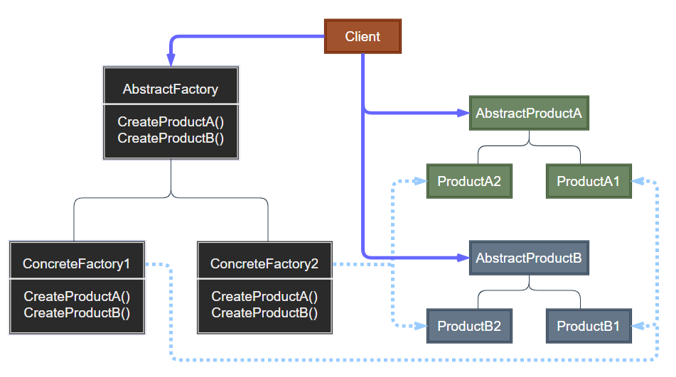
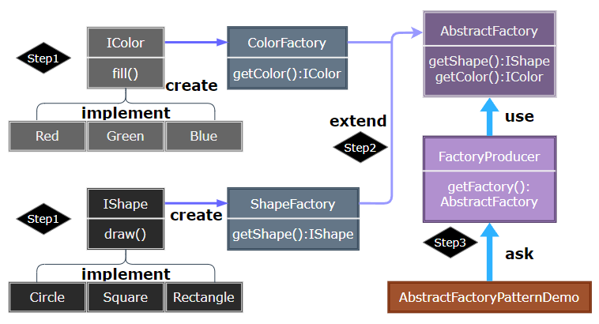

# Abstract Factory Pattern

---

- [Abstract Factory Pattern](#abstract-factory-pattern)
	- [1. 抽象工厂模式(Abstract Factory)](#1-抽象工厂模式abstract-factory)
	- [2. 意图](#2-意图)
	- [3. 动机](#3-动机)
	- [4. 适用性](#4-适用性)
	- [5. 结构与参与者](#5-结构与参与者)
	- [6. 抽象工厂优缺点](#6-抽象工厂优缺点)
	- [7. 实现](#7-实现)
	- [8. 设计要点](#8-设计要点)
	- [9. 案例](#9-案例)

---
## 1. 抽象工厂模式(Abstract Factory)

- 抽象工厂模式（Abstract Factory Pattern）是围绕一个超级工厂创建其他工厂。该超级工厂又称为其他工厂的工厂。这种类型的设计模式属于创建型模式，它提供了一种创建对象的最佳方式。
- 在抽象工厂模式中，接口是负责创建一个相关对象的工厂，不需要显式指定它们的类。每个生成的工厂都能按照工厂模式提供对象。

> 工厂模式存在的问题

- 不能应对 “不同系列对象” 的变化。比如有不同风格的游戏场景——对应不同风格的道路、房屋、地道
- 如何解决——使用面向对象的技术来 “封装” 变化点。
- 解决思路：封装变化点——哪里变化，封装哪里。潜台词：如果没有变化，当然不需要额外的封装。

---
## 2. 意图

- 提供一个创建一系列相关或相互依赖对象的接口，而无需指定它们具体的类。**主要解决接口选择的问题**

---
## 3. 动机

- 在软件系统中，经常面临着 “一系列相互依赖的对象” 的创建工作；同时，由于需求的变化，往往存在更多系列对象的创建工作。
- 如何应对这种变化？如何绕过常规的对象创建方法 (new)，提供一种 “封装机制” 来避免客户程序和这种 “多系列具体对象创建工作” 的紧耦合?

---
## 4. 适用性

- 一个系统要独立于它的产品的创建、组合和表示时
- 一个系统要由多个产品系列中的一个来配置时
- 当要强调一系列相关的产品对象的设计以便联合使用时
- 当要提供一个产品类库，仅显示它们的接口而不是实现时

---
## 5. 结构与参与者

> Abstract Factory 抽象工厂设计

  

> 参与者

- AbstractFactory：声明一个创建抽象产品对象的操作接口
- ConcreteFactory：实现创建具体产品对象的操作
- AbstractProduct：为一类产品对象对应声明一个接口
- ConcreteProduct：定义一个将被相应的具体工厂创建的产品对象，实现 AbstractProduct 接口
- Client：仅使用由 AbstractFactory 和 AbstractProduct 类声明的接口

---
## 6. 抽象工厂优缺点

- 抽象工厂分离了具体的类，一个工厂封装创建产品对象的责任和过程，将客户与类的实现分离；客户通过抽象工厂提供的接口操纵实例
- 使得易于交换产品系列：抽象工厂创建了一个完整的产品系列，只需改变具体的工厂即可使用不同的产品配置
- 有利于产品的一致性：一个应用一次只能使用同一个系列中的对象
- 难以支持新种类的产品：AbstractFactory 接口确定了可以被创建的产品的集合，支持新产品需要扩展该工厂接口，这将改变 AbstractFactory 类及其子类的结构

---
## 7. 实现

1. 将工厂作为单件：一个产品系列只需要一个 ConcreteFactory 的实例，可使用 Singleton 单例模式
2. 创建产品：AbstractFactory 只负责创建产品的接口，创建产品是由 ConcreteFactory 子类实现，可使用 Factory Method 工厂模式或 Prototype
3. 定义可扩展的工厂：增加一个新的产品需求可能要求改变 AbstractFactory 的接口形式与其相关的类，一种灵活的方式可以给创建对象的操作增加一个参数，该参数指定将被创建对象的种类

---
## 8. 设计要点

1. 如果没有应对 “多系列对象构建” 的需求变化，则没有必要使用 AbstractFactory 模式，这时候使用简单工厂模式完全可以。
2. “系列对象” 指的是这些对象之间有相互依赖、或作用的关系，例如游戏开发场景中的 “道路” 与 "房屋” 的依赖，“道路” 与 “地道” 的依赖。
3. AbstractFactory 模式主要在于应对 “新系列” 的需求变动。其缺点在于难以应对 “新对象” 的需求变动。
4. AbstractFactory 模式经常和 Factory Method 模式共同组合来应对 “对象创建” 的需求变化。

---
## 9. 案例

- 我们将创建 Cloth 和 Pants 接口和实现这些接口的实体类。下一步是创建抽象工厂类 AbFactory。接着定义工厂类 ClothFactory 和 PantsFactory。然后创建一个工厂创造器/生成器类 FactoryProducer。

- AbFactoryPatternDemo 中，演示用 FactoryProducer 来获取 AbstractFactory 对象。

> STEP

- **Step1**：构建 Cloth 与 Pants 相关抽象对象与实体类。
- **Step2**：构建 Abstract 工厂和具体的实体类用于组合 Cloth 和 Pants。
- **Step3**：可以构建一个组合枚举，将多个工厂组合到 FactoryProducer 中。

> 案例示意

  

> 代码实现

1. [C# 实现](/【设计模式】程序参考/DesignPatterns%20For%20CSharp/Creational%20Patterns/Abstract%20Factory/AbstractFactory.cs)

2. ...

---