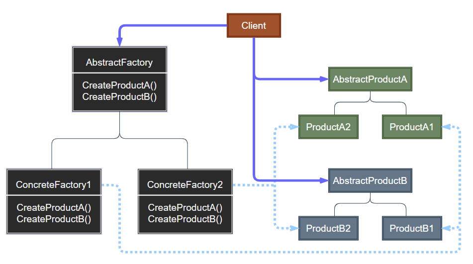
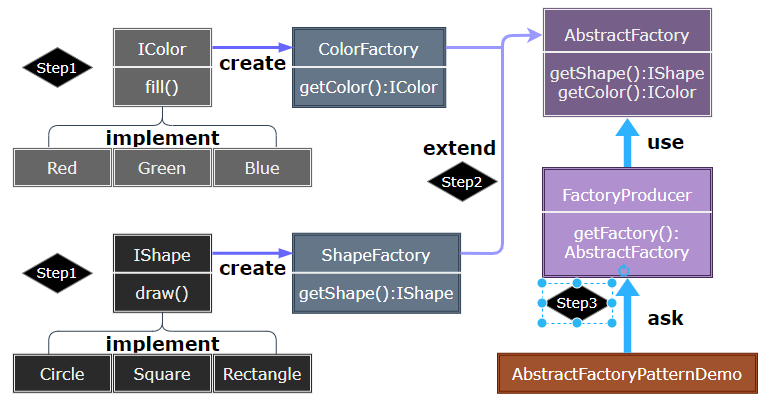

# Abstract Factory Pattern

---

- [Abstract Factory Pattern](#abstract-factory-pattern)
  - [1. 抽象工厂模式(Abstract Factory)](#1-抽象工厂模式abstract-factory)
  - [2. 抽象工厂简介](#2-抽象工厂简介)
  - [3. 动机与结构](#3-动机与结构)
  - [4. 抽象工厂优缺点](#4-抽象工厂优缺点)
  - [5. 应用场景](#5-应用场景)
  - [6. 案例实现](#6-案例实现)
  - [7. 设计要点](#7-设计要点)

---
## 1. 抽象工厂模式(Abstract Factory)

- 抽象工厂模式（Abstract Factory Pattern）是围绕一个超级工厂创建其他工厂。该超级工厂又称为其他工厂的工厂。这种类型的设计模式属于创建型模式，它提供了一种创建对象的最佳方式。

- 在抽象工厂模式中，接口是负责创建一个相关对象的工厂，不需要显式指定它们的类。每个生成的工厂都能按照工厂模式提供对象。

> 简单工厂的问题

- 不能应对“不同系列对象”的变化。比如有不同风格的游戏场景——对应不同风格的道路、房屋、地道
- 如何解决——使用面向对象的技术来“封装”变化点。
- 解决思路：封装变化点一哪里变化，封装哪里。潜台词：如果没有变化，当然不需要额外的封装。

---
## 2. 抽象工厂简介

- 意图：提供一个创建一系列相关或相互依赖对象的接口，而无需指定它们具体的类。**主要解决接口选择的问题**
- 何时使用：系统的产品有多于一个的产品族，而系统只消费其中某一族的产品。
- 如何解决：在一个产品族里面，定义多个产品。
- 关键代码：在一个工厂里聚合多个同类产品。

---
## 3. 动机与结构

- 在软件系统中，经常面临着“一系列相互依赖的对象"的创建工作；同时，由于需求的变化，往往存在更多系列对象的创建工作。
- 如何应对这种变化？如何绕过常规的对象创建方法(new)，提供一种“封装机制”来避免客户程序和这种“多系列具体对象创建工作”的紧耦合?

> 抽象工厂设计示意

  

---
## 4. 抽象工厂优缺点

- 优点：
  - 当一个产品族中的多个对象被设计成一起工作时，它能保证客户端始终只使用同一个产品族中的对象。

- 缺点：
  - 产品族扩展非常困难，要增加一个系列的某一产品，既要在抽象的 Creator 里加代码，又要在具体的里面加代码。

---
## 5. 应用场景

1. 服装搭配成套问题：为了参加一些聚会，肯定有两套或多套衣服吧，比如说有商务装（成套，一系列具体产品）、时尚装（成套，一系列具体产品），甚至对于一个家庭来说，可能有商务女装、商务男装、时尚女装、时尚男装，这些也都是成套的，即一系列具体产品。
2. QQ 换皮肤，一整套一起换。 
3. 生成不同操作系统的程序。
4. 切换角色皮肤装备问题。

> 注意事项：产品族难扩展，产品等级易扩展。

---
## 6. 案例实现

- 我们将创建 Cloth 和 Pants 接口和实现这些接口的实体类。下一步是创建抽象工厂类 AbFactory。接着定义工厂类 ClothFactory 和 PantsFactory 。然后创建一个工厂创造器/生成器类 FactoryProducer。

- AbFactoryPatternDemo 中，演示用 FactoryProducer  来获取 AbstractFactory 对象。

> STEP

- Step1：构建 Cloth 与 Pants 相关抽象对象与实体类。
- Step2：构建 Abstract 工厂和具体的实体类用于组合 Cloth 和 Pants。
- Step3：可以构建一个组合枚举，将多个工厂组合到 FactoryProducer 中。

    

---
## 7. 设计要点

1. 如果没有应对“多系列对象构建”的需求变化，则没有必要使用Abstract Factory模式，这时候使用简单的静态工厂完全可以。(即直接在类中实现工厂，而不需要再创建抽象工厂应对不同的变化。多新系列的变化会使用抽象工厂模式。)
2. “系列对象”指的是这些对象之间有相互依赖、或作用的关系，例如游戏开发场景中的“道路”与"房屋”的依赖，“道路”与“地道”的依赖。
3. Abstract Factory模式主要在于应对“新系列”的需求变动。其缺点在于难以应对“新对象”的需求变动。
4. Abstract Factory模式经常和Factory Method模式共同组合来应对“对象创建”的需求变化。

---