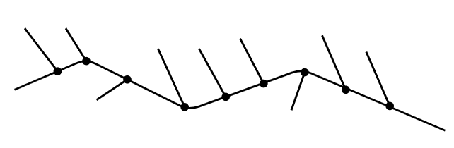

# Factory Pattern

---

- [Factory Pattern](#factory-pattern)
  - [1. 工厂模式(Factory)](#1-工厂模式factory)
  - [2. 工厂模式简介](#2-工厂模式简介)
  - [3. 动机与结构](#3-动机与结构)
  - [4. 工厂模式优缺点](#4-工厂模式优缺点)
  - [5. 应用场景](#5-应用场景)
  - [6. 案例实现](#6-案例实现)
  - [7. 设计要点](#7-设计要点)
  - [8. 从分支易变到拓展](#8-从分支易变到拓展)

---
## 1. 工厂模式(Factory)

- 工厂模式（Factory Pattern）是 C# 中最常用的设计模式之一。这种类型的设计模式属于创建型模式，它提供了一种创建对象的最佳方式。
- 在工厂模式中，我们在创建对象时不会对客户端暴露创建逻辑，并且是通过使用一个共同的接口来指向新创建的对象。

> 从耦合关系谈起

- 耦合关系直接决定着软件面对变化时的行为
  - 模块与模块之间的紧耦合使得软件面对变化时，相关的模块都要随之更改

    

  - 模块与模块之间的松耦合使得软件面对变化时，一些模块更容易被替换或者更改，但其他模块保持不变

    

---
## 2. 工厂模式简介

- 意图：定义一个创建对象的接口，让其子类自己决定实例化哪一个工厂类，工厂模式使其创建过程延迟到子类进行。**主要解决接口选择的问题**
- 何时使用：我们明确地计划不同条件下创建不同实例时。
- 如何解决：让其子类实现工厂接口，返回的也是一个抽象的产品。
- 关键代码：创建过程在其子类执行。

---
## 3. 动机与结构

- 在软件系统中，经常面临着“某个对象”的创建工作；由于需求的变化，这个对象的具体实现经常面临着剧烈的变化，但是它却拥有比较稳定的接口。（例如床需要床单，但是床单可以经常换，但是床不换）
  
- 如何应对这种变化？如何提供一种“封装机制"来隔离出“这个易变对象”的变化，从而保持系统中“其他依赖该对象的对象"不随着需求改变而改变?（只改变床单而不需要修改床的变化）

> 工厂模式

  

---
## 4. 工厂模式优缺点

- 优点： 
  1. 一个调用者想创建一个对象，只要知道其名称就可以了。 
  2. 扩展性高，如果想增加一个产品，只要扩展一个工厂类就可以。 
  3. 屏蔽产品的具体实现，调用者只关心产品的接口。

- 缺点：
  - 每次增加一个产品时，都需要增加一个具体类和对象实现工厂，使得系统中类的个数成倍增加，在一定程度上增加了系统的复杂度，同时也增加了系统具体类的依赖。这并不是什么好事。

---
## 5. 应用场景

1. 您需要一辆汽车，可以直接从工厂里面提货，而不用去管这辆汽车是怎么做出来的，以及这个汽车里面的具体实现。
2. 日志记录器：记录可能记录到本地硬盘、系统事件、远程服务器等，用户可以选择记录日志到什么地方。 
3. 数据库访问，当用户不知道最后系统采用哪一类数据库，以及数据库可能有变化时。 
4. 设计一个连接服务器的框架，需要三个协议，"POP3"、"IMAP"、"HTTP"，可以把这三个作为产品类，共同实现一个接口。

> 注意事项：作为一种创建类模式，在任何需要生成复杂对象的地方，都可以使用工厂方法模式。有一点需要注意的地方就是复杂对象适合使用工厂模式，而简单对象，特别是只需要通过 new 就可以完成创建的对象，无需使用工厂模式。如果使用工厂模式，就需要引入一个工厂类，会增加系统的复杂度。

---
## 6. 案例实现

- 我们将创建一个 IShape 接口和实现 Shape 接口的实体类。下一步是定义工厂类 ShapeFactory。
- FactoryPatternDemo，我们的演示类使用 ShapeFactory 来获取 Shape 对象。它将向 ShapeFactory 传递信息（CIRCLE / RECTANGLE / SQUARE），以便获取它所需对象的类型。

> STEP

- Step1: 创建 IShape 接口与 circle, rectrangle, square 等 IShape 的实体类 
- Step2: 创建一个工厂, 生成基于给定信息的实体类的对象
- Step3: 使用该工厂, 通过传递类型信息获取实体类的对象

    

---
## 7. 设计要点

1. Factory Method模式主要用于隔离类对象的使用者和具体类型之间的耦合关系。面对一个经常变化的具体类型，紧耦合关系会导致软件的脆弱。
2. Factory Method模式通过面向对象的手法，将所要创建的具体对象工作延迟到子类，从而实现一种扩展(而非更改)的策略，较好地解决了这种紧耦合关系。
3. FactoryMethod模式解决“单个对象”的需求变化，Abstract Factory模式解决“系列对象”的需求变化，Builder模式解决“对象部分”的需求变化。
4. 工厂生产模式表示将对象的变种通过一个入口（生产的工厂）进入，进入的钥匙则是具体的对象变种（或者说是抽象对象的继承子类，即汽车下面的大众车，丰田车），而整体程序的主框架不会发生大的改变（对车的性能测试功能并没有进行太大的改动）。

---
## 8. 从分支易变到拓展

- 通过配置表的方式实现对象的变化，而解析配置表的方法就是构建对象变体的过程，但是配置表的格式要提前约定，才能保证解析配置到数据分配生产具体对象的过程不需要太大的变动。

---