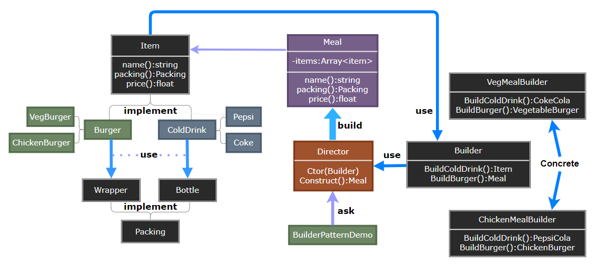

# Builder Pattern

---

- [Builder Pattern](#builder-pattern)
  - [1. 建造者模式(Builder)](#1-建造者模式builder)
  - [2. 建造者模式简介](#2-建造者模式简介)
  - [3. 动机与结构](#3-动机与结构)
  - [4. 建造者模式优缺点](#4-建造者模式优缺点)
  - [5. 应用场景](#5-应用场景)
  - [6. 案例实现](#6-案例实现)
  - [7. 设计要点](#7-设计要点)

---
## 1. 建造者模式(Builder)

- 建造者模式（Builder Pattern）使用多个简单的对象一步一步构建成一个复杂的对象。这种类型的设计模式属于创建型模式，它提供了一种创建对象的最佳方式。
- 一个 Builder 类会一步一步构造最终的对象。该 Builder 类是独立于其他对象的。

> Building 的缘起

- 假设创建游戏中的一个房屋House设施，该房屋的构建由几个部分组成，且各个部分要富于变化。
- 如果使用最直观的设计方法，每一个房屋部分的变化，都将导致房屋构建的重新修正。

---
## 2. 建造者模式简介

- 意图：**将一个复杂的构建与其表示相分离，使得同样的构建过程可以创建不同的表示**。主要解决在软件系统中，有时候面临着"一个复杂对象"的创建工作，其通常由各个部分的子对象用一定的算法构成；由于需求的变化，这个复杂对象的各个部分经常面临着剧烈的变化，但是将它们组合在一起的算法却相对稳定。

- 何时使用：一些基本部件不会变，而其组合经常变化的时候。
- 如何解决：将变与不变分离开。
- 关键代码：建造者：创建和提供实例，导演：管理建造出来的实例的依赖关系。

---
## 3. 动机与结构

- 在软件系统中，有时候而临着“一个复杂对象”的创建工作，其通常由各个部分的子对象用一定的算法构成；由于需求的变化，这个复杂对象的各个部分经常面临着剧烈的变化，但是将它们组合在一起的算法却相对稳定。
- 如何应对这种变化?如何提供一种“封装机制”来隔离出“复杂对象的各个部分”的变化，从而保持系统中的“稳定构建算法”不随着需求改变而改变?

> 建造者设计示意

  

---
## 4. 建造者模式优缺点

- 优点：
  - 建造者独立，易扩展。 
  - 便于控制细节风险。

- 缺点： 
  - 产品必须有共同点，范围有限制。 
  - 内部变化复杂，会有很多的建造类。

---
## 5. 应用场景

1. 去肯德基，汉堡、可乐、薯条、炸鸡翅等是不变的，而其组合是经常变化的，生成出所谓的"套餐"。 
2. StringBuilder.Append(...)
3. 需要生成的对象具有复杂的内部结构。 
4. 需要生成的对象内部属性本身相互依赖。

> 注意事项：与工厂模式的区别是：建造者模式更加关注与零件装配的顺序。

---
## 6. 案例实现

- 我们假设一个快餐店的商业案例，其中，一个典型的套餐可以是一个汉堡（Burger）和一杯冷饮（Cold drink）。汉堡（Burger）可以是素食汉堡（Veg Burger）或鸡肉汉堡（Chicken Burger），它们是包在纸盒中。冷饮（Cold drink）可以是可口可乐（coke）或百事可乐（pepsi），它们是装在瓶子中。

> STEP

- Step1: 我们将创建一个表示食物条目（比如汉堡和冷饮）的 Item 接口和实现 Item 接口的实体类，以及一个表示食物包装的 Packing 接口和实现 Packing 接口的实体类，汉堡是包在纸盒中，冷饮是装在瓶子中。
- Step2: 然后我们创建一个 Meal 类，带有 Item 的 ArrayList 和一个通过结合 Item 来创建不同类型的 Meal 对象的 MealBuilder。BuilderPatternDemo，我们的演示类使用 MealBuilder 来创建一个 Meal。
  
    

---
## 7. 设计要点

1. Builder模式主要用于“分步骤构建一个复杂的对象”在这其中“分步骤”是一个稳定的算法，而复杂对象的各个部分则经常变化。
2. 变化点在哪里，封装哪里一一Builder模式主要在于应对“复杂对象各个部分”的频繁需求变动。其缺点在于难以应对“分步骤构建算法”的需求变动。
3. Abstract Factory模式解决“系列对象”的需求变化，Builder模式解决“对象部分”的需求变化（对象）。Builder模式通常和Composite模式组合使用。

---