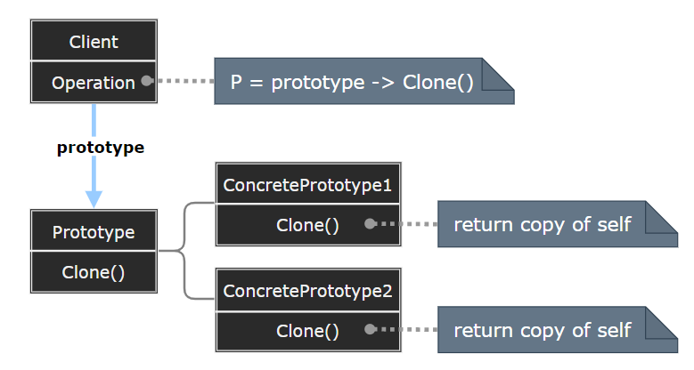

# Prototype Pattern

---

- [Prototype Pattern](#prototype-pattern)
  - [1. 原型模式(Prototype)](#1-原型模式prototype)
  - [2. 原型模式简介](#2-原型模式简介)
  - [3. 动机与结构](#3-动机与结构)
  - [4. 原型模式优缺点](#4-原型模式优缺点)
  - [5. 应用场景](#5-应用场景)
  - [6. 案例实现](#6-案例实现)
  - [7. CSharp 中的深拷贝与浅拷贝](#7-csharp-中的深拷贝与浅拷贝)
    - [7.1 浅拷贝](#71-浅拷贝)
    - [7.2 深拷贝](#72-深拷贝)
  - [8. 设计要点](#8-设计要点)
  - [9. 有关创建型模式的讨论](#9-有关创建型模式的讨论)

---
## 1. 原型模式(Prototype)

- 原型模式（Prototype Pattern）是用于创建重复的对象，同时又能保证性能。这种类型的设计模式属于创建型模式，它提供了一种创建对象的最佳方式。

- 这种模式是实现了一个原型接口，该接口用于创建当前对象的克隆。当直接创建对象的代价比较大时，则采用这种模式。例如，一个对象需要在一个高代价的数据库操作之后被创建。我们可以缓存该对象，在下一个请求时返回它的克隆，在需要的时候更新数据库，以此来减少数据库调用。

> 依赖关系的倒置

- 抽象不应该依赖于实现细节，实现细节应该依赖于抽象。
  - 抽象A直接依赖于实现细节b （人用陶瓷水杯喝水，人直接依赖于陶瓷水杯）
  - 抽象A依赖于抽象B，实现细节b依赖于抽象B（人A用杯子B喝水，杯子是陶瓷水杯b）

---
## 2. 原型模式简介

- 意图：用原型实例指定创建对象的种类，并且通过拷贝这些原型创建新的对象。
- 主要解决：在运行期建立和删除原型。
- 何时使用： 
  1. 当一个系统应该独立于它的产品创建，构成和表示时。 
  2. 当要实例化的类是在运行时刻指定时，例如，通过动态装载。 
  3. 为了避免创建一个与产品类层次平行的工厂类层次时。 
  4. 当一个类的实例只能有几个不同状态组合中的一种时。建立相应数目的原型并克隆它们可能比每次用合适的状态手工实例化该类更方便一些。

- 如何解决：利用已有的一个原型对象，快速地生成和原型对象一样的实例。

---
## 3. 动机与结构

- 在软件系统中，经常面临着“某些结构复杂的对象’的创建工作；由于需求的变化，这些对象经常面临着剧烈的变化，但是它们却拥有比较稳定一致的接口。
- 如何应对这种变化?如何向“客户程序(使用这些对象的程序)”隔离出“这些易变对象，从而使得“依赖这些易变对象的客户程序”不随着需求改变而改变?

> 原型模式

  

---
## 4. 原型模式优缺点

- 优点： 
  - 性能提高。
  - 逃避构造函数的约束。

- 缺点： 
  - 配备克隆方法需要对类的功能进行通盘考虑，这对于全新的类不是很难，但对于已有的类不一定很容易，特别当一个类引用不支持串行化的间接对象，或者引用含有循环结构的时候。 
  - 必须实现 Cloneable 接口。 
  - 逃避构造函数的约束。

---
## 5. 应用场景

 1. 资源优化场景。 
 2. 类初始化需要消化非常多的资源，这个资源包括数据、硬件资源等。 
 3. 性能和安全要求的场景。 
 4. 通过 new 产生一个对象需要非常繁琐的数据准备或访问权限，则可以使用原型模式。 
 5. 一个对象多个修改者的场景。 
 6. 一个对象需要提供给其他对象访问，而且各个调用者可能都需要修改其值时，可以考虑使用原型模式拷贝多个对象供调用者使用。 
 7. 在实际项目中，原型模式很少单独出现，一般是和工厂方法模式一起出现，通过 clone 的方法创建一个对象，然后由工厂方法提供给调用者。原型模式已经与 Java 融为浑然一体，大家可以随手拿来使用。

> 注意事项：与通过对一个类进行实例化来构造新对象不同的是，原型模式是通过拷贝一个现有对象生成新对象的。浅拷贝实现 Cloneable，重写，深拷贝是通过实现  Serializable 读取二进制流。

---
## 6. 案例实现

- 我们将创建一个抽象类 Shape 和扩展了 Shape 类的实体类。下一步是定义类 ShapeCache，该类把 shape 对象存储在一个 Hashtable 中，并在请求的时候返回它们的克隆。
- ototypPatternDemo，我们的演示类使用 ShapeCache 类来获取 Shape 对象。

    

---
## 7. CSharp 中的深拷贝与浅拷贝
### 7.1 浅拷贝

```csharp
    public class WiseCloneDemo
    {
        WiseCloneDemo wiseClone;
        public WiseCloneDemo WiseClone()
        {
            WiseCloneDemo wise = null;
            if (wiseClone == null)
            {
                wiseClone = new WiseCloneDemo();
            }
            try
            {
                wise = wiseClone.MemberwiseClone() as WiseCloneDemo;
            }
            catch (Exception e)
            {
                Console.WriteLine("[ WiseClone Failed ]:" + e.Message);
            }
            return wise;
        }
    }
```

---
### 7.2 深拷贝

1. 二进制流

```csharp
    // 使用二进制流进行 对象深拷贝, 要求对象必须具有[Serializable]属性
    public static T CloneObject<T>(this T source) where T : class
    {
        if (!typeof(T).IsSerializable)
        {
            throw new ArgumentException("The type must be Serializable.", "source");
        }

        if (Object.ReferenceEquals(source, null))
        {
            return default(T);
        }
        IFormatter formatter = new BinaryFormatter();
        Stream stream = new MemoryStream();
        using (stream)
        {
            formatter.Serialize(stream, source);
            stream.Seek(0, SeekOrigin.Begin);
            stream.Close();
            return (T)formatter.Deserialize(stream);
        }
    }
    
```

2. 序列化与反序列化

```csharp
    // using Newtonsoft.Json;
    // 利用序列化与反序列化进行 对象深拷贝
    public static T serializerClone<T>(this T source) where T : class
    {
        if (Object.ReferenceEquals(source, null))
        {
            return default(T);
        }
        JsonSerializerSettings serializerSettings = new JsonSerializerSettings
        {
            ObjectCreationHandling = ObjectCreationHandling.Replace
        };
        return JsonConvert.DeserializeObject<T>(JsonConvert.SerializeObject(source), serializerSettings);
    }
```

3. 反射

```csharp
    /// 利用反射进行 对象深拷贝
    public static T ReflectClone<T>(this T source) where T : class
    {
        if (source is string || source.GetType().IsValueType)
        {
            return source;
        }
        object retval = Activator.CreateInstance(source.GetType());
        FieldInfo[] fields = source.GetType().GetFields(BindingFlags.Public 
            | BindingFlags.NonPublic | BindingFlags.Instance | BindingFlags.Static);
        foreach (FieldInfo item in fields)
        {
            try
            {
                item.SetValue(retval, ReflectClone(item.GetValue(source)));
            }
            catch (Exception)
            {
                Console.WriteLine("ReflectClone failed");
            }
        }
        return (T)retval;
    }
```

4. XML 序列化

```csharp
    /// 利用XML序列化进行 对象深拷贝
    public static T xmlSerClone<T>(this T source) where T : new()
    {
        T docItms = new T();
        using (MemoryStream ms = new MemoryStream())
        {
            XmlSerializer xms = new XmlSerializer(docItms.GetType());
            xms.Serialize(ms, source);
            ms.Seek(0, SeekOrigin.Begin);
            docItms = (T)xms.Deserialize(ms);
            ms.Close();
        }
        return docItms == null ? default(T) : docItms;
    }
```

5. DataContractSerializer 序列化

```csharp
    /// 利用 DataContract 序列化进行 对象深拷贝
    public static T DataSerClone<T>(this T source) where T : new()
    {
        T docItms = new T();
        using (MemoryStream ms = new MemoryStream())
        {
            DataContractSerializer ser = new DataContractSerializer(docItms.GetType());
            ser.WriteObject(ms, source);
            ms.Seek(0, SeekOrigin.Begin);
            docItms = (T)ser.ReadObject(ms);
            ms.Close();
        }
        return docItms == null ? default(T) : docItms;
    }
```

---
## 8. 设计要点

- Prototype模式同样用于隔离类对象的使用者和具体类型(易变类)之间的耦合关系，它同样要求这些“易变类”拥有“稳定的接口”
- Prototype模式对于“如何创建易变类的实体对象”采用“原型克隆”的方法来做，它使得我们可以非常灵活地动态创建“拥有某些稳定接口”的新对象——所需工作仅仅是注册一个新类的对象(即原型)，然后在任何需要的地方不断地Clone。
- Prototype模式中的Clone方法可以利用，NET中的Object类的MemberwiseClone()方法浅拷贝或者序列化来实现深拷贝。

---
## 9. 有关创建型模式的讨论

- Singleton模式解决的是实体对象个数的问题。除了Singleton之外，其他创建型模式解决的都是new所带来的耦合关系。
- Factory Method, Abstract Factory, Builder都需要一个额外的工厂类来负责实例化“易变对象”。
- Prototype则是通过原型(一个特殊的工厂类)来克隆“易变对象。
- 如果遇到“易变类”，起初的设计通常从Factory Method开始，当遇到更多的复杂变化时，再考虑重构为其他三种工厂模式( Abstract Factory，Builder，Prototype )。

---