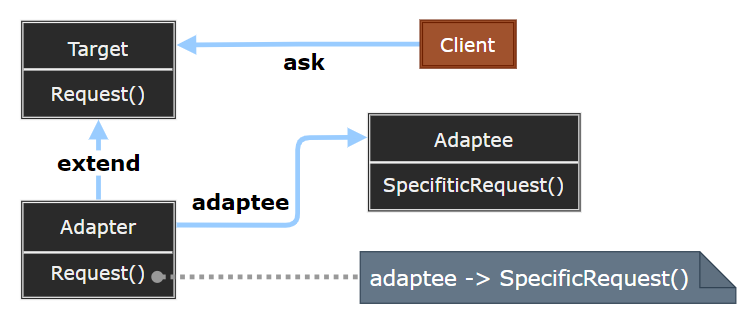
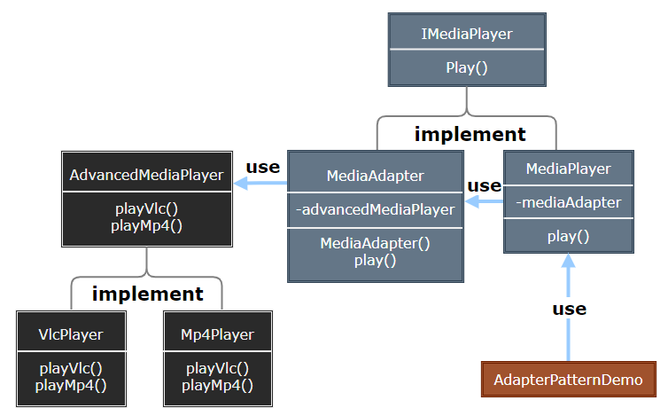

# Adapter Pattern

---

- [Adapter Pattern](#adapter-pattern)
  - [1. 适配器模式(Adapter)](#1-适配器模式adapter)
  - [2. 适配器模式简介](#2-适配器模式简介)
  - [3. 动机与结构](#3-动机与结构)
  - [4. 适配器模式优缺点](#4-适配器模式优缺点)
  - [5. 应用场景](#5-应用场景)
  - [6. 案例实现](#6-案例实现)
  - [7. Adapter 在.NET中的应用](#7-adapter-在net中的应用)

---
## 1. 适配器模式(Adapter)

- 适配器模式（Adapter Pattern）是作为两个不兼容的接口之间的桥梁。这种类型的设计模式属于结构型模式，它结合了两个独立接口的功能。

- 这种模式涉及到一个单一的类，该类负责加入独立的或不兼容的接口功能。举个真实的例子，读卡器是作为内存卡和笔记本之间的适配器。您将内存卡插入读卡器，再将读卡器插入笔记本，这样就可以通过笔记本来读取内存卡。

> 适配(转换)的概念无处不在...

- 适配，即在不改变原有实现的基础上，将原先不兼容的接口转换为兼容的接口。

---
## 2. 适配器模式简介

- 意图：将一个类的接口转换成客户希望的另外一个接口。适配器模式使得原本由于接口不兼容而不能一起工作的那些类可以一起工作。

- 主要解决：主要解决在软件系统中，常常要将一些"现存的对象"放到新的环境中，而新环境要求的接口是现对象不能满足的。

- 何时使用： 
  - 系统需要使用现有的类，而此类的接口不符合系统的需要。 
  - 想要建立一个可以重复使用的类，用于与一些彼此之间没有太大关联的一些类，包括一些可能在将来引进的类一起工作，这些源类不一定有一致的接口。 
  - 通过接口转换，将一个类插入另一个类系中。（比如老虎和飞禽，现在多了一个飞虎，在不增加实体的需求下，增加一个适配器，在里面包容一个虎对象，实现飞的接口。）

- 如何解决：继承或依赖（推荐）。

---
## 3. 动机与结构

- 在软件系统中，由于应用环境的变化，常常需要将“一些现存的对象”放在新的环境中应用，但是新环境要求的接口是这些现存对象所不满足的。
- 如何应对这种"迁移的变化”?如何既能利用现有对象的良好实现，同时又能满足新的应用环境所要求的接口?

> 适配器模式

  

---
## 4. 适配器模式优缺点

- 优点： 
  1. 可以让任何两个没有关联的类一起运行。 
  2. 提高了类的复用。 
  3. 增加了类的透明度。 
  4. 灵活性好。

- 缺点： 
  1. 过多地使用适配器，会让系统非常零乱，不易整体进行把握。比如，明明看到调用的是 A 接口，其实内部被适配成了 B 接口的实现，一个系统如果太多出现这种情况，无异于一场灾难。因此如果不是很有必要，可以不使用适配器，而是直接对系统进行重构。 
  2. 由于继承类具有单一性(C#,java)，所以至多只能适配一个适配者类，而且目标类必须是抽象类。

---
## 5. 应用场景

1. 美国电器 110V，中国 220V，就要有一个适配器将 110V 转化为 220V。 
2. JAVA JDK 1.1 提供了 Enumeration 接口，而在 1.2 中提供了 Iterator 接口，想要使用 1.2 的 JDK，则要将以前系统的 Enumeration 接口转化为 Iterator 接口，这时就需要适配器模式。
3. 在 LINUX 上运行 WINDOWS 程序。
4. 有动机地修改一个正常运行的系统的接口，这时应该考虑使用适配器模式。

> 注意事项: 适配器不是在详细设计时添加的，而是解决正在服役的项目的问题。

---
## 6. 案例实现

- 我们通过下面的实例来演示适配器模式的使用。其中，音频播放器设备只能播放 mp3 文件，通过使用一个更高级的音频播放器来播放 vlc 和 mp4 文件。

> STEP

- Step1: 我们有一个 MediaPlayer 接口和一个实现了 MediaPlayer 接口的实体类 AudioPlayer。默认情况下，AudioPlayer 可以播放 mp3 格式的音频文件。

- Step2: 我们还有另一个接口 AdvancedMediaPlayer 和实现了 AdvancedMediaPlayer 接口的实体类。该类可以播放 vlc 和 mp4 格式的文件。

- Step3: 我们想要让 AudioPlayer 播放其他格式的音频文件。为了实现这个功能，我们需要创建一个实现了 MediaPlayer 接口的适配器类 MediaAdapter，并使用 AdvancedMediaPlayer 对象来播放所需的格式。

- Step4: AudioPlayer 使用适配器类 MediaAdapter 传递所需的音频类型，不需要知道能播放所需格式音频的实际类。AdapterPatternDemo，我们的演示类使用 AudioPlayer 类来播放各种格式。

    

---
## 7. Adapter 在.NET中的应用

- 在.NET中复用COM对象:
  - COM对象不符合.NET对象的接口
  - 使用tlbimp.exe来创建一个Runtime Callable Wrapper(RCW)以使其符合.NET对象的接口。

- .NET数据访问类( Adapter变体) :
  - 各种数据库并没有提供DataSet接口
  - 使用DbDataAdapter可以将任何各数据库访问/存取适配到一个DataSet对象上。

- 集合类中对现有对象的排序(Adapter变体)
  - 现有对象未实现IComparable接口
  - 实现一个排序适配器(继承IComparer接口)，然后在其Compare方法中对两个对象进行比较。

---