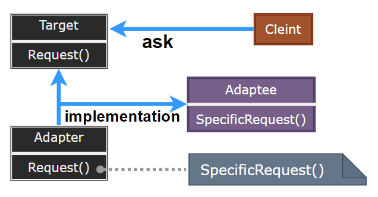

# Adapter Pattern

---

- [Adapter Pattern](#adapter-pattern)
	- [1. 适配器模式(Adapter)](#1-适配器模式adapter)
	- [2. 意图](#2-意图)
	- [3. 动机](#3-动机)
	- [4. 适用性](#4-适用性)
	- [5. 结构与参与者](#5-结构与参与者)
	- [6. 适配器模式优缺点](#6-适配器模式优缺点)
	- [7. 实现](#7-实现)
	- [8. Adapter 在 DotNET 中的应用](#8-adapter-在-dotnet-中的应用)
	- [9. 案例实现](#9-案例实现)
	- [10. 相关模式比较](#10-相关模式比较)

---
## 1. 适配器模式(Adapter)

- 适配器模式（Adapter Pattern）是作为两个不兼容的接口之间的桥梁。这种类型的设计模式属于结构型模式，它结合了两个独立接口的功能。

- 这种模式涉及到一个单一的类，该类负责加入独立的或不兼容的接口功能。举个真实的例子，读卡器是作为内存卡和笔记本之间的适配器。您将内存卡插入读卡器，再将读卡器插入笔记本，这样就可以通过笔记本来读取内存卡。

> 适配(转换)的概念无处不在...

- 适配，即在不改变原有实现的基础上，将原先不兼容的接口转换为兼容的接口。

---
## 2. 意图

- 将一个类的接口转换成客户希望的另外一个接口。Adapter 模式使得原本由于接口不兼容而不能一起工作的那些类可以一起工作。主要解决：**主要解决在软件系统中，常常要将一些 “现存的对象” 放到新的环境中，而新环境要求的接口是现对象不能满足的**。

---
## 3. 动机

- 在软件系统中，由于应用环境的变化，常常需要将 “一些现存的对象” 放在新的环境中应用，但是新环境要求的接口是这些现存对象所不满足的。
- 如何应对这种 “迁移的变化” ? 如何既能利用现有对象的良好实现，同时又能满足新的应用环境所要求的接口?

---
## 4. 适用性

> 使用 Adapter 的情况

- 想使用一个已经存在的类，而它的接口不符合设计的需求
- 相创建一个可以复用的类，该类可以与其它不相关的类或不可预见的类（即接口可能不兼容）协同工作
- （仅适用于 Adapter 对象）使用一些已经存在的子类，但是不可能对每一个都进行子类化以匹配它们的接口。对象适配器可以适配它的父类接口

---
## 5. 结构与参与者

> 类适配器结构

  

> 对象适配器结构

  

> 参与者

- Target：定义 Client 使用的与特定领域相关的接口
- Client：与符合 Target 接口的对象协同
- Adaptee：定义一个已经存在的接口，这个接口需要适配
- Adapter：对 Adapter 的接口与 Target 接口进行适配

> 协作

- Client 在 Adapter 实例上调用一些操作，然后 Adapter 调用 Adaptee 的操作实现这个请求
  
---
## 6. 适配器模式优缺点

> 类适配器与对象适配器有不同的权衡

- 类适配器：
  - 用一个具体的 Adapter 类对 Adaptee 和 Target 进行匹配：当想要匹一个类以及子类时，类适配器将不能生效，对象适配器可以灵活使用
  - 类 Adapter 可以重定义 Adaptee 的部分行为
  - 仅引入一个对象且不需要额外的指针就可以间接获得 Adaptee

- 对象适配器：
  - 允许 Adapter 与 多个 Adaptee 及它的所有子类一起工作
  - 但重定义 Adapter 行为比较困难

> Adapter 的其他一些因素

1. Adapter 的匹配程度：工作范围可能是从简单的接口转换到支持完全不同的操作集合
2. 可插入的 Adapter：当其他的类使用一个类时，需要的假定条件越少，这个类更具有可复用性；接口匹配使得可以将自己的类加入到现有的系统中去
3. 使用双向适配器提供透明操作：如 IList 继承 ICollection 与  IEnumerable 接口，IList 对象可以在 ICollection 系统中运行，也可以在 IEnumerable 系统中运行

- 缺点： 
  1. 过多地使用适配器，会让系统非常零乱，不易整体进行把握。比如，明明看到调用的是 A 接口，其实内部被适配成了 B 接口的实现，一个系统如果太多出现这种情况，无异于一场灾难。因此如果不是很有必要，可以不使用适配器，而是直接对系统进行重构。 
  2. 由于继承类具有单一性(C#,java)，所以至多只能适配一个适配者类，而且目标类必须是抽象类。

---
## 7. 实现

1. 实现 Adapter 类：Adapter 类应采用公共方式继承 Target 类，并且用私有方式继承和组合 Adaptee 类
2. 可插入的适配器：使用抽象操作、使用代理对象、使用参数化的适配器

---
## 8. Adapter 在 DotNET 中的应用

- 在 DotNET 中复用 COM 对象:
  - COM 对象不符合 DotNET 对象的接口
  - 使用 tlbimp.exe 来创建一个 Runtime Callable Wrapper(RCW) 以使其符合 DotNET 对象的接口。

- DotNET 数据访问类 (Adapter 变体) :
  - 各种数据库并没有提供 DataSet 接口
  - 使用 DbDataAdapter 可以将任何各数据库访问/存取适配到一个 DataSet 对象上。

- 集合类中对现有对象的排序 (Adapter 变体)
  - 现有对象未实现 IComparable 接口
  - 实现一个排序适配器 (继承 IComparer 接口)，然后在其 Compare 方法中对两个对象进行比较。

---
## 9. 案例实现

- 我们通过下面的实例来演示适配器模式的使用。其中，音频播放器设备只能播放 mp3 文件，通过使用一个更高级的音频播放器来播放 vlc 和 mp4 文件。

> STEP

- **Step1**: 我们有一个 MediaPlayer 接口和一个实现了 MediaPlayer 接口的实体类 AudioPlayer。默认情况下，AudioPlayer 可以播放 mp3 格式的音频文件。
- **Step2**: 我们还有另一个接口 AdvancedMediaPlayer 和实现了 AdvancedMediaPlayer 接口的实体类。该类可以播放 vlc 和 mp4 格式的文件。
- **Step3**: 我们想要让 AudioPlayer 播放其他格式的音频文件。为了实现这个功能，我们需要创建一个实现了 MediaPlayer 接口的适配器类 MediaAdapter，并使用 AdvancedMediaPlayer 对象来播放所需的格式。
- **Step4**: AudioPlayer 使用适配器类 MediaAdapter 传递所需的音频类型，不需要知道能播放所需格式音频的实际类。AdapterPatternDemo，我们的演示类使用 AudioPlayer 类来播放各种格式。

> 案例示意

  

> 代码实现

1. [C# 实现](/【设计模式】程序参考/DesignPatterns%20For%20CSharp/Structural%20Patterns/Adapter/Adapter.cs)
2. ...

---
## 10. 相关模式比较

- Bridge 的结构与对象适配器类似，但 Bridge 目的是将接口部分与实现部分分离，从而是抽象与实现可以相对独立的加以改变，Adapter 则是直接改变一个已有的接口
- Decorator 增强了其他对象的功能而同时又不改变它的接口，其程序的透明性比适配器要好，且支持递归组合，但适配器不支持
- Proxy 在不改变它的接口的条件下，为另一个对象定义了一个代理

---