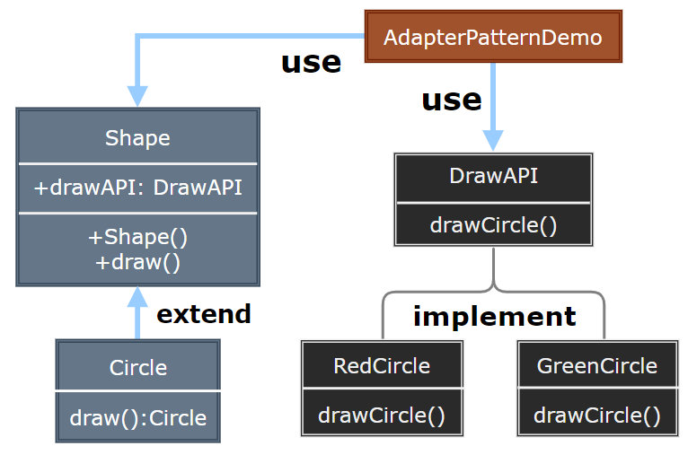

# Bridge Pattern

---

- [Bridge Pattern](#bridge-pattern)

---
## 1. 桥接模式(Bridge)

- 抽象不应该依赖于实现细节，实现细节应该依赖于抽象。
- 假如我们需要开发一个同时支持PC和手机的坦克游戏，游戏在PC和手机上功能都一样，都有同样的类型，面临同样的功能需求变化，比如坦克可能有多种不同的型号: T50,T75, T90对于其中的坦克设计，我们可能很容易设计出来一个Tank的抽象基类，然后各种不同型号的Tank继承自该类
- 但是PC和手机上的图形绘制、声效、操作等实现完全不同——因此对于各种型号的坦克，都要提供各种不同平台上的坦克实现
- 这样的设计会带来很多问题:有很多重复代码，类的结构过于复杂，难以维护，最致命的是引入任何新平台，比如在TV上的Tank游戏，都会让整个类层级结构复杂化。

---
## 2. 桥接模式简介

- 意图：将抽象部分与实现部分分离，使它们都可以独立的变化。
- 主要解决：在有多种可能会变化的情况下，用继承会造成类爆炸问题，扩展起来不灵活。
- 何时使用：实现系统可能有多个角度分类，每一种角度都可能变化。
- 如何解决：把这种多角度分类分离出来，让它们独立变化，减少它们之间耦合。
- 关键代码：抽象类依赖实现类。

---
## 3. 动机与结构

- 思考上述问题的症结：事实上由于Tank类型的固有逻辑，使得Tank类型具有了两个变化的维度：一个变化的维度为“平台的变化”，一个变化的维度为“型号的变化”。
- 如何应对这种“多维度的变化”?如何利用面向对象技术来使得Tank类型可以轻松地沿着“平台”和“型号”两个方向变化，而不引入额外的复杂度?

> 桥接模式

  

---
## 4. 桥接模式优缺点

- 优点：
  - 抽象和实现的分离。 
  - 优秀的扩展能力。 
  - 实现细节对客户透明。

- 缺点：
  - 桥接模式的引入会增加系统的理解与设计难度，由于聚合关联关系建立在抽象层，要求开发者针对抽象进行设计与编程。

---
## 5. 应用场景

1. 猪八戒从天蓬元帅转世投胎到猪，转世投胎的机制将尘世划分为两个等级，即：灵魂和肉体，前者相当于抽象化，后者相当于实现化。生灵通过功能的委派，调用肉体对象的功能，使得生灵可以动态地选择。 
2. 墙上的开关，可以看到的开关是抽象的，不用管里面具体怎么实现的。
3. 如果一个系统需要在构件的抽象化角色和具体化角色之间增加更多的灵活性，避免在两个层次之间建立静态的继承联系，通过桥接模式可以使它们在抽象层建立一个关联关系。 
4. 对于那些不希望使用继承或因为多层次继承导致系统类的个数急剧增加的系统，桥接模式尤为适用。 
5. 一个类存在两个独立变化的维度，且这两个维度都需要进行扩展。

> 注意事项：对于两个独立变化的维度，使用桥接模式再适合不过了。

---
## 6. 案例实现

- 我们有一个作为桥接实现的 DrawAPI 接口和实现了 DrawAPI 接口的实体类 RedCircle、GreenCircle。
- Shape 是一个抽象类，将使用 DrawAPI 的对象。BridgePatternDemo，我们的演示类使用 Shape 类来画出不同颜色的圆。

    

---
## 7. 设计要点

1. Bridge模式使用“对象间的组合关系”解耦了抽象和实现之间固有的绑定关系，使得抽象(Shape)和实现(DrawAPI)可以沿着各自的维度来变化。
2. 所谓抽象和实现沿着各自纬度的变化，即“子类化”它们，比如不同的Shape(Circle等)子类，和不同的 DrawAPI 子类)。得到各个子类之后，便可以任意组合它们，从而获得不同颜色的图形。
3. Bridge模式有时候类似于多继承方案，但是多继承方案往往违背单一职责原则(即一个类只有一个变化的原因)，复用性比较差。Bridge模式是比多继承方案更好的解决方法。(作为桥接成为类的成员或参数)
4. Bridge模式的应用一般在“两个非常强的变化维度”，有时候即使有两个变化的维度，但是某个方向的变化维度并不剧烈一换言之两个变化不会导致纵横交错的结果，并不一定要使用 Bridge模式。

---