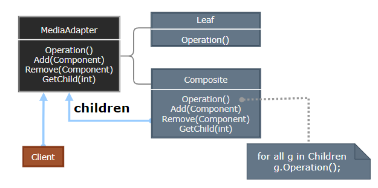
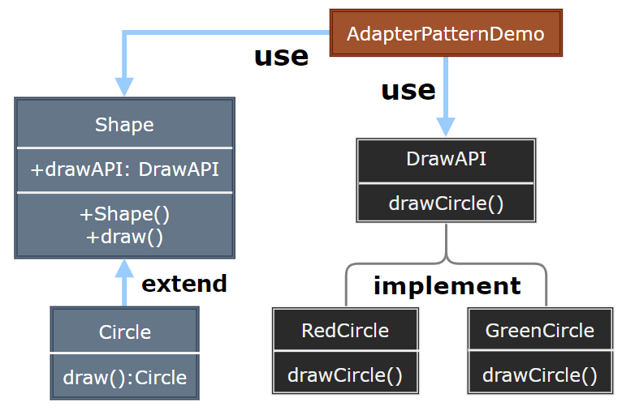

# Composite Pattern

---

- [Composite Pattern](#composite-pattern)
  - [1. 组合模式(Composite)](#1-组合模式composite)
  - [2. 组合模式简介](#2-组合模式简介)
  - [3. 动机与结构](#3-动机与结构)
  - [4. 组合模式优缺点](#4-组合模式优缺点)
  - [5. 应用场景](#5-应用场景)
  - [6. 案例实现](#6-案例实现)
  - [7. 设计要点](#7-设计要点)

---
## 1. 组合模式(Composite)

- 组合模式（Composite Pattern），又叫部分整体模式，是用于把一组相似的对象当作一个单一的对象。组合模式依据树形结构来组合对象，用来表示部分以及整体层次。这种类型的设计模式属于结构型模式，它创建了对象组的树形结构。

- 这种模式创建了一个包含自己对象组的类。该类提供了修改相同对象组的方式。

> 对象容器的问题（俄罗斯套娃）

- 在面向对象系统中，我们常会遇到一类具有“容器”特征的对象——即它们在充当对象的同时，又是其他对象的容器。

---
## 2. 组合模式简介

- 意图：将对象组合成树形结构以表示"部分-整体"的层次结构。组合模式使得用户对单个对象和组合对象的使用具有一致性。

- 主要解决：它在我们树型结构的问题中，模糊了简单元素和复杂元素的概念，客户程序可以向处理简单元素一样来处理复杂元素，从而使得客户程序与复杂元素的内部结构解耦。

- 何时使用： 1、您想表示对象的部分-整体层次结构（树形结构）。 2、您希望用户忽略组合对象与单个对象的不同，用户将统一地使用组合结构中的所有对象。

- 如何解决：树枝和叶子实现统一接口，树枝内部组合该接口。
- 关键代码：树枝内部组合该接口，并且含有内部属性 List，里面放 Component。

---
## 3. 动机与结构

- 客户代码过多地依赖干对象容器复杂的内部实现结构，对象容器内部实现结构(而非抽象接口)的变化将引起客户代码的频繁变化，带来了代码的维护性、扩展性等弊端。
- 如何将“客户代码与复杂的对象容器结构”解耦？让对象容器自己来实现自身的复杂结构，从而使得客户代码就像处理简单对象一样来处理复杂的对象容器?

> 组合模式

  

---
## 4. 组合模式优缺点

- 优点： 
  - 高层模块调用简单。 
  - 节点自由增加。

- 缺点：
  - 在使用组合模式时，其叶子和树枝的声明都是实现类，而不是接口，违反了依赖倒置原则。

---
## 5. 应用场景

- 部分、整体场景，如树形菜单，文件、文件夹的管理。
- 存在父子模块层级关系

> 注意事项：定义时为具体类。

---
## 6. 案例实现

- 我们有一个类 Employee，该类被当作组合模型类。CompositePatternDemo，我们的演示类使用 Employee 类来添加部门层次结构，并打印所有员工。

    

---
## 7. 设计要点

- Composite模式采用树形结构来实现普遍存在的对象容器，从而将“一对多的关系转化为“一对一”的关系，使得客户代码可以一致地处理对象和对象容器，无需关心处理的是单个的对象，还是组合的对象容器。
- 将“客户代码与复杂的对象容器结构”解耦是Composite模式的核心思想，解耦之后，客户代码将与纯粹的抽象接口——而非对象容器的复内部实现结构——发生依赖关系，从而更能“应对变化”。
- Composite模式中，是将“Add和Remove等和对象容器相关的方法”定义在“表示抽象对象的Component类”中，还是将其定义在“表示对象容器的Composite类"中，是一个关乎“透明性”和“安全性”的两难问题，需要仔细权衡。这里有可能违背面向对象的“单一职责原则”，但是对于这种特殊结构，这又是必须付出的代价。ASP .NET控件的实现在这方面为我们提供了一个很好的示范。
- Composite模式在具体实现中，可以让父对象中的子对象反向追朔：如果父对象有频繁的遍历需求，可使用缓存技巧来改善效率。

---