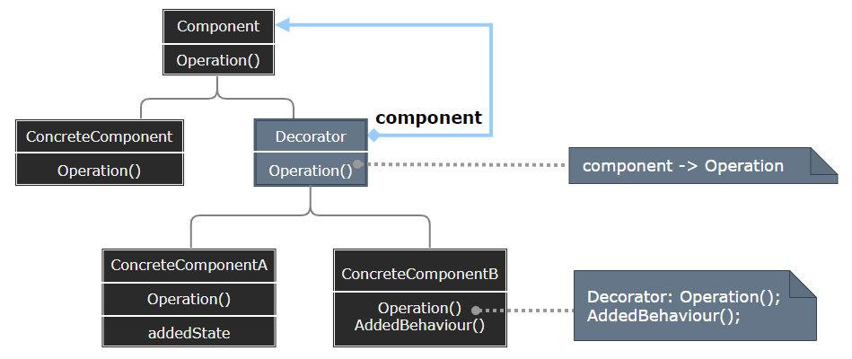
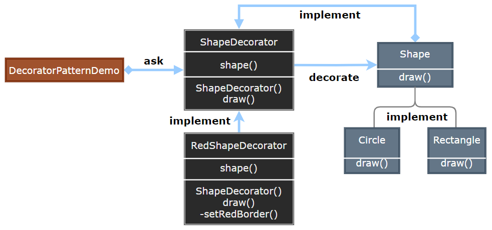

# Decorator Pattern

---

- [Decorator Pattern](#decorator-pattern)

---
## 1. 装饰器模式(Decorator)

- 装饰器模式（Decorator Pattern）允许向一个现有的对象添加新的功能，同时又不改变其结构。这种类型的设计模式属于结构型模式，它是作为现有的类的一个包装。
- 这种模式创建了一个装饰类，用来包装原有的类，并在保持类方法签名完整性的前提下，提供了额外的功能。

> 子类复子类，子类何其多

- 假如我们需要为游戏中开发一种坦克，除了各种不同型号的坦克外，我们还希望在不同场合中为其增加以下一种或多种功能：比如红外线夜视功能，比如水陆两栖功能，比如卫星定位功能等等。

---
## 2. 装饰器模式简介

- 意图：动态地给一个对象添加一些额外的职责。就增加功能来说，装饰器模式相比生成子类更为灵活。

- 主要解决：一般的，我们为了扩展一个类经常使用继承方式实现，由于继承为类引入静态特征，并且随着扩展功能的增多，子类会很膨胀。

- 何时使用：在不想增加很多子类的情况下扩展类。

- 如何解决：将具体功能职责划分，同时继承装饰者模式。

- 关键代码： 
  - Component 类充当抽象角色，不应该具体实现。 
  - 修饰类引用和继承 Component 类，具体扩展类重写父类方法。

---
## 3. 动机与结构

- 上述描述的问题根源在于我们“过度地使用了继承来扩展对象的功能”，由于继承为类型引入的静态特质，使得这种扩展方式缺乏灵活性；并且随着子类的增多(扩展功能的增多)，各种子类的组合(扩 展功能的组合)会导致更多子类的膨胀(多继承)
- 如何使“对象功能的扩展”能够根据需要来动态地实现？ 同时避免“扩展功能的增多’带来的子类膨胀问题?从而使得任何“功能扩展变化"所导致的影响将为最低?

> 装饰器模式

  

---
## 4. 装饰器模式优缺点

- 优点：   
  - 装饰类和被装饰类可以独立发展，不会相互耦合，装饰模式是继承的一个替代模式，装饰模式可以动态扩展一个实现类的功能。

- 缺点：
  - 多层装饰比较复杂。

---
## 5. 应用场景

1. 孙悟空有 72 变，当他变成"庙宇"后，他的根本还是一只猴子，但是他又有了庙宇的功能。
2. 不论一幅画有没有画框都可以挂在墙上，但是通常都是有画框的，并且实际上是画框被挂在墙上。在挂在墙上之前，画可以被蒙上玻璃，装到框子里；这时画、玻璃和画框形成了一个物体。
3. 扩展一个类的功能。 
4. 动态增加功能，动态撤销

> 注意事项：可代替继承。

---
## 6. 案例实现

- 我们将创建一个 Shape 接口和实现了 Shape 接口的实体类。然后我们创建一个实现了 Shape 接口的抽象装饰类 ShapeDecorator，并把 Shape 对象作为它的实例变量。
- RedShapeDecorator 是实现了 ShapeDecorator 的实体类。
- DecoratorPatternDemo，我们的演示类使用 RedShapeDecorator 来装饰 Shape 对象。

    

---
## 7. 设计要点

- 通过采用组合、而非继承的手法，Decorator模式实现 了在运行时动态地扩展对象功能的能力，而且可以根据需要扩展多个功能。避免了单独使用继承带来的灵活性差”和“多子类衍生问题。
- Component类在Decorator模式中充当抽象接口的角色，不应该去现具体的行为。而且Decorator类对于Component类应该透明一换言之Component类无需知道Decorator类，Decorator类 是从外部来扩展Component类的功能。
- Decorator类在接口上表现为is-a Component的继承关系，即Decorator类继承了Component类所具有的接口。但在实现上又表现为拓展A功能的 Component的组合关系，即Decorator类 又使用了另外一个Component类。我们可以使用一个或者多个Decorator对象来“装饰”一个Component对象，且装饰后的对象仍然是一个Component对象。
- Decorator模式并非解决“多子类衍生的多继承”问题，Decorator模式应用的要点在于解决“主体类在多个方向上的扩展功能”是 为装饰的含义。

---