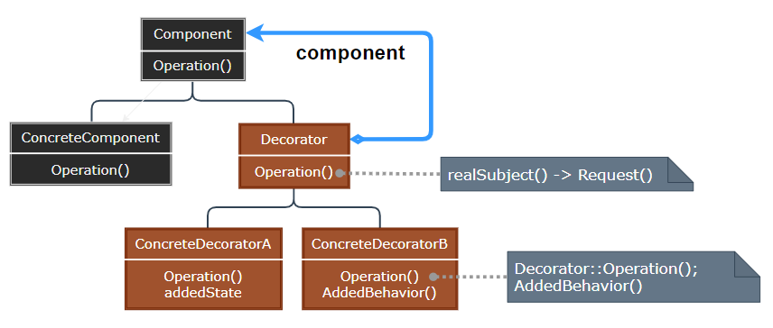

# Decorator Pattern

---

- [Decorator Pattern](#decorator-pattern)
- [1. 装饰器模式(Decorator)](#1-装饰器模式decorator)
- [2. 意图](#2-意图)
- [3. 动机](#3-动机)
- [4. 适用性](#4-适用性)
- [5. 结构与参与者](#5-结构与参与者)
- [6. 装饰器模式优缺点](#6-装饰器模式优缺点)
- [7. 实现](#7-实现)
- [8. 设计要点](#8-设计要点)
- [9. 案例实现](#9-案例实现)
- [10. 相关模式](#10-相关模式)

---
# 1. 装饰器模式(Decorator)

- 装饰器模式（Decorator Pattern）允许向一个现有的对象添加新的功能，同时又不改变其结构。这种类型的设计模式属于结构型模式，它是作为现有的类的一个包装。
- 这种模式创建了一个装饰类，用来包装原有的类，并在保持类方法签名完整性的前提下，提供了额外的功能。

> 子类复子类，子类何其多

- 假如我们需要为游戏中开发一种坦克，除了各种不同型号的坦克外，我们还希望在不同场合中为其增加以下一种或多种功能：比如红外线夜视功能，比如水陆两栖功能，比如卫星定位功能等等。

---
# 2. 意图

- 意图：动态地给一个对象添加一些额外的职责。就增加功能来说，Decorator 模式相比生成子类更为灵活。
- 主要解决：一般的，我们为了扩展一个类经常使用继承方式实现，由于继承为类引入静态特征，并且随着扩展功能的增多，子类会很膨胀。

- 何时使用：在不想增加很多子类的情况下扩展类。
- 如何解决：将具体功能职责划分，同时继承装饰者模式。

- 关键代码： 
  - Component 类充当抽象角色，不应该具体实现。 
  - 修饰类引用和继承 Component 类，具体扩展类重写父类方法。

---
# 3. 动机

- 上述描述的问题根源在于我们 “过度地使用了继承来扩展对象的功能”，由于继承为类型引入的静态特质，使得这种扩展方式缺乏灵活性；并且随着子类的增多 (扩展功能的增多)，各种子类的组合 (扩展功能的组合) 会导致更多子类的膨胀 (多继承)
- 如何使 “对象功能的扩展” 能够根据需要来动态地实现？ 同时避免 “扩展功能的增多” 带来的子类膨胀问题? 从而使得任何 “功能扩展变化” 所导致的影响降为最低?

---
# 4. 适用性

> 适用情况

- 在不影响其他对象的情况下，以动态、透明的方式给单个对象添加职责
- 处理那些可以撤销的职责
- 当不能采用生成子类的方法进行扩充时：一种是大量独立的扩展，一种是类定义被隐藏或类定义不能用于生成子类

---
# 5. 结构与参与者

> 装饰器模式

  

> 参与者

- Component：定义一个对象接口，可以给这些对象动态地添加职责
- ConcreteComponent：定义一个对象，可以给这个对象添加一些职责
- Decorator：维持一个指向 Component 对象的指针，并定义一个与 Component 接口一致的接口
- ConcreteDecorator：向组件添加职责

> 协作

- Decorator 将请求转变给它的 Component 对象，并有可能在转发请求前后执行一些附加的动作

---
# 6. 装饰器模式优缺点

> 优点

- 比静态继承更灵活：可以用添加或分离的方式，用装饰在运行时刻增加和删除职责；可以为一个特定 Component 提供多个不同的 Decorator 类，使得可以对一些职责进行混合和匹配
- 避免在层次结构高层的类有太多的特征：可以从简单的部件组合出复杂的功能
- 装饰类和被装饰类可以独立发展，不会相互耦合，装饰模式是继承的一个替代模式，装饰模式可以动态扩展一个实现类的功能。

> 缺点

- Decorator 与它的 Component 不一样：Decorator 是一个透明的包装；使用 Decorator 不应该依赖于对象标识
- 有许多的小对象，多层装饰比较复杂。

---
# 7. 实现

1. 接口的一致性：Decorator 与它修饰的 Component 的接口必须是一致的
2. 省略抽象的 Decorator 类：当仅需添加一个职责时，不需要定义抽象的 Decorator，可以把 Decorator 向 Component 转发请求的职责合并到 ConcreteDecorator 中
3. 保持 Component 类的简单性：组件和装饰必须有一个公共的 Component 父类，它应集中于定义接口而不是存储数据
4. 改变对象外壳与改变对象内核：将 Decorator 看作一个对象的外壳，它可以改变对象的行为；Strategy 用于改变对象的内核

> 注意事项：可代替继承。

---
# 8. 设计要点

- 通过采用组合、而非继承的手法，Decorator 模式实现了在运行时动态地扩展对象功能的能力，而且可以根据需要扩展多个功能。避免了单独使用继承带来的 “灵活性差” 和 “多子类衍生” 问题。
- Component 类在 Decorator 模式中充当抽象接口的角色，不应该去现具体的行为。而且 Decorator 类对于 Component 类应该透明——换言之 Component 类无需知道 Decorator 类，Decorator 类是从外部来扩展 Component 类的功能。
- Decorator 类在接口上表现为 is-a Component 的继承关系，即 Decorator 类继承了 Component 类所具有的接口。但在实现上又表现为拓展 A 功能的  Component 的组合关系，即 Decorator 类又使用了另外一个 Component 类。我们可以使用一个或者多个 Decorator 对象来 “装饰” 一个 Component 对象，且装饰后的对象仍然是一个 Component 对象。
- Decorator 模式并非解决 “多子类衍生的多继承” 问题，Decorator 模式应用的要点在于解决 “主体类在多个方向上的扩展功能”，是为装饰的含义。

---
# 9. 案例实现

- 我们将创建一个 Shape 接口和实现了 Shape 接口的实体类。然后我们创建一个实现了 Shape 接口的抽象装饰类 ShapeDecorator，并把 Shape 对象作为它的实例变量。
- RedShapeDecorator 是实现了 ShapeDecorator 的实体类。
- DecoratorPatternDemo，我们的演示类使用 RedShapeDecorator 来装饰 Shape 对象。

> 案例示意

  

> 代码实现

1. [C# 实现](/【设计模式】程序参考/DesignPatterns%20For%20CSharp/Structural%20Patterns/Decorator/Decorator.cs)
2. ...

---
# 10. 相关模式

- Adapter：Decorator 不同于 Adapter，装饰仅改变对象的职责而不是接口
- Composite：可以将装饰视为一个退化的仅有一个组件的组合，但它的目的不在于对象组合
- Strategy：与装饰为两种改变对象的两种途径

---