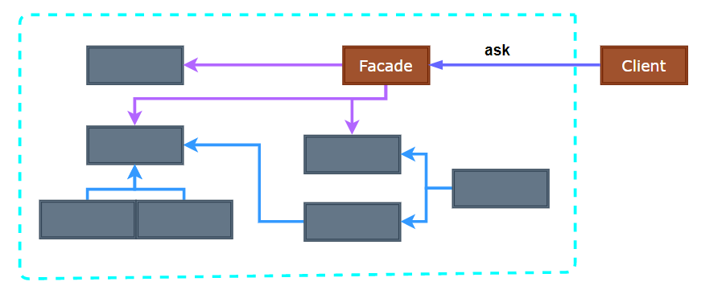
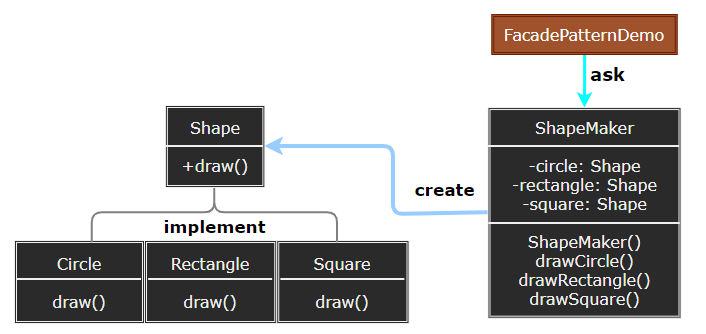

# Facade Pattern

---

- [Facade Pattern](#facade-pattern)
  - [1. 外观模式(Facade)](#1-外观模式facade)
  - [2. 外观模式简介](#2-外观模式简介)
  - [3. 动机与结构](#3-动机与结构)
  - [4. 外观模式优缺点](#4-外观模式优缺点)
  - [5. 应用场景](#5-应用场景)
  - [6. 案例实现](#6-案例实现)
  - [7. 设计要点](#7-设计要点)

---
## 1. 外观模式(Facade)

- 外观模式（Facade Pattern）隐藏系统的复杂性，并向客户端提供了一个客户端可以访问系统的接口。这种类型的设计模式属于结构型模式，它向现有的系统添加一个接口，来隐藏系统的复杂性。

- 这种模式涉及到一个单一的类，该类提供了客户端请求的简化方法和对现有系统类方法的委托调用。

> 系统的复杂度

- 假设我们需要开发一个坦克模拟系统用于模拟坦克车在各种作战环境中的行为，其中坦克系统由引擎、控制器、车轮、车身等各子系统构成。
- 系统内部与外部相耦合, 复杂度提高, 抵抗变化的能力较低, 稳定性较差。

---
## 2. 外观模式简介

- 意图：为子系统中的一组接口提供一个一致的界面，外观模式定义了一个高层接口，这个接口使得这一子系统更加容易使用。

- 主要解决：降低访问复杂系统的内部子系统时的复杂度，简化客户端与之的接口。

- 何时使用： 
  - 客户端不需要知道系统内部的复杂联系，整个系统只需提供一个"接待员"即可。 - 定义系统的入口。

- 如何解决：客户端不与系统耦合，外观类与系统耦合。(内部耦合, 内部提供接口与外部耦合)

- 关键代码：在客户端和复杂系统之间再加一层，这一次将调用顺序、依赖关系等处理好。

---
## 3. 动机与结构

- 系统内部与外部相耦合的方案, 问题在于组件的客户和组件中各种复杂的子系统有了过多的耦合，随着外部客户程序和各子系统的演化，这种过多的耦合面临很多变化的挑战。
- 如何简化外部客户程序和系统间的交互接口？如何将外部客户程序的演化和内部子系统的变化之间的依赖相互解耦?

> 外观模式

  

---
## 4. 外观模式优缺点

- 优点： 
  - 减少系统相互依赖。 
  - 提高灵活性。 
  - 提高了安全性。

- 缺点：
  - 不符合开闭原则，如果要改东西很麻烦，继承重写都不合适。

---
## 5. 应用场景

1. 去医院看病，可能要去挂号、门诊、划价、取药，让患者或患者家属觉得很复杂，如果有提供接待人员，只让接待人员来处理，就很方便。
2. 为复杂的模块或子系统提供外界访问的模块。
3. 子系统相对独立。 
4. 预防低水平人员带来的风险。

> 注意事项：在层次化结构中，可以使用外观模式定义系统中每一层的入口。

---
## 6. 案例实现

- Step1: 我们将创建一个 Shape 接口和实现了 Shape 接口的实体类。下一步是定义一个外观类 ShapeMaker。

- Step2: ShapeMaker 类使用实体类来代表用户对这些类的调用。FacadePatternDemo，我们的演示类使用 ShapeMaker 类来显示结果。

    

---
## 7. 设计要点

1. 从客户程序的角度来看，Facade模式不仅简化了整个组件系统的接口，同时对于组件内部与外部客户程序来说，从某种程度上也达到了一种“解耦”的效果——内部子系统的任何变化不会影响到Facade接口的变化。
2. Facade设计模式更注重从架构的层次去看整个系统，而不是单个类的层次。Facade很多时候更是一种架构设计模式。
3. 注意区分Fagade模式、Adapter模式、Bridge模式与Decorator模式。Facade模式注重简化接口，Adapter 模式注重转换接口，Bridge模式注重分离接口(抽象)与其实现，Decorator模式注重稳定接口的前提下为对象扩展功能。

---