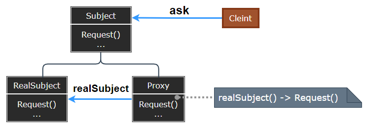
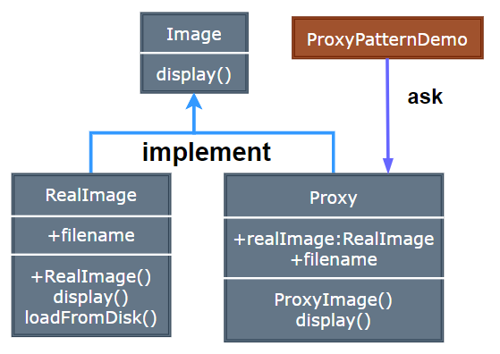

# Proxy Pattern

---

- [Proxy Pattern](#proxy-pattern)

---
## 1. 代理模式(Proxy)

- 在代理模式（Proxy Pattern）中，一个类代表另一个类的功能。这种类型的设计模式属于结构型模式。

- 在代理模式中，我们创建具有现有对象的对象，以便向外界提供功能接口。

> 直接与间接

- 人们对于复杂的软件系统常常有一种处理手法, 即增加一层间接层, 从而对系统获得一种更为灵活、满足特定需求的解决方案。

---
## 2. 代理模式简介

- 意图：为其他对象提供一种代理以控制对这个对象的访问。
- 主要解决：在直接访问对象时带来的问题，
- 何时使用：想在访问一个类时做一些控制。
- 如何解决：增加中间层。
- 关键代码：实现与被代理类组合。

---
## 3. 动机与结构

- 在面向对象系统中，有些对象由于某种原因(比如对象创建的开销很大，或者某些操作需要安全控制，或者需要进程外的访问等)，直接访问会给使用者、或者系统结构带来很多麻烦。
- 如何在不失去透明操作对象的同时来管理/控制这些对象特有的复杂性? 增加一层间接层是软件开发中常见的解决方式。

> 代理模式
    
  

---
## 4. 代理模式优缺点

- 优点：
    职责清晰、高扩展性、智能化。

- 缺点： 
  1. 由于在客户端和真实主题之间增加了代理对象，因此有些类型的代理模式可能会造成请求的处理速度变慢。 
  2. 实现代理模式需要额外的工作，有些代理模式的实现非常复杂。

---
## 5. 应用场景

1. Windows 里面的快捷方式。 
2. 猪八戒去找高翠兰结果是孙悟空变的，可以这样理解：把高翠兰的外貌抽象出来，高翠兰本人和孙悟空都实现了这个接口，猪八戒访问高翠兰的时候看不出来这个是孙悟空，所以说孙悟空是高翠兰代理类。 
3. 买火车票不一定在火车站买，也可以去代售点。 
4. 一张支票或银行存单是账户中资金的代理。支票在市场交易中用来代替现金，并提供对签发人账号上资金的控制。
5. 按职责来划分，通常有以下使用场景： 
6. 远程代理、虚拟代理、Copy-on-Write 代理。 
7. 保护（Protect or Access）代理。 
8. Cache代理、防火墙（Firewall）代理、同步化（Synchronization）代理
9. 智能引用（Smart Reference）代理。

---
## 6. 案例实现

- 我们将创建一个 Image 接口和实现了 Image 接口的实体类。ProxyImage 是一个代理类，减少 RealImage 对象加载的内存占用。

- ProxyPatternDemo，我们的演示类使用 ProxyImage 来获取要加载的 Image 对象，并按照需求进行显示。

    

---
## 7. 设计要点

1. “增加一层间接层”是软件系统中对许多复杂问题的一种常见解决方法。在面向对象系统中，直接使用某些对象会带来很多问题，作为间接层的proxy对象便是解决这一问题的常用手段。
2. 具体proxy设计模式的实现方法、实现粒度都相差很大，有些可能对单个对象做细粒度的控制，如copy-on-write技术，有些可能对组件模块提供抽象代理层，在架构层次对对象做proxy。
3. Proxy并不一定要求保持接口的一致性，只要能够实现间接控制，有时候损及一些透明性是可以接受的。

---