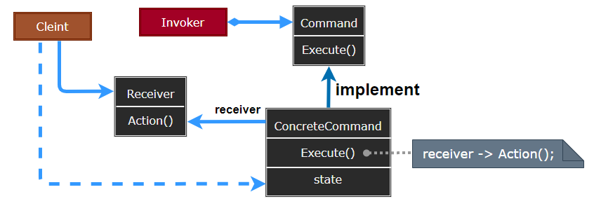
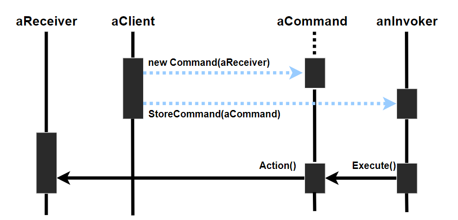
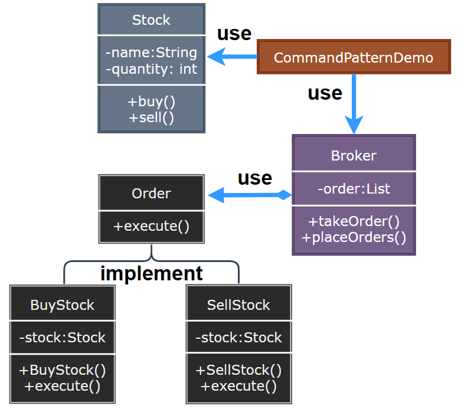

# Command Pattern

---

- [Command Pattern](#command-pattern)
	- [1. 命令模式(Command)](#1-命令模式command)
	- [2. 意图](#2-意图)
	- [3. 动机](#3-动机)
	- [4. 适用性](#4-适用性)
	- [5. 结构与参与者](#5-结构与参与者)
	- [6. 命令模式优缺点](#6-命令模式优缺点)
	- [7. 实现](#7-实现)
	- [8. 设计要点](#8-设计要点)
	- [9. 案例实现](#9-案例实现)
	- [10. 相关模式](#10-相关模式)

---
## 1. 命令模式(Command)

- 命令模式（Command Pattern）是一种数据驱动的设计模式，它属于行为型模式。请求以命令的形式包裹在对象中，并传给调用对象。调用对象寻找可以处理该命令的合适的对象，并把该命令传给相应的对象，该对象执行命令。

> 耦合与变化:  行为请求者 ---> 行为实现者

- 耦合是软件不能抵御变化灾难的根本性原因。不仅实体对象与实体对象之间存在耦合关系，**实体对象与行为操作之间也存在耦合关系**。

---
## 2. 意图

- 将一个请求封装成一个对象，从而使你可以用不同的请求对客户进行参数化；对请求排队或记录请求日志，以及支持可撤销的操作

- 主要解决：在软件系统中，行为请求者与行为实现者通常是一种紧耦合的关系，但某些场合，比如需要**对行为进行记录、撤销或重做、事务**等处理时，这种无法抵御变化的紧耦合的设计就不太合适。

- 关键代码————定义三个角色：
  - received 真正的命令执行对象 
  - Command 命令
  - invoker 使用命令对象的入口

---
## 3. 动机

- 在软件构建过程中，“行为请求者” 与 “行为实现者” 通常呈现一种 “紧耦合”。但在某些场合——比如需要对行为进行 “记录、撤销/重做(undo/redo) 、事务” 等处理，这种无法抵御变化的紧耦合是不合适的
- 在这种情况下，如何将 “行为请求者” 与 “行为实现者” 解耦? 将一组行为抽象为对象，可以实现二者之间的松耦合。
- 命令模式通过将请求本身变成一个对象来使工具箱对象可向未指定的应用对象提出要求，这个对象可被存储并像其他对象一样被传递

---
## 4. 适用性

1. 可使用过程回调（委托）函数表达这类参数化机制
2. 在不同时刻指定、排列和执行请求
3. 支持取消操作：Command 的 Execute 操作可在操作前将状态存储起来，在取消操作时这个状态用来消除该操作的影响
4. 支持修改日志：在系统崩溃时，这些修改可以被重做一遍
5. 用构建在原语操作上的高层操作构造一个系统：支持事务的信息系统，一个系统封装了对数据的一组变动

---
## 5. 结构与参与者

> 命令模式

  

> 参与者

- Command：声明执行操作的接口
- ConcreteCommand：将一个接收者对象绑定于一个动作，调用接收者相应的操作，以实现 Execute
- Client：创建一个具体命令对象并设定它的接收者
- Invoker：要求该命令执行这个请求
- Receiver：知道如何实施与执行一个请求相关的操作，任何类都可能作为一个接收者

> 协作

- Client 创建一个 ConcreteCommand 对象并指定它的 Receiver 对象
- 某 Invoker 对象存储该 ConcreteCommand 对象
- 该 Invoker 通过调用 Command 对象的 Execute 操作来提交一个请求；若该 Command 是可撤销的，ConcreteCommand 就在执行 Execute 操作之前存储当前状态以用于取消该命令
- ConcreteCommand 对象对调用它的 Receiver 的一些操作以执行该请求

> 对象交互图示

  

---
## 6. 命令模式优缺点

1. Command 模式将调用操作的对象与知道如何实现该操作的对象解耦
2. Command 是头等的对象，可像其他对象一样被操纵与扩展
3. 可以将多条命令装配成一个复合命令
4. 增加一个 Command 时无需改变已有的类，但使用命令模式可能会导致某些系统有过多的具体命令类。

---
## 7. 实现

1. 一个命令对象应达到何种智能程度：一种极端是它仅确定一个接收者和执行该请求的动作；另一个极端是它自己实现所有功能，不需要额外的接收者对象
2. 支持取消与重做：Command 若提供方法逆转它们的操作，就可支持取消和重做功能；
3. 若达到这种目的，ConcreteCommand 需要额外的状态信息：接收者对象、接收者上执行操作的参数、如果处理请求的操作会改变接收者对象中的值，也需要将它们存储下来；需要一个已被执行命令的历史列表，向后遍历并逆向执行为取消它们的结果，向前遍历并执行是重执行
4. 避免取消操作过程中的错误积累

---
## 8. 设计要点

1. Command 模式的根本目的在于将 “行为请求者” 与 “行为实现者” 解耦，在面向对象语言中，常见的实现手段是 “将行为抽象为对象”。
2. 实现 Command 接口的具体命令对象 ConcreteCommand 有时候根据需要可能会保存一些额外的状态信息。
3. 通过使用 Composite 模式，可以将多个 “命令” 封装为一个 “复合命令” MacroCommand.
4. Command 模式与 C# 中的 Delegate 有些类似。但两者定义行为接口的规范有所区别: Command 以面向对象中的 “接口——实现” 来定义行为接口规范，更严格，更符合抽象原则; Delegate 以函数签名来定义行为接口规范，更灵活，但抽象能力比较弱。

---
## 9. 案例实现

- 我们首先创建作为命令的接口 Order，然后创建作为请求的 Stock 类。实体命令类 BuyStock 和 SellStock，实现了 Order 接口，将执行实际的命令处理。创建作为调用对象的类 Broker，它接受订单并能下订单。

- Broker 对象使用命令模式，基于命令的类型确定哪个对象执行哪个命令。CommandPatternDemo，我们的演示类使用 Broker 类来演示命令模式。

> 案例示意

  

> 代码实现

1. [C# 实现](/【设计模式】程序参考/DesignPatterns%20For%20CSharp/Behavioral%20Patterns/Command/Command.cs)
2. ...

---
## 10. 相关模式

- Composite 可被用来实现宏命令
- Memento 可用来保持某个状态，命令用这一状态来取消它的效果
- 在被放入历史列表前，被拷贝的命令必须起到一种原型的作用

---