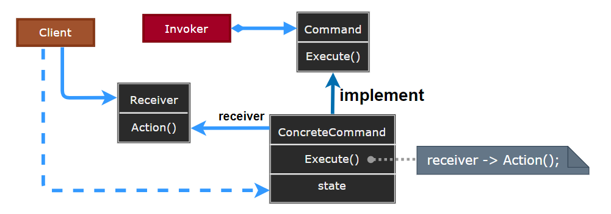

# Command Pattern

---

- [Command Pattern](#command-pattern)

---
## 1. 命令模式(Command)

命令模式（Command Pattern）是一种数据驱动的设计模式，它属于行为型模式。请求以命令的形式包裹在对象中，并传给调用对象。调用对象寻找可以处理该命令的合适的对象，并把该命令传给相应的对象，该对象执行命令。

> 耦合与变化:  行为请求者 ---> 行为实现者

- 耦合是软件不能抵御变化灾难的根本性原因。不仅实体对象与实体对象之间存在耦合关系，**实体对象与行为操作之间也存在耦合关系**。

---
## 2. 命令模式介绍

- 意图：将一个请求封装成一个对象，从而使您可以用不同的请求对客户进行参数化。

- 主要解决：在软件系统中，行为请求者与行为实现者通常是一种紧耦合的关系，但某些场合，比如需要**对行为进行记录、撤销或重做、事务**等处理时，这种无法抵御变化的紧耦合的设计就不太合适。

- 何时使用：在某些场合，比如要对行为进行"记录、撤销/重做、事务"等处理，这种无法抵御变化的紧耦合是不合适的。在这种情况下，如何将"行为请求者"与"行为实现者"解耦？将一组行为抽象为对象，可以实现二者之间的松耦合。

- 如何解决：通过调用者调用接受者执行命令，顺序：调用者→接受者→命令。

- 关键代码————定义三个角色：
  - received 真正的命令执行对象 
  - Command 命令
  - invoker 使用命令对象的入口

---
## 3. 动机与结构

- 在软件构建过程中，“行为请求者”与“行为实现者”通常呈现一种“紧耦合”。但在某些合————比如需要对行为进行“记录、撤销/重做(undo/redo) 、事务”等处理，这种无法抵御变化的紧耦合是不合适的
- 在这种情况下，如何将“行为请求者”与“行为实现者”解耦? 将一组行为抽象为对象，可以实现二者之间的松耦合。

> 命令模式

  

---
## 4. 命令模式优缺点

- 优点： 
  - 降低了系统耦合度。 
  - 新的命令可以很容易添加到系统中去。

- 缺点：
  - 使用命令模式可能会导致某些系统有过多的具体命令类。

---
## 5. 应用场景

- 认为是命令的地方都可以使用命令模式, 比如 GUI 中每一个按钮都是一条命令。
- 模拟 CMD。

---
## 6. 案例实现

- 我们首先创建作为命令的接口 Order，然后创建作为请求的 Stock 类。实体命令类 BuyStock 和 SellStock，实现了 Order 接口，将执行实际的命令处理。创建作为调用对象的类 Broker，它接受订单并能下订单。

- Broker 对象使用命令模式，基于命令的类型确定哪个对象执行哪个命令。CommandPatternDemo，我们的演示类使用 Broker 类来演示命令模式。

    

---
## 7. 设计要点

1. Command模式的根本目的在于将“行为请求者”与“行为实现者”解耦，在面向对象语言中，常见的实现手段是“将行为抽象为对象”。
2. 实现Command接口的具体命令对象ConcreteCommand有时候根据需要可能会保存一些额外的状态信息。
3. 通过使用Composite模式，可以将多个“命令”封装为一个"复合命令"MacroCommand.
4. Command模式与C#中的Delegate有些类似。但两者定义行为接口的规范有所区别: Command以面向对象中的“接口————实现"来定义行为接口规范，更严格，更符合抽象原则; Delegate以函数签名来定义行为接口规范，更灵活，但抽象能力比较弱。

---