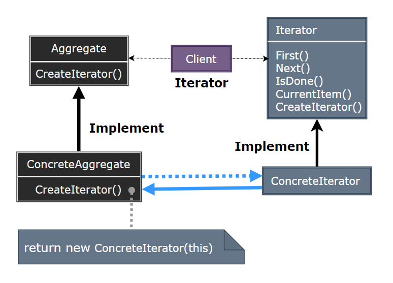
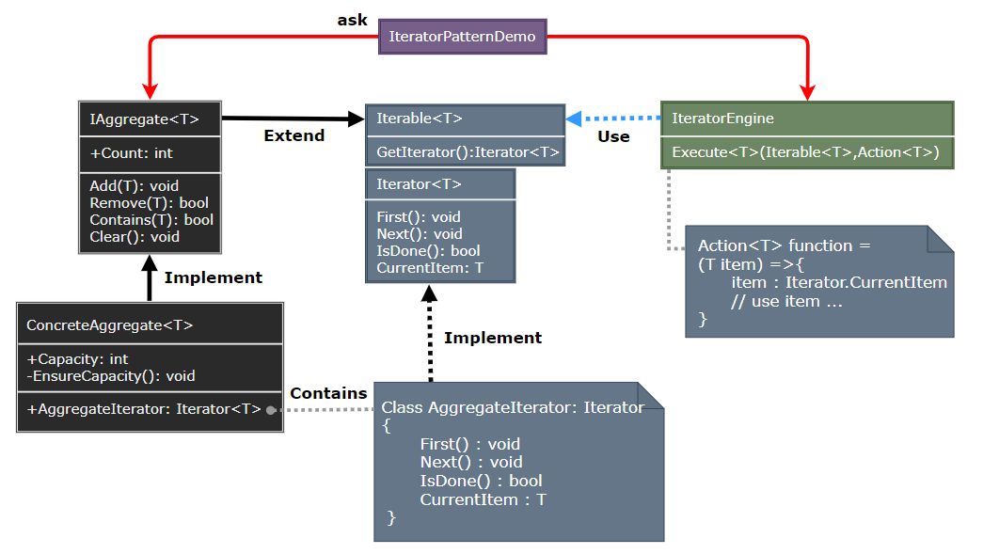

# Iterator Pattern

---

- [Iterator Pattern](#iterator-pattern)
- [1. 迭代器模式(Iterator)](#1-迭代器模式iterator)
- [2. 意图](#2-意图)
- [3. 动机](#3-动机)
- [4. 适用性](#4-适用性)
- [5. 结构与参与者](#5-结构与参与者)
- [6. 迭代器模式优缺点](#6-迭代器模式优缺点)
- [7. 实现](#7-实现)
- [8. 设计要点](#8-设计要点)
- [9. 案例实现](#9-案例实现)
- [10. 相关模式](#10-相关模式)

---
# 1. 迭代器模式(Iterator)

---
# 2. 意图

---
# 3. 动机

---
# 4. 适用性

---
# 5. 结构与参与者

> 命令模式

  

> 参与者

> 协作

> 对象交互图示

  

---
# 6. 迭代器模式优缺点

---
# 7. 实现

---
# 8. 设计要点

---
# 9. 案例实现

> 案例示意

  

> 代码实现

1. [C# 实现]()
2. ...

---
# 10. 相关模式

---