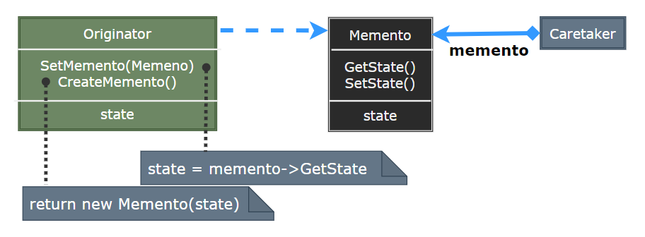
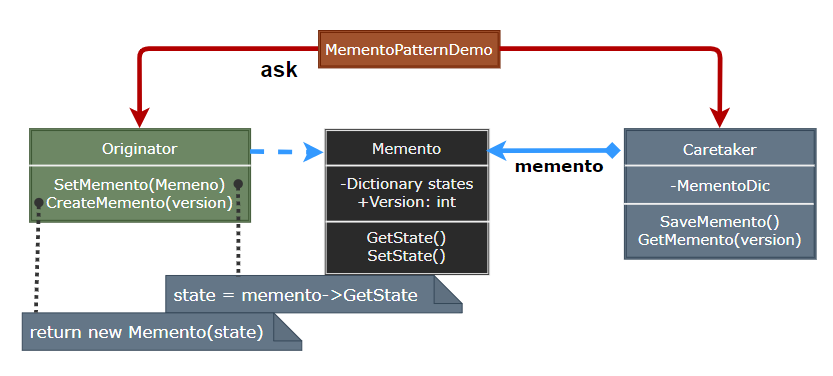

# Memento Pattern

---

- [Memento Pattern](#memento-pattern)
- [1. 备忘录模式(Memento)](#1-备忘录模式memento)
- [2. 意图](#2-意图)
- [3. 动机](#3-动机)
- [4. 适用性](#4-适用性)
- [5. 结构与参与者](#5-结构与参与者)
- [6. 备忘录模式优缺点](#6-备忘录模式优缺点)
- [7. 实现](#7-实现)
- [8. 设计要点](#8-设计要点)
- [9. 案例实现](#9-案例实现)
- [10. 相关模式](#10-相关模式)

---
# 1. 备忘录模式(Memento)

- 备忘录模式（Memento Pattern）保存一个对象的某个状态，以便在适当的时候恢复对象。备忘录模式属于行为型模式。

---
# 2. 意图

- 在不破坏封装性的前提下，捕获一个对象的内部状态，并在该对象之外保存这个状态。这样以后就可将该对象恢复到原先保存的状态
- 主要解决：所谓备忘录模式就是在不破坏封装的前提下，捕获一个对象的内部状态，并在该对象之外保存这个状态，这样可以在以后将对象恢复到原先保存的状态。

---
# 3. 动机

- 在软件构建过程中，某些对象的状态在转换过程中，可能由于某种需要，要求程序能够回溯到对象之前处于某个点时的状态。如果使用一些公有接口来让其他对象得到对象的状态，便会暴露对象的细节实现。
- 如何实现对象状态的良好保存与恢复? 但同时又不会因此而破坏对象本身的封装性。

---
# 4. 适用性

- 必须保存一个对象在某一个时刻的（部分）状态，必要时可恢复到先前的状态
- 若一个用接口来让其他对象直接得到这些状态，将会暴露对象的实现细节并破坏对象的封装性

---
# 5. 结构与参与者

> 备忘录模式

  

> 参与者

- Memento：备忘存储原发器对象的内部状态，原发器根据需求决定备忘录存储原发器的哪些内部状态；防止原发器之外的其他对象访问备忘录。备忘录存在两个接口，管理者只能看到备忘录的窄接口—它只能将备忘录传递给其他对象，而原发器能看到一个宽接口，允许它访问返回先前状态所需的所有数据
- Originator：原发器，创建一个备忘录，用以记录当前时刻它的内部状态，也可使用备忘录恢复内部状态
- Caretaker：负责人负责保存好备忘录，不能对备忘录的内容进行操作和检查

> 协作

- 备忘录是被动的。只有创建备忘录的原发器会对它的状态进行赋值和检索

---
# 6. 备忘录模式优缺点

1. 保持封装边界：内部状态信息被封存，且只能由原发器进行管理
2. 简化了原发器：Originator 负责保持客户请求过的内部状态版本
3. 使用备忘录可能代价很高：若原发器在生成备忘录时必须拷贝并存储大量的信息，或客户频繁的创建备忘录与恢复状态操作，可能会造成非常大的开销
4. 定义窄接口与宽接口：一些语言中可能难以保证只有原发器可访问备忘录的状态
5. 维护备忘录的潜在代价：管理者负责删除它维护的备忘录，但管理器不知道备忘录中有多少个状态

---
# 7. 实现

1. 考虑语言支持：一个为原发器所使用的宽接口（私有），一个是其他对象使用的窄接口（公有）
2. 存储增量式改变：备忘录的创建与返回的顺序是可预测的情况下，它可以仅存储原发器内部状态的增量改变；备忘录可只存储一个命令所产生的增量改变而不是每一个对象的完整状态

> 基于备忘录的迭代接口的优点

1. 在同一个集合上可有多个状态一起工作
2. 它不需要为支持迭代而破坏一个集合的封装性

---
# 8. 设计要点

- 备忘录 (Memento) 存储原发器 (Originator) 对象的内部状态，在需要时恢复原发器状态。Memento 模式适用于 “由原发器管理，却又必须存储在原发器之外的信息”
- 在实现 Memento 模式中，要防止原发器以外的对象访问备忘录对象。备忘录对象有两个接口，一个为原发器使用的宽接口，一个为其他对象使用的窄接口。
- 在实现 Memento 模式时，要考虑拷贝对象状态的效率问题，如果对象开销比较大，可以采用某种增量式改变来改进 Memento 模式

---
# 9. 案例实现

- 备忘录模式使用三个类 Memento、Originator 和 Caretaker。Memento 包含了要被恢复的对象的状态。Originator 创建并在 Memento 对象中存储状态。Caretaker 对象负责从 Memento 中恢复对象的状态。

- MementoPatternDemo，我们的演示类使用 Caretaker 和 Originator 对象来显示对象的状态恢复。

> 案例示意

  

> 代码实现

1. [C# 实现](/【设计模式】程序参考/DesignPatterns%20For%20CSharp/Behavioral%20Patterns/Memento/Memento.cs)
2. ...

---
# 10. 相关模式

- Command：命令可使用备忘录来为可撤销的操作维护状态
- Iterator：备忘录可用于迭代

---