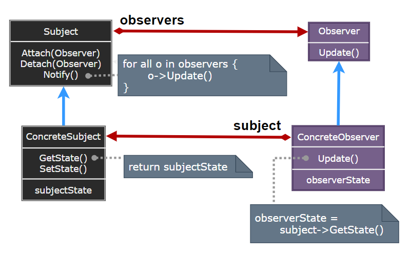

# Interpreter Pattern

---

- [Interpreter Pattern](#interpreter-pattern)
- [1. 观察者模式(Observer)](#1-观察者模式observer)
- [2. 意图](#2-意图)
- [3. 动机](#3-动机)
- [4. 适用性](#4-适用性)
- [5. 结构与参与者](#5-结构与参与者)
- [6. 观察者模式优缺点](#6-观察者模式优缺点)
- [7. 实现](#7-实现)
- [8. 设计要点](#8-设计要点)
- [9. 案例实现](#9-案例实现)
- [10. 相关模式](#10-相关模式)

---
# 1. 观察者模式(Observer)

- 当对象间存在一对多关系时，则使用观察者模式（Observer Pattern）。比如，当一个对象被修改时，则会自动通知它的依赖对象。观察者模式属于行为型模式

---
# 2. 意图

- 定义对象间的一种一对多的依赖关系，当一个对象的状态发生改变时，所有依赖于它的对象都得到通知并被自动更新。
- 主要解决：一个对象状态改变给其他对象通知的问题，而且要考虑到易用和低耦合，保证高度的协作。

---
# 3. 动机

---
# 4. 适用性

- 当一个抽象模型有两个方面，其中一个方面依赖于另一方面。将这二者封装在独立的对象中以使它们可以各自独立地改变和复用。
- 当对一个对象的改变需要同时改变其它对象，而不知道具体有多少对象有待改变。
- 当一个对象必须通知其它对象，而它又不能假定其它对象是谁。换言之，你不希望这些对象是紧密耦合的。

---
# 5. 结构与参与者

> 观察者模式

  

> 参与者

- Subject：目标知道它的观察者。可以有任意多个观察者观察同一个目标；提供注册和删除观察者对象的接口。
- Observer：为那些在目标发生改变时需获得通知的对象定义一个更新接口
- ConcreteSubject：将有关状态存入各 ConcreteObserver 对象。当它的状态发生改变时，向它的各个观察者发出通知。
- ConcreteObserver：维护一个指向 ConcreteSubject 对象的引用；存储有关状态，这些状态应与目标的状态保持一致；实现 Observer 的更新接口以使自身状态与目标的状态保持一致。

> 协作

> 对象交互图示

  

---
# 6. 观察者模式优缺点

---
# 7. 实现

---
# 8. 设计要点

---
# 9. 案例实现

> 案例示意

  

> 代码实现

1. [C# 实现]()
2. ...

---
# 10. 相关模式

---