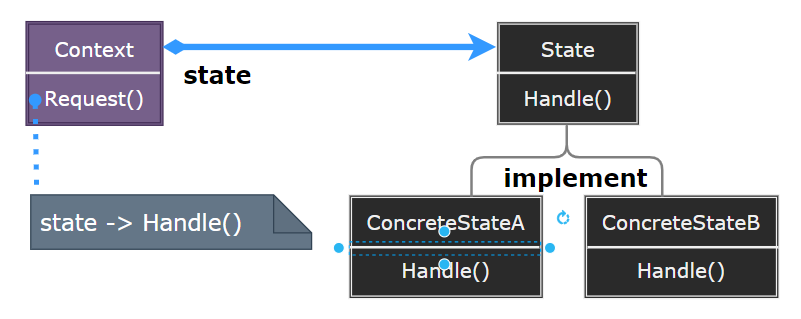
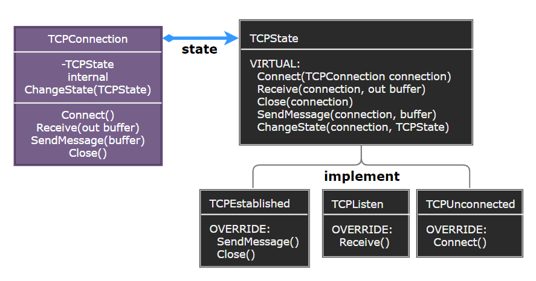

# State Pattern

---

- [State Pattern](#state-pattern)
- [1. 状态模式(State)](#1-状态模式state)
- [2. 意图](#2-意图)
- [3. 动机](#3-动机)
- [4. 适用性](#4-适用性)
- [5. 结构与参与者](#5-结构与参与者)
- [6. 状态模式优缺点](#6-状态模式优缺点)
- [7. 实现](#7-实现)
- [8. 设计要点](#8-设计要点)
- [9. 案例实现](#9-案例实现)
- [10. 相关模式](#10-相关模式)

---
# 1. 状态模式(State)

- 在状态模式（State Pattern）中，类的行为是基于它的状态改变的。这种类型的设计模式属于行为型模式。
- 在状态模式中，我们创建表示各种状态的对象和一个行为随着状态对象改变而改变的 context 对象。

---
# 2. 意图

- 允许一个对象在其内部状态改变时改变它的行为。对象看起来似乎修改了它的类。
- 主要解决：对象的行为依赖于它的状态（属性），并且可以根据它的状态改变而改变它的相关行为。

---
# 3. 动机

- 在软件构建过程中，某些对象的状态如果改变，其行为也会随之而发生变化，比如文档处于只读状态，其支持的行为和读写状态支持的行为就可能完全不同。
- 如何在运行时根据对象的状态来透明地更改对象的行为? 而不会为对象操作和状态转化之间引入紧耦合?

---
# 4. 适用性

- 一个对象的行为取决于它的状态，并且它必须在运行时刻根据状态改变它的行为。
- 一个操作中含有庞大的多分支的条件语句，且这些分支依赖于该对象的状态。这个状态通常用一个或多个枚举常量表示。通常有多个操作包含这一相同的条件结构。State 模式将每一个条件分支放人一个独立的类中。这使得你可以根据对象自身的情况将对象的状态作为一个对象，这一对象可以不依赖于其他对象而独立变化。

---
# 5. 结构与参与者

> 状态模式

  

> 参与者

- Context：定义客户感兴趣的接口，维护一个 ConcreteState 子类的实例，该实例定义当前状态
- State：状态，定义一个接口以封装与 Context 的一个特定状态相关的行为
- ConcreteState subclasses：每一子类实现一个与 Context 的一个状态相关的行为。

> 协作

- Context 将与状态相关的请求委托给当前的 ConcreteState 对象处理。
- Context 可将自身作为一个参数传递给处理该请求的状态对象。这使得状态对象在必要时可访问 Context。
- Context 是客户使用的主要接口。客户可用状态对象来配置一个 Context，一旦一个 Context 配置完毕，它的客户不再需要直接与状态对象打交道。
- Context 或 ConcreteState 子类都可决定哪个状态是另外哪一个的后继者，以及是在何种条件下进行状态转换。

---
# 6. 状态模式优缺点

1. 它将与特定状态相关的行为局部化，并且将不同状态的行为分割开来：State 模式将所有与一个特定的状态相关的行为都放入一个对象中。通过定义新的子类可以很容易的增加新的状态和转换。另一个方法是使用数据值定义内部状态并且让 Context 操作来显式地检查这些数据。
2. 它使得状态转换显式化：为不同的状态引人独立的对象使得转换变得更加明确。
3. State 对象可被共享：如果 State 对象没有实例变量——即它们表示的状态完全以它们的类型来编码（引用类型），那么各 Context 对象共享一个 State 对象。

---
# 7. 实现

1. 谁定义状态转换：State 模式不指定哪一个参与者定义状态转换准则。如果该准则是固定的，它们可在 Context 中完全实现。若让 State 子类指定它们的后继状态以及何时进行转换，通常更灵活更合适。这需要 Context 增加一个接口，让 State 对象显式地设定 Context 的当前状态。
2. 基于表 (字典) 的另一种方法：使用表将输人映射到状态转换。对每一个状态，一张表将每一个可能的输人映射到一个后继状态。
3. 创建和销毁 State 对象：是仅当需要 State 对象时才创建它们并随后销毁它们，还是提前创建它们并且始终不销毁它们。
4. 使用动态继承：改变一个响应特定请求的行为可以用在运行时刻改变这个对象的类的办法实现。其他一些基于委托的语言却是例外，它们提供这种机制，从而直接支持 State 模式。

---
# 8. 设计要点

- State 模式将所有与一个特定状态相关的行为都放入一个 State 的子类对象中，在对象状态切换时，切换相应的对象；但同时维持 State 的接口，这样实现了具体操作与状态转换之间的解耦。
- 为不同的状态引入不同的对象使得状态转换变得更加明确，而且可以保证不会出现状态不一致的情况，因为转换是原子性的 — 即要么彻底转换过来，要么不转换。
- 如果 State 对象没有实例变量，那么各个上下文可以共享同一个 State 对象，从而节省对象开销。

---
# 9. 案例实现

- 考虑一个表示网络连接的类 TCPConnection。一个 TCPConnection 对象的状态处于若干不同状态之一：连接巳建立 (Established)、正在监听 (Listening)、连接已关闭 (Unconnected))。
- 当一个 TCPConnection 对象收到其他对象的请求时，它根据自身的当前状态作出不同的反应。

> 案例示意

  

> 代码实现

1. [C# 实现](/【设计模式】程序参考/DesignPatterns%20For%20CSharp/Behavioral%20Patterns/State/State.cs)
2. ...

---
# 10. 相关模式

- Flyweight 模式解释了何时以及怎样共享状态对象。
- 状态对象通常是 Singleton。

---