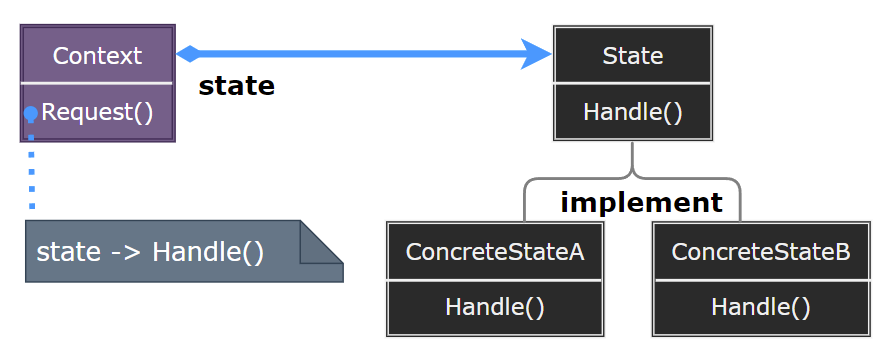
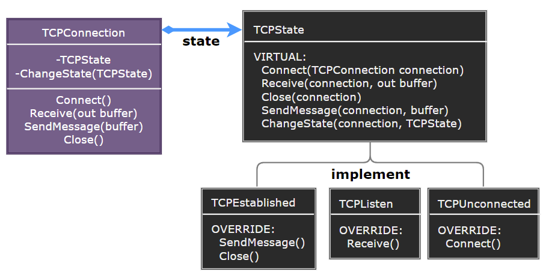

# State Pattern

---

- [State Pattern](#state-pattern)
- [1. 状态模式(State)](#1-状态模式state)
- [2. 意图](#2-意图)
- [3. 动机](#3-动机)
- [4. 适用性](#4-适用性)
- [5. 结构与参与者](#5-结构与参与者)
- [6. 状态模式优缺点](#6-状态模式优缺点)
- [7. 实现](#7-实现)
- [8. 设计要点](#8-设计要点)
- [9. 案例实现](#9-案例实现)
- [10. 相关模式](#10-相关模式)

---
# 1. 状态模式(State)

- 在状态模式（State Pattern）中，类的行为是基于它的状态改变的。这种类型的设计模式属于行为型模式。
- 在状态模式中，我们创建表示各种状态的对象和一个行为随着状态对象改变而改变的 context 对象。

---
# 2. 意图

- 允许一个对象在其内部状态改变时改变它的行为。对象看起来似乎修改了它的类。
- 主要解决：对象的行为依赖于它的状态（属性），并且可以根据它的状态改变而改变它的相关行为。

---
# 3. 动机

- 在软件构建过程中，某些对象的状态如果改变，其行为也会随之而发生变化，比如文档处于只读状态，其支持的行为和读写状态支持的行为就可能完全不同。
- 如何在运行时根据对象的状态来透明地更改对象的行为? 而不会为对象操作和状态转化之间引入紧耦合?

---
# 4. 适用性

- 一个对象的行为取决于它的状态，并且它必须在运行时刻根据状态改变它的行为。
- 一个操作中含有庞大的多分支的条件语句，且这些分支依赖于该对象的状态。这个状态通常用一个或多个枚举常量表示。通常有多个操作包含这一相同的条件结构。State 模式将每一个条件分支放人一个独立的类中。这使得你可以根据对象自身的情况将对象的状态作为一个对象，这一对象可以不依赖于其他对象而独立变化。

---
# 5. 结构与参与者

> 状态模式

  

> 参与者

> 协作

> 对象交互图示

  

---
# 6. 状态模式优缺点

---
# 7. 实现

---
# 8. 设计要点

---
# 9. 案例实现

> 案例示意

  

> 代码实现

1. [C# 实现]()
2. ...

---
# 10. 相关模式

---