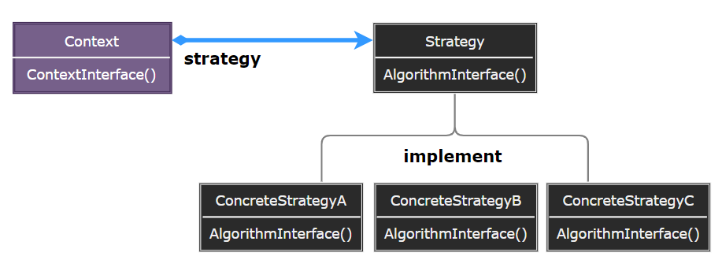
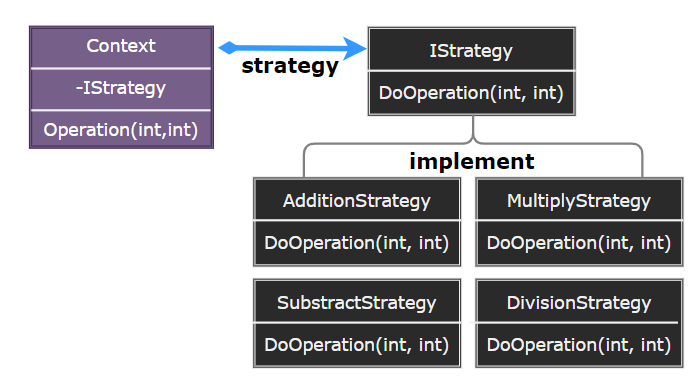

# Strategy Pattern

---

- [Strategy Pattern](#strategy-pattern)
- [1. 策略模式(Strategy)](#1-策略模式strategy)
- [2. 意图](#2-意图)
- [3. 动机](#3-动机)
- [4. 适用性](#4-适用性)
- [5. 结构与参与者](#5-结构与参与者)
- [6. 策略模式优缺点](#6-策略模式优缺点)
- [7. 实现](#7-实现)
- [8. 设计要点](#8-设计要点)
- [9. 案例实现](#9-案例实现)
- [10. 相关模式](#10-相关模式)

---
# 1. 策略模式(Strategy)

- 在策略模式（Strategy Pattern）中，一个类的行为或其算法可以在运行时更改。这种类型的设计模式属于行为型模式。
- 在策略模式中，我们创建表示各种策略的对象和一个行为随着策略对象改变而改变的 context 对象。策略对象改变 context 对象的执行算法。

---
# 2. 意图

- 定义一系列的算法把它们一个个封装起来，并且使它们可相互替换。策略模式使得算法可独立于使用它的客户而变化。
- 主要解决：在有多种算法相似的情况下，使用 if...else 所带来的复杂和难以维护。

---
# 3. 动机

- 在软件构建过程中，某些对象使用的算法可能多种多样，经常改变，如果将这些算法都编码到对象中，将会使对象变得异常复杂：而且有时候支持不使用的算法也是一个性能负担。
- 如何在运行时根据需要透明地更改对象的算法? 将算法与对象本身解耦，从而避免上述问题?

---
# 4. 适用性

- 许多相关的类仅仅是行为有异：“策略” 提供了一种用多个行为中的一个行为来配置一个类的方法。
- 需要使用一个算法的不同变体：可能会定义一些反映不同的空间/时间权衡的算法。
- 算法使用客户不应该知道的数据：可使用策略模式以避免暴露复杂的、与算法相关的数据结构。
- 一个类定义了多种行为，并且这些行为在这个类的操作中以多个条件语句的形式出现：将相关的条件分支移入它们各自的 Strategy 类中以代替这些条件语句。

---
# 5. 结构与参与者

> 策略模式

  

> 参与者

- Strategy：定义所有支持的算法的公共接口，Context 使用这个接口来调用某 ConcreteStrategy 定义的算法。
- ConcreteStrategy：以 Strategy 接口实现某具体算法。
- Context：用一个 ConcreteStrategy 对象来配置；维护一个对 Strategy 对象的引用；可定义一个接口来让 Stategy 访问它的数据。

> 协作

- Strategy 和 Context 相互作用以实现选定的算法。当算法被调用时, Context 可以将该算法所需要的所有数据都传递给该 Stategy。或 Context 可以将自身作为一个参数传递给 Strategy 操作。这就让 Strategy 在需要时可以回调 Context。
- Context 将它的客户的请求转发给它的 Strategy：客户通常创建并传递一个 ConcreteStrategy 对象给该 Context

---
# 6. 策略模式优缺点

1. 相关算法系列 Strategy 类层：为 Context 定义了一系列的可供重用的算法或行为
2. 一个替代继承的方法：继承提供了另一种支持多种算法或行为的方法，但不能动态的更改算法
3. 消除了一些条件语句：将行为封装在一个个独立的 Strategy 类中消除了这些条件语句
4. 实现的选择 Strategy 模式：可以提供相同行为的不同实现，客户可以根据不同时间空间权衡取舍要求从不同策略中进行选择。
5. 客户必须了解不同的 Strategy：一个客户要选择一个合适的 Strategy 就必须知道这些 Strategy 到底有何不同。
6. strategy 和 Context 之间的通信开销：无论各个 ConcreteStrategy 实现的算法是简单还是复杂，它们都共享 Strategy 定义的接口。可能某些 ConcreteStrategy 不会都用到所有通过这个接口传递给它们的信息；简单的 ConcreteStrategy 可能不使用其中的任何信息。有时 Context 会创建和初始化一些永远不会用到的参数。如果存在这样问题，那么将需要在 Strategy 和 Context 之间更进行紧密的耦合。
7. 增加了对象的数目：Strategy 增加了一个应用中的对象的数目。

---
# 7. 实现

1. 定义 Strategy 和 Context 接口：Strategy 和 Context 接口必须使得 ConcreteStrategy 能够有效的访问它所需要的 Context 中的任何数据。一种是让 Context 将数据放在参数中传递给 Strategy 操作；另一种是让 Context 将自身作为一个参数传递给 Strategy
2. 使 Strategy 对象成为可选：Context 在访问某 Strategy 前先检查它是否存在；如果没有，那么Context执行缺省的行为。

---
# 8. 设计要点

- Strategy 及其子类为组件提供了一系列可重用的算法，从而可以使得类型在运行时方便地根据需要在各个算法之间进行切换。所谓封装算法，支持算法的变化。
- Strategy 模式提供了用条件判断语句以外的另一种选择，消除条件判断语句，就是在解耦合。含有许多条件判断语句的代码通常都需要 Strategy 模式。
- 与 State 类似，如果 Strategy 对象没有实例变量，那么各个上下文可以共享同一个 Strategy 对象，从而节省对象开销。

---
# 9. 案例实现

- 我们将创建一个定义活动的 Strategy 接口和实现了 Strategy 接口的实体策略类。Context 是一个使用了某种策略的类。
- StrategyPatternDemo，我们的演示类使用 Context 和策略对象来演示 Context 在它所配置或使用的策略改变时的行为变化。

> 案例示意

  

> 代码实现

1. [C# 实现](/【设计模式】程序参考/DesignPatterns%20For%20CSharp/Behavioral%20Patterns/Strategy/Strategy.cs)
2. ...

---
# 10. 相关模式

- Flyweight：Strategy 经常是很好的轻量级对象。

---