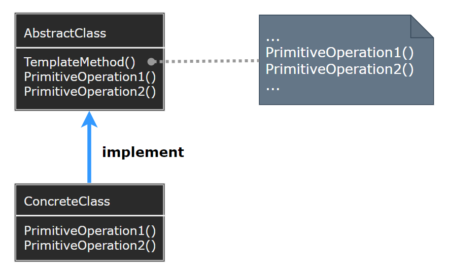
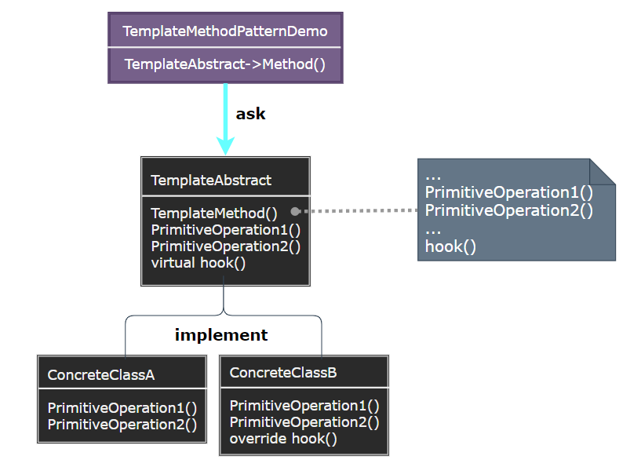

# Template Method Pattern

---

- [Template Method Pattern](#template-method-pattern)
- [1. 模板方法模式 (Template Method)](#1-模板方法模式-template-method)
- [2. 意图](#2-意图)
- [3. 动机](#3-动机)
- [4. 适用性](#4-适用性)
- [5. 结构与参与者](#5-结构与参与者)
- [6. 模板方法模式优缺点](#6-模板方法模式优缺点)
- [7. 实现](#7-实现)
- [8. 设计要点](#8-设计要点)
- [9. 案例实现](#9-案例实现)
- [10. 相关模式](#10-相关模式)

---
# 1. 模板方法模式 (Template Method)

- 在模板模式（Template Pattern）中，一个抽象类公开定义了执行它的方法的方式/模板。它的子类可以按需要重写方法实现，但调用将以抽象类中定义的方式进行。这种类型的设计模式属于行为型模式。

---
# 2. 意图

- 定义一个操作中的算法的骨架，而将一些步骤延迟到子类中。Template Method 使得子类可以不改变一个算法的结构即可重定义该算法的某些特定步骤。
- 主要解决：一些方法通用，却在每一个子类都重新写了这一方法。

---
# 3. 动机

- 在软件构建过程中，对于某一项任务，它常常有稳定的整体操作结构，但各个子步骤却有很多改变的需求，或者由于固有的原因（比如框架与应用之间的关系）而无法和任务的整体结构同时实现。
- 如何在确定稳定操作结构的前提下，来灵活应对各个子步骤的变化或者晚期实现需求？

---
# 4. 适用性

> 模板方法应用于下列情况:

- 一次性实现一个算法的不变的部分，并将可变的行为留给子类来实现。
- 各子类中公共的行为应被提取出来并集中到一个公共父类中以避免代码重复。
- 控制子类扩展

---
# 5. 结构与参与者

> 模板方法模式

  

> 参与者

- AbstractClass：抽象类，定义抽象的原语操作（primitive operation），具体的子类将重定义它们以实现一个算法的各步骤；实现一个模板方法，定义一个算法的骨架，用于调用原语操作与调用定义在 AbstractClass 或其他对象中的操作
- ConcreteClass：实现原语操作以完成算法中与特定子类相关的步骤

---
# 6. 模板方法模式优缺点

- 模板方法是一种代码复用的基本技术，在类库中提取了其中的公共行为
- 子类可以通过重定义父类的操作来扩展该操作的行为，其间可显式地调用父类操作。
- 每一个不同的实现都需要一个子类来实现，导致类的个数增加，使得系统更加庞大。

---
# 7. 实现

- 添加访问控制：一个模板方法调用的原语操作可以被定义为保护成员，这保证它们只被模板方法调用
- 尽量减少原语操作：定义模板方法应尽量减少一个子类具体实现该算法时必须重定义的原语操作的数目
- 命名约定：可以给应被重定义的那些操作之前添加标识以识别它们，如 Do- 前缀

---
# 8. 设计要点

- Template Method 模式是一种非常基础性的设计模式，在面向对象系统中有着大量的应用。一般会定义为 sealed 状态
- 它用最简洁的机制（虚函数的多态性）为很多应用程序框架提供了灵活的扩展，是代码复用方面的基本实现结构。
- 可以灵活应对子步骤的变化外，“Don't call me, let me call you（不要调用我，让我来调用你）” 的反向控制结构是 Template Method 的典型应用。

> 模板方法调用的一些操作类型：

- 具体的操作：ConcreteClass 对客户类的操作
- 具体的 AbstractClass 操作：通常对子类有用的操作
- 原语操作：抽象操作
- Factory Method
- 钩子操作（hook operation）：提供缺省行为，子类在必要时进行扩展；一般 hook 为空操作

---
# 9. 案例实现

- 实现 Template Method 抽象实现

> 案例实现

  

> 代码实现

1. [C# 实现](./../【设计模式】程序参考/DesignPatterns%20For%20CSharp/Behavioral%20Patterns/Template%20Method/AbstractClass.cs)
2. ...

---
# 10. 相关模式

- Factory Method 模式常被模板方法调用。
- 模板方法使用继承来改变算法的一部分。Strategy 使用委托来改变整个算法。

---