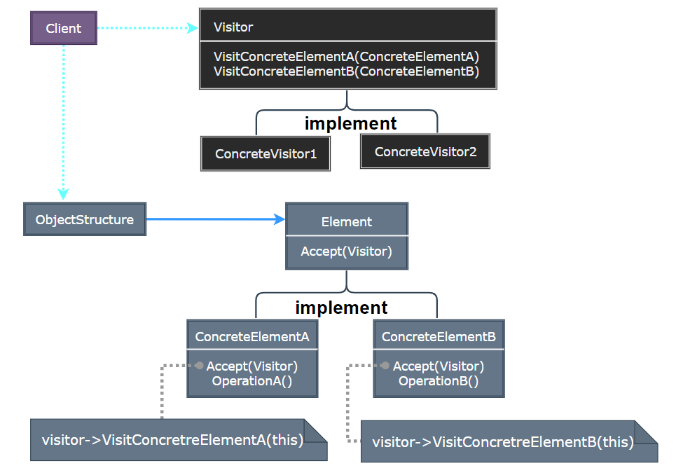
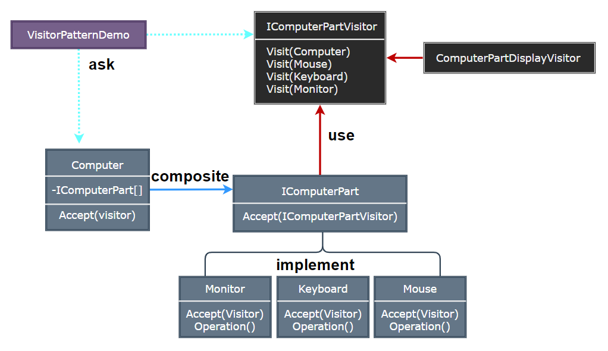

# Visitor Pattern

---

- [Visitor Pattern](#visitor-pattern)
- [1. 访问者模式(Visitor)](#1-访问者模式visitor)
- [2. 意图](#2-意图)
- [3. 动机](#3-动机)
- [4. 适用性](#4-适用性)
- [5. 结构与参与者](#5-结构与参与者)
- [6. 访问者模式优缺点](#6-访问者模式优缺点)
- [7. 实现](#7-实现)
- [8. 设计要点](#8-设计要点)
- [9. 案例实现](#9-案例实现)
- [10. 相关模式](#10-相关模式)

---
# 1. 访问者模式(Visitor)

- 在访问者模式（Visitor Pattern）中，我们使用了一个访问者类，它改变了元素类的执行算法。通过这种方式，元素的执行算法可以随着访问者改变而改变。这种类型的设计模式属于行为型模式。
- 根据模式，元素对象已接受访问者对象，这样访问者对象就可以处理元素对象上的操作。

---
# 2. 意图

- 表示一个作用于某对象结构中的各元素的操作。它使你可以在不改变各元素的类的前提下定义作用于这些元素的新操作。
- 主要解决：稳定的数据结构和易变的操作耦合问题。
- 何时使用：需要对一个对象结构中的对象进行很多不同的并且不相关的操作，而需要避免让这些操作"污染"这些对象的类，使用访问者模式将这些封装到类中。

---
# 3. 动机

- 在软件构建过程中，由于需求的改变，某些类层次结构中常常需要增加新的行为 (方法)，如果直接在基类中做这样的更改，将会给子类带来很繁重的变更负担，甚至破坏原有设计。
- 如何在不更改类层次结构的前提下，在运行时根据需要透明地为类层次结构上的各个类动态添加新的操作，从而避免上述问题?

---
# 4. 适用性

- 一个对象结构包含很多类对象，它们有不同的接口，而你想对这些对象实施一些依赖于其具体类的操作。
- 需要对一个对象结构中的对象进行很多不同的并且不相关的操作：当该对象结构被很多应用共享时，用 Visitor 模式让每个应用仅包含需要用到的操作
- 定义对象结构的类很少改变，但经常需要在此结构上定义新的操作
  
---
# 5. 结构与参与者

> 访问者模式

  

> 参与者

- Visitor：访问者，为该对象结构中 ConcreteElement 的每一个类声明一个 Visit 操作。该操作的名字和特征标识了发送 Visit 请求给该访问者的那个类。这使得访问者可以确定正被访问元素的具体的类。这样访问者就可以通过该元素的特定接口直接访问它。
- ConcreteVisitor：具体访问者，实现每个由 Visitor 声明的操作。每个操作实现本算法的一部分，而该算法片断乃是对应于结构中对象的类。ConcreteVisitor 为该算法提供了上下文并存储它的局部状态。这一状态常常在遍历该结构的过程中累积结果。
- Element：元素，定义一个 Accept 操作，它以一个访问者为参数
- ConcreteElement：具体元素，实现 Accept 操作，该操作以一个访问者为参数。
- ObjectStructure：对象结构，能枚举它的元素；可以提供一个高层的接口以允许该访问者访问它的元素。可以是一个复合或是一个集合，如一个列表或一个无序集

> 协作

- 一个使用 Visitor 模式的客户必须创建一个 ConcreteVisitor 对象，然后遍历该对象结构，并用该访问者访问每一个元素。
- 当一个元素被访问时，它调用对应于它的类的 Visitor 操作。如果必要，该元素将自身作为这个操作的一个参数以便该访问者访问它的状态。

---
# 6. 访问者模式优缺点

1. 访问者模式使得易于增加新的操作：访问者使得增加依赖于复杂对象结构的构建的操作变得简单
2. 访问者集中相关的操作而分离无关的操作：相关的行为不是分布在定义该对象结构的类上而是集中在一个访问者中
3. 增加新的 ConcreteElement 类很困难：每增加一个 ConcreteElement 要在 Visitor 中添加一个新的抽象操作，且在每个 Concrete 中实现相应的操作
4. 通过类层次进行访问：一个迭代器可以通过调用节点对象的特定操作遍历整个对象结构，同时访问这些对象
5. 累积状态：当访问者访问对象结构中的每一个元素时

---
# 7. 实现

---
# 8. 设计要点

---
# 9. 案例实现

> 案例示意

  

> 代码实现

1. [C# 实现]()
2. ...

---
# 10. 相关模式

---